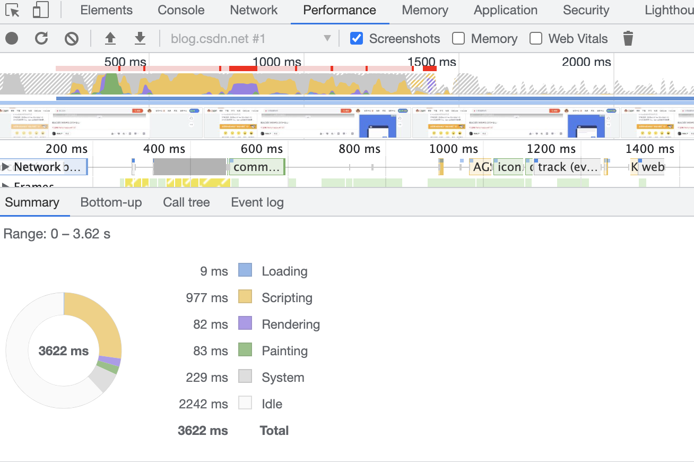

# 前端面试题汇总1

## 1. 盒模型是指什么？

盒模型指的是页面在渲染时，DOM 元素所采用的布局模型，一个元素占用的空间大小由几个部分组成，内容(content)、内边距(padding)，边框(border)和外边距(margin)。
w3c 盒子模型  =  内容区域 content(height,width)+内边距(padding)+边框(border)+外边距(margin),content = width
IE 盒模型 width = content + paddding + border
后来 W3C 中加入了  box-sizing 样式，属性包含 content-box 和 border-box；content-box 就是默认的样式（W3C 盒模型），border-box（IE 盒模型）是 width 包含了 content+padding+boder

## 2. css 选择器优先级

**！important>内联选择器>ID 选择器>类别选择器>属性选择器>伪类>元素选择器>通配符选择器>继承选择器**
属性选择器有以下几种：

- 第一种：[属性]

          [title] {
              color: blue;
          }

- 第二种：属性=值

          [title=one] {
              border: 5px solid green;
              color: crimson;
          }

- 第三种：[属性~=值] 属性中包含独立的单词

          [title~=one] {
              color: dodgerblue;
          }

* 第四种 属性中必须是完整且唯一的单词，或用" - "隔开
  [lang|=one] {
  background: #72D1FF;
  font-weight: 600;
  text-align: center;
  }

- 第五种：[属性*=值] 属性中做字符串拆分，只要能拆出来 value 这个词就行

          .box .content [title*=one] {
              color: orange;
          }

- 第六种：[属性^=值] 属性的前几个字母是值就可以

                  .box .content [title^=one] {
                      color: darkorchid;
                  }

  ## 3. 伪类和伪元素分别有哪些，什么区别？

  伪类：
  |属性|用法|说明|
  |:---|:---:|:---|
  |:link |用法--a:link |选择所有未访问链接|
  |:visited |用法--a:visited |选择所有访问过的链接|
  |:active |用法--a:active |选择活动链接|
  |:hover |用法--a:hover |选择鼠标在链接上面时|
  |:focus |用法--input:focus |选择具有焦点的输入元素|
  |:first-letter |用法--p:first-letter |选择每一个<p>元素的第一个字母|
  |:first-line |用法--p:first-line |选择每一个<p>元素的第一行|
  |:first-child |用法--p:first-child |指定只有当<p>元素是其父级的第一个子级的样式|
  |:lang |用法--p:lang(it) |选择一个 lang 属性的起始值="it"的所有<p>元素|
  |:enable |用法--p:enable|选择每个已启动的元素|
  |:disable |用法--p:disable|选择每个已禁止的元素|
  |:checked |用法--p:checked|选择每个被选中的元素|
  |:target |用法--p:target|选择当前的锚点元素|
  |:first-of-type |用法--p:first-of-type|选择满足是其父元素的第一个某类型子元素的元素|
  |:last-of-type |用法--p:last-of-type|选择满足是其父元素的最后一个某类型子元素的元素|
  |:only-of-type |用法--p:only-of-type|选择满足是其父元素的唯一一个某类型子元素的元素|
  |:nth-of-type(n) |用法--p:nth-of-type(n)|选择满足是其父元素的第 n 个某类型子元素的元素|
  |:nth-last-of-type(n) |用法--p:nth-last-of-type(n)|选择满足是其父元素的倒数第 n 个某类型的元素|
  |:only-child |用法--p:only-child|选择满足是其父元素的唯一一个子元素的元素|
  |:last-child |用法--p:last-child|选择满足是其父元素的最后一个元素的元素|
  |:nth-child(n) |用法--p:nth-child(n)|选择满足是其父元素的第 n 个子元素的元素|
  |:nth-last-child(n) |用法--p:nth-last-child(n)|选择满足是其父元素的倒数第 n 个子元素的元素|
  |:empty |用法--p:empty|选择满足没有子元素的元素|
  |:in-range |用法--p:in-range|选择满足值在指定范围内的元素|
  |:out-of-range |用法--p:out-of-range|选择值不在指定范围内的元素|
  |:invalid |用法--p:invalid|选择满足值为无效值的元素|
  |:valid |用法--p:valid|选择满足值为有效值的元素|
  |:not(selector) |用法--p:not(selector) |选择不满足 selector 的元素|
  |:optional |用法--p:optional|选择为可选项的表单元素，即没有“required”属性|
  |:read-only |用法--p:read-only |选择有"readonly"的表单元素|
  |:read-write |用法--p:read-write|选择没有"readonly"的表单元素|
  |:root |用法--div:read-write|选择根元素|

伪元素：
|属性|用法|说明|
|:---|:---:|:---|
|:before |用法--p:before |在每个<p>元素之前插入内容|
|:after |用法--p:after |在每个<p>元素之后插入内容|
|::first-letter|用法--p::first-letter| 选择指定元素的第一个单词|
|::first-line|用法--p::first-line| 选择指定元素的第一行|
|::selection|用法--p::selection| 选择指定元素中被用户选中的内容|
区别：伪类的操作对象是文档树中已有的元素，本身存在，只是在特定场景下才会触发，而伪元素则创建了一个文档树外的 dom 元素,并为其添加样式.

## 4. css hack
为什么会有css hack?

由于不同浏览器和浏览器版本对css的支持和解析结果不一样，以及css优先级对浏览器展示效果的影响，这样就会导致相同的css代码在不同的浏览器和不同浏览器版本上显示不同的效果，所以就需要针对不同的浏览器和浏览器版本写特定的css样式，这种针对不同浏览器和不同浏览器版本写相应的css code的过程叫做css hack.
css hack有3中表现形式：属性前缀法，选择器前缀法，IE条件注释法
属性前缀法就是在属性前面
属性前缀法(即类内部Hack)：例如 IE6能识别下划线"_"和星号" * "，IE7能识别星号" * "，但不能识别下划线"_"，IE6~IE10都认识"\9"，但firefox前述三个都不能认识。
选择器前缀法(即选择器Hack)：例如 IE6能识别*html .class{}，IE7能识别*+html .class{}或者*:first-child+html .class{}。
IE条件注释法(即HTML条件注释Hack)：针对所有IE(注：IE10+已经不再支持条件注释)： \<!--[if IE]>IE浏览器显示的内容 <![endif]-->
针对IE6及以下版本： \<!--[if lt IE 6]>只在IE6-显示的内容 <![endif]-->。这类Hack不仅对CSS生效，对写在判断语句里面的所有代码都会生效。

## 5. 什么是 BFC，BFC 实现原理，如何创建 BFC。可以解决的问题?

### 什么是 BFC？

.BFC(Block formatting context)直译为“块级格式化上下文”。1.BFC 它是一个独立的渲染区域，只有 （块元素）参与，它规定了内部的 块元素如何布局，并且与这个区域外部毫不相关。 2.可以理解成：创建了 BFC 的元素就是一个独立的盒子，里面的子元素不会在布局上影响外面的元素（里面怎么布局都不会影响外部），**BFC 仍属于文档中的普通流** 3.不是所有的元素，模式都能产生 BFC 。w3c 规范：display 属性为 block, list-item ,table 的元素，会产生 BFC。

### BFC 的原理是什么？

1）内部的 Box 会在垂直方向，一个接一个地放置。
2）Box 垂直方向的距离由 margin 决定。属于同一个 BFC 的两个相邻 Box 的 margin 会发生重叠
3）每个元素的 margin box 的左边， 与包含块 border box 的左边相接触(对于从左往右的格式化，否则相反)。即使存在浮动也是如此。
4）BFC 的区域不会与浮动box 重叠。
5）BFC 就是页面上的一个隔离的独立容器，容器里面的子元素不会影响到外面的元素。反之也如此。
6）计算 BFC 的高度时，浮动元素也参与计算。

### 如何创建 BFC?

1）根元素
2）float 属性不为 none
3）position 不为 static 和 relative
4）overflow 不为 visible
5）display 为 inline-block, table-cell, table-caption, flex, inline-flex


### BFC 作用？

1）防止外边距重叠。
bfc 导致的属于同一个 bfc 中的子元素的 margin 重叠(Box 垂直方向的距离由 margin 决定。属于同一个 BFC 的两个相邻 Box 的 margin 会发生重叠)
我们可以在 div 外面包裹一层容器，并触发该容器生成一个 BFC。那么两个 div 便不属于同一个 BFC，就不会发生 margin 重叠了。
正常两个div元素有margin的时候，上元素的margin-bottom和下元素的margin-top会重叠为最大的一个margin大小展示，但是这样达不到要求了，所以可以给这两个元素添加容器box-wrap,然后给这个外面容器添加overflow:hidden;
<style>
   .box3,
  .box4 {
    width: 100px;
    height: 100px;
    margin: 100px;
    background: blue;
  }
  .box4 {
    background: red;
  }
  .box-wrap {
    overflow: hidden;
  }
</style>
  <!-- 防止margin重叠 -->
  <div class="box-wrap">
    <div class="box3"></div>
  </div>
  <div class="box-wrap">
    <div class="box4"></div>
  </div>

2）清除浮动的影响
块级子元素浮动，如果块级父元素没有设置高度，其会有高度塌陷的情况发生。
原因：子元素浮动后，均开启了 BFC，父元素不会被子元素撑开。
解决方法：由第六条原理得，计算 BFC 的高度时，浮动元素也参与计算。所以只要将父容器设置为 bfc
就可以把子元素包含进去：这个容器将包含浮动的子元素，它的高度将扩展到可以包含它的
子元素，在这个 BFC，这些元素将会回到页面的常规文档流。
<style>
  .container {
    border: 1px solid red;
    overflow: hiidden;
  }

  .cube {
    width: 100px;
    height: 100px;
    background: blue;
    margin: 100px;

  }
</style>
 <div class="container">
    <div class="cube"></div>
  </div>
3）防止文字环绕

## 什么是 margin 重叠？

是指两个或多个盒子(可能相邻也可能嵌套)的相邻边界(其间没有任何非空内容、补白、边框)重合在一起而形成一个单一边界,发生在（垂直相邻边界），即上下结果的边界宽度是相邻边界宽度中（最大的值）.
边界的重叠也有例外情况：
1、水平边距永远不会重合。
2、在规范文档中，2 个或以上的块级盒模型相邻的垂直 margin 会重叠。最终的 margin 值计算方法如下：
3、全部都为正值，取最大者；
4、不全是正值，则都取绝对值，然后用正值减去最大值；
5、没有正值，则都取绝对值，然后用 0 减去最大值。

## 6. CSS 中如何使用@规则？

常用规则：

- @charset, 定义样式表使用的字符集。
  `@charset "UTF-8";`
- @import, 告诉 CSS 引擎引入一个外部样式表。(常用)
  `@import '~antd/es/style/themes/default.less';`
- @media，如果满足媒介查询的条件则条件规则组里的规则生效。(常用)
  ```
  @media screen and (max-width: @screen-xs) {
  .container {
    width: 100% !important;
  }
  }
  ```
  
- @font-face，引入外部下载的外部的字体。(常用)
  ```
  @font-face {
  font-family: 'PingFangSC-Regular';
  src: url('./assets/fonts/苹方黑体-准-简.ttf');
  font-weight: normal;
  font-style: normal;
  font-display: swap;
  }
  ```
- @keyframes，描述 CSS 动画的中间步骤。(常用)
  ```
  @keyframes slideRightIn {
  0% {
    -webkit-transform-origin: 100% 100%;
    transform-origin: 100% 100%;
    -webkit-transform: scaleX(0.8);
    transform: scaleX(0.8);
  }
  100% {
    -webkit-transform-origin: 100% 100%;
    transform-origin: 100% 100%;
    -webkit-transform: scaleX(1);
    transform: scaleX(1);
  }
  }
  ```
  不常用：

- @namespace, 告诉 CSS 引擎必须考虑 XML 命名空间。
- @supports, 一般用于检测 css 属性，如果满足给定条件则条件规则组里的规则生效。
  ```
  @supports (display: grid) {
    .container {
     color: red;
  }
  }
  ```
  
- @page，描述打印文档时布局的变化。
- @document，如果文档样式表满足给定条件则条件规则组里的规则生效。 (推延至 CSS Level 4 规范)
- @counter-style — 一个 @counter-style 规则定义了如何把一个计数器的值转化为字符串表示。
- @font-feature-values (plus @swash, @ornaments, @annotation, @stylistic, @styleset and @character-variant)， 允许作者在 font-variant-alternates 中使用通用名称，用于在 OpenType 中以不同方式激活功能。它允许在使用几种字体时简化 CSS。
- @property （实验性），是 CSS Houdini API 的一部分，它允许开发者显式地定义他们的 css 自定义属性, 允许进行属性类型检查、设定默认值以及定义该自定义属性是否可以被继承。
- @layer， 声明了一个 级联层，同一层内的规则将级联在一起，这给予了开发者对层叠机制的更多控制。

## 7. HTML 文档流的排版规则，CSS 几种定位的规则、定位参照物、对文档流的影响，如何选择最好的定位方式，雪碧图实现原理

文档流指的是元素排版布局过程中，元素会默认自动从左往右，从上往下的流式排列方式。并最终窗体自上而下分成一行行，并在每行中从左至右的顺序排放元素。
HTML 文档流的排版规则：html 标签分成了块级元素和行内元素，块级元素在标准文档流中独占一行，多个块级元素垂直排列，行内元素在标准文档流中没有宽高，与其他元素排成一排。
css 定位规则：绝对定位（position:absolute;）脱离标准文档流，以父元素左上角为定位原点、相对定位（position:relative;）不脱离文档流，以自身左上角为定为定位原点、固定定位（position:fixed;）、粘性定位（position:sticky）设置 position:sticky 的元素并不会脱离文档流，粘性定位可以被认为是相对定位(position: relative)和固定定位(position: fixed)的混合。元素在跨越特定阈值前为相对定位，之后为固定定位。
雪碧图实现原理：雪碧图就是 css sprite,也叫 css 精灵，是将很多个小图标放到一张背景图上，通过定位的方式获取
雪碧图优点：减少加载网页图片时对服务器的请求次数

## 8. 水平垂直居中的方案、可以实现 6 种以上并对比它们的优缺点

水平垂直对齐包含文字水平垂直对齐，图片/容器水平垂直对齐
文字水平可以用 text-align:center;垂直对齐用：1.vertical-align:middle;2.paddding,3.line-height:1.5;
或者给文字容器设置宽度，设置右浮动，在设置 text-align:center;
图片/容器水平垂直对齐可以用：

1. 绝对定位 position:absolute;left,top,margin-left:-50px(子元素宽度的一半),margin-top:-50px(子元素高度的一半)
2. position:absolute;left,top,transform:translate(-50%,-50%)
3. 父元素设置display:flex,子元素设置margin:auto
4. 父元素的padding，已知父元素和子元素的宽高，设置padding=(父元素宽 - 子元素的宽) / 2
5. 用flex布局，父元素display:flex;justify-content:center;align-items:center;
6. 父元素display: table-cell;text-align: center;vertical-align: middle;子元素：display: inline-block;
7. 父元素固定定位，父元素固定定位,left,right,top,bottom 都为0，添加一个：after占位，height:100%;vertical-align:middle;子元素display:inline-block;vertical-align: middle;
[水平垂直对齐](../demo/水平垂直对齐.html)
## 浮动
设置了浮动之后，会使其脱离标准文档流，会影响其他元素的排版，不占用空间，因为其脱离了标准文档流，可以使元素排列在一排，如果父级元素没有设置宽高，设置浮动之后会引起父元素高度塌陷，同时也会影响父级元素同级的兄弟元素的排列，
清除浮动的方法：给浮动元素的父元素添加overflow:hidden;
或者添加伪元素清除浮动：给浮动元素父级增加 .clearfix::after { content: ''; display: table; clear: both; } 


## 9. CSS 模块化方案、如何配置按需加载、如何防止 CSS 阻塞渲染
css模块化就是把一个大的功能拆解成小功能，目前主流的 css 模块化分为 css modules 和 css in js 两种方案
css模块化的优点：
1. 相对独立性 – 避免作用域污染
2. 通用性 – 可复用
3. 互换性 – 可按需加载，从而优化性能
CSS Modules：是很好的 CSS 模块化解决方案：所有样式都是局部作用域的，解决了全局污染问题，class 名生成规则配置灵活，可以此来压缩class名，依然是CSS，几乎 0 学习成本；
css in js: 简单来说CSS-in-JS就是将应用的CSS样式写在JavaScript文件里面，而不是独立为一些.css.
babel-plugin-import插件可以实现js,css的按需加载，本质上就是将按需引入的方式变更为直接引入的方式。 如果配置了style字段，同时也会注入style的直接引入代码。css如果需要按需加载，需要手动直接引入。
常用的按需加载方式
- 使用babel-plugin-import插件
- 提供es module版本，开启tree shaking

link引入外部css会阻塞
1. 对css进行压缩，使用css-minimizer-webpack-plugin
2. 对css进行拆分：mini-css-extract-plugin
3. 优化样式表的代码


## 10. 熟练使用 CSS 实现常见动画，如渐变、移动、旋转、缩放等等

https://www.cnblogs.com/starof/p/4968769.html

## 11. CSS 浏览器兼容性的写法，了解不同 API 在不同浏览器下的兼容性情况

- -webkit-,针对 safari、chrome 浏览器的内核
- -moz-，针对 firefox 浏览器内核
- -ms-，针对 ie 内核
- -o-，针对 Opera 内核

## 12. 掌握一套完整的响应式布局方案

1.第三方库：normalize.css、bootstrap
2.JavaScript 计算
3.CSS：css3 @media、rem、postcss
## 13. 说一说css尺寸设置的单位
有px,rem,em,vw,vh,
px:绝对长度单位，就是设计图中设计的长度，是css中常用的长度单位；
rem:相对长度单位，相对于根元素的字体大小，根元素字体没有设置，使用浏览器默认字体大小，在实际宽度和设计图的宽度所占百分比radio，然后再和根元素设置的基本尺寸相乘，就得到了根元素的字号大小，监听窗口resize事件,重新计算根元素字号大小。
em:相对长度单位，设置font-size属性时，是相对于父元素的字体大小，相对于其他属性，是相对于自身字体大小设置，如当前元素的字体尺寸未设置，由于字体大小可继承的原因，可逐级向上查找，最终找不到则相对于浏览器默认字体大小
vw:相对长度单位，相对于视图宽度的百分比，比如分辨率width=1980px,那么使用vw的话就是100vw
vh:相对长度单位，相对于视图高度的百分比
之前做官网的时候就使用rem和vw/vh做响应式布局。

## 14. 谈谈 js 的数据类型,typeof,instanceof

基本数据类型：Number，String，Undefined，Null，Boolean，Symbol
Symbol是ES6新出的一种数据类型，这种数据类型的特点就是没有重复的数据，可以作为object的key。
引用数据类型：Object，Array, Function,
基本数据类型存储在栈（stack）中，占据空间小，大小固定，属于频繁使用的数据
引用数据类型存储在堆中，占据空间大，大小不固定，如果存储在栈中，将会影响程序运行的性能，引用数据类型在栈中存储了指针，该指针指向堆中该实体的起始地址，当解释器寻找引用值时，会首先检索其在栈中的地址，取得地址后，从堆中获取实体。
基本数据类型具有不可变的性质，方法操作无法改变一个基本类型的值
引用数据类型是可以改变的，引用类型的值是同时保存在栈内存和堆内存中的对象
javascript 和其他语言不同，不允许直接访问内存中的位置，也就是说不能直接操作对象的内存空间，实际上操作对象的引用，所以引用类型的值是按照引用访问的，准确的说 ，引用数据类型的存储需要内存中的栈区和堆区共同完成，栈区内存保存变量标识符和指向堆内存 中该对象的指针，也可以说是该对象在堆内存的地址。
在方法体内改变形参,将同时改变实参

```
function fun(param)  //相对于fun方法来说 param是形参
 {
    param[0]=99;
　    return param;
}
 var num=[10];
 var result=fun(num); //相对于fun方法来说 num是实参
 console.log(num[0]);  //99
 console.log(result);//[99]
```

typeof 是一个一元运算，放在一个运算数之前，运算数可以是任意类型。
它返回值是一个字符串，该字符串说明运算数的类型。（typeof 运算符返回一个用来表示表达式的数据类型的字符串。 ）
typeof 其实就是判断参数是什么类型的实例，就一个参数
instanceof  运算符用来测试一个对象在其原型链中是否存在一个构造函数的  prototype  属性。
语法：object instanceof constructor
参数：object（要检测的对象.）constructor（某个构造函数）
描述：instanceof  运算符用来检测  constructor.prototype  是否存在于参数  object  的原型链上。
判断 A 是否是在 B 对象的原型链上
instanceof  运算符用于检测构造函数的  prototype  属性是否出现在某个实例对象的原型链上。
number，string,bool,undefined,null
其他数据类型：引用数据类型：Function,Object, Array,
==的两边的转换，判断 true 或者 false，为什么？

## 15. 什么是闭包,有什么优缺点？

闭包是函数和声明该函数的词法环境的组合。闭包有权访问一个函数作用域中的变量的函数。
闭包的特点：
特性：闭包具有封闭性，外部作用域无法访问闭包内部的数据，如果在闭包内部声明变量，外界是无法访问的，除非闭包向外界暴露接口；
持久性：一般函数被调用完毕之后系统 自动注销函数，对于闭包来说，在外部函数被调用之后闭包结构依然存在，
缺点：由于闭包含有自身内部的函数，所以占有内存比较多，占用内存资源，过多的使用闭包会导致内存溢出等。
优点：减少全局变量的声明，减少参数的传递，封闭性。
## 16. 闭包使用场景
1. 返回值
```js
//1.返回值 最常用的
		function fn(){
			var name="hello";
			return function(){
				return name;
			}
		}
		var fnc = fn();
		console.log(fnc())//hello
```
2. 函数赋值
```js
 var fn2;
		function fn(){
			var name="hello";
			//将函数赋值给fn2
			fn2 = function(){
				return name;
			}
		}
		fn()//要先执行进行赋值，
		console.log(fn2())//执行输出fn2
```

3. 函数参数
用闭包返回一个函数，把此函数作为另一个函数的参数，在另一个函数里面执行这个函数，最终输出 hello
```js
function fn(){
			var name="hello";
			return function callback(){
				return name;
			}
		}
		var fn1 = fn()//执行函数将返回值（callback函数）赋值给fn1，
		
		function fn2(f){
			//将函数作为参数传入
			console.log(f());//执行函数，并输出
		}
		fn2(fn1)//执行输出fn2
```
4. IIFE（自执行函数）
```js
(function(){
			var name="hello";
			var fn1= function(){
				return name;
			}
			//直接在自执行函数里面调用fn2，将fn1作为参数传入
			fn2(fn1);
		})()
		function fn2(f){
			//将函数作为参数传入
			console.log(f());//执行函数，并输出
		}


```
5. 循环赋值
```js
//每秒执行1次，分别输出1-10
	for(var i=1;i<=10;i++){
		(function(j){
			//j来接收
			setTimeout(function(){
				console.log(j);
			},j*1000);
		})(i)//i作为实参传入
	}
```
6. getter和setter
```js
function fn(){
		var name='hello'
		setName=function(n){
			name = n;
		}
		getName=function(){
			return name;
		}
		
		//将setName，getName作为对象的属性返回
		return {
			setName:setName,
			getName:getName
		}
	}
	var fn1 = fn();//返回对象，属性setName和getName是两个函数
	console.log(fn1.getName());//getter
		fn1.setName('world');//setter修改闭包里面的name
	console.log(fn1.getName());//getter

```
7. 迭代器
```js
var arr =['aa','bb','cc'];
		function incre(arr){
			var i=0;
			return function(){
				//这个函数每次被执行都返回数组arr中 i下标对应的元素
				 return arr[i++] || '数组值已经遍历完';
			}
		}
		var next = incre(arr);
		console.log(next());//aa
		console.log(next());//bb
		console.log(next());//cc
		console.log(next());//数组值已经遍历完

```
8. <a href="#preface">节流和防抖函数</a>


## 17. http 的长轮询，短轮询缓存机制，长连接，短连接

http 长轮询：客户端发起请求，如果服务端的数据没有发生变更，那么就 hold 住请求，直到服务端的数据发生了变更，或者达到了一定的时间就会返回。这样就减少了客户端和服务端不断频繁连接和传递数据的过程，并且不会消耗服务端太多资源。长轮询在传输层本质上还是走的 TCP 协议。
http 长轮询的局限:
浏览器端对统一服务器同时 http 连接有最大限制, 最好同一用户只存在一个长轮询;
服务器端没有数据 hold 住连接时会造成浪费, 容易产生服务器瓶颈;

http 短轮询：就是一遍一遍的查询，不断的发送 http 请求，服务器收到请求不管是否有数据都直接响应 http 请求; 浏览器收到 http 响应隔一段时间再发送同样的 http 请求查询是否有数据;http 短轮询如果频率较高，那么就会导致服务端压力大，如果频率低则实时性低;
两者相同点：
可以看出 http 长轮询和 http 短轮询的都会 hold 一段时间;
两者不同点
间隔发生在服务端还是浏览器端: http 长轮询在服务端会 hold 一段时间, http 短轮询在浏览器端 “hold” 一段时间;
轮询的优势：所有浏览器都支持，使用 XHR 对象和 setTimeout()就能实现。

和短连接和长连接有本质区别

1. 短轮询：重复发送 Http 请求，查询目标事件是否完成，优点：编写简单，缺点：浪费带宽和服务器资源
2. 长轮询：在服务端 hold 住 Http 请求（死循环或者 sleep 等等方式），等到目标时间发生，返回 Http 响应。优点：在无消息的情况下不会频繁的请求，缺点：编写复杂

应用：
长轮询一般用在 web im（网页即时通信工具）, im 实时性要求高, http 长轮询的控制权一直在服务器端, 而数据是在服务器端的, 因此实时性高;
像新浪微薄的 im, 朋友网的 im 以及 webQQ 都是用 http 长轮询实现的;
NodeJS 的异步机制貌似可以很好的处理 http 长轮询导致的服务器瓶颈问题, 这个有待研究.
http 短轮询一般用在实时性要求不高的地方, 比如新浪微薄的未读条数查询就是浏览器端每隔一段时间查询的.

HTTP 协议是基于请求/响应模式的，因此只要服务端给了响应，本次 HTTP 连接就结束了，或者更准确的说，是本次 HTTP 请求就结束了，根本没有长连接这一说。那么自然也就没有短连接这一说了。
之所以说 HTTP 分为长连接和短连接，其实本质上是说的 TCP 连接。**TCP 连接是一个双向的通道，它是可以保持一段时间不关闭的，因此 TCP 连接才有真正的长连接和短连接这一说。**
**http 协议是应用层协议，TCP 是传输协议**，如果 http 请求是一个物品的话，TCP 就是传输物品的一个通道，HTTP 请求和响应都是通过 TCP 连接这个通道进行传输的
长连接：
在 HTTP1.0 和 HTTP1.1协议中都有对长连接的支持。其中 HTTP1.0 需要在 request 的 header 中设置 Connection:keep-alive;这个需要客户端和服务端同时设置，这样就建立起长连接了，http1.1 默认就是长连接。
为什么我们会用长连接呢，有什么好处？这里就要说到 TCP 连接的复用性，一个网页里面肯定包含 css,js，图片等一系列资源，如果是短连接的话，那么每次 http 请求都要建立一个 TCP 连接，那么打开一个网页基本要建立几个甚至几十个 TCP 连接，这样就会浪费资源，但是如果是长连接，那么多次 http 请求，使用一个 TCP 连接，很显然可以节省 TCP 的连接和断开消耗。
短连接：
浏览器与服务器只保持短暂的连接，浏览器的每次请求都需要与服务器建立一个 TCP 连接，服务器完成请求处理后立即断开 TCP 连接，服务器不跟踪每个客户也不记录过去的请求。

## 图片


## 18. http1.0-http2.0 的变化

http1.0 在 1996 年就已经产生，已经能满足 ajax 的需求，但是同时也有很多的缺点，http1.0 最大的问题就是 TCP 连接，TCP 是传输层协议，所以就需要不断的建立连接断开链接，这样使高并发的状态下，带宽的利用率很低，并且有很大的带宽消耗，所以 1999 年就推出了 http1.1
http1.1 相对 1.0 有以下优点：
http1.1 支持长连接。在 http1.1 中默认 Connection:keep-alive，在一个 TCP 链接上可以传送多个 HTTP 链接，减少了建立和断开连接的带宽消耗和延迟。
带宽优化以及网络连接使用。http1.0 中存在很严重的带宽浪费的现象，例如客户端只是需要某个对象的一部分，而服务器却将整个对象送过来了，并且不支持断点续传功能，HTTP1.1 则在请求头引入了 range 头域，它允许只请求资源的某个部分，即返回码是 206（Partial Content），这样就方便了开发者自由的选择以便于充分利用带宽和连接。
错误通知管理。在 http1.1 中增加了 124 个错误状态相应码，当发生错误的时候能及时通知。
Host 头处理。在 http1.0 中认为每台服务器都绑定一个唯一的 IP 地址，因此请求消息中 URL 并没有传递主机，但是随着虚拟技术发展，在一台物理服务器上可以存在多个虚拟主机，并且他们都共享一个 IP 地址，HTTP1.1 的请求消息和相应消息都支持 Host 头域，且请求消息中中如果没有 Host 头域会报告一个错误（400 Bad Request）
http1.1 缺点：
发生堵塞，请求到达的服务器速度是不同的， 如果先发的请求到达可能会发生阻塞，这样带宽就降低了；
不支持服务器推送，如果要求做一个服务端数据变动页面立即改变的组件就要用长轮询和短轮询，这样对带宽的影响是很大，

降低延迟：
http 和 https 的区别： 1.网站 URL 中分为两部分：通信协议和域名地址。域名地址很好理解，不同的域名表示网站中不同的页面，而通信协议简单 说就是浏览器和服务器之间沟通的协议。网站中通信协议一般就是 http 和 https 协议。
http 协议是一种明文数据传输的网络协议，一直以来 http 协议都是最主流的网页协议，但是互联网发展到今天，http 协议的明文传输会让用户存在一个非常大的安宣隐患，设想一下，假如一个 http 协议网站上购物，你需要在网页上输入你的银行卡和密码，然后把数据提交到服务器购买，假如这个适合，你的传输数据就会被第三者截获，由于 http 明文数据传输到原因，你的银行卡和密码两会被这个截获人所得到，购物网站还安全吗？
https 协议是 http 协议的升级，在 http 协议的基础上，增加了数据加密就是 SSL（safe socket level）安全套接层，在数据进行传输的过程中对数据进行加密，这样就算数据被第三者截获，由于数据是加密的， 所以个人信息还是安全的，这就是 http 和 https 的区别。 2.如果你足够细心电话，就会发现很多大型互联网网站，如百度，淘宝，腾讯很早就把 http 换成了 https
其他不同点：当你 使用 Chrome 浏览器访问 http 网站的时候，你会发现，浏览器会对 http 网站数据显示‘不安全’的安全警告，提示用户当前所访问的网站可能存在风险。假如你访问的是 https 网站时情况就完全不一样，你回发现浏览器地址栏会变成绿色，企业名称会展示在地址栏中，地址栏上面还会出现一把安全锁图标，这些都会给用户很大的视觉上的安全体验，
3.https 对搜索排名提升，百度谷歌两大搜索引擎都已经明确表示，https 网站将会作为搜索排名 了一个重要的权重指标，也就是说 https 比 http 网站在搜索排名中更有优势。

## 19. 谈谈 websocket 的基本用法，与 http 有什么区别

WebSocket 是 HTML5 开始提供的一种在单个 TCP 连接上进行全双工通讯的协议。
WebSocket 使得客户端和服务器之间的数据交换变得更加简单，允许服务端主动向客户端推送数据。在 WebSocket API 中，浏览器和服务器只需要完成一次握手，两者之间就直接可以创建持久性的连接，并进行双向数据传输。
在 WebSocket API 中，浏览器和服务器只需要做一个握手的动作，然后，浏览器和服务器之间就形成了一条快速通道。两者之间就直接可以数据互相传送。
现在，很多网站为了实现推送技术，所用的技术都是 Ajax 轮询。轮询是在特定的的时间间隔（如每 1 秒），由浏览器对服务器发出 HTTP 请求，然后由服务器返回最新的数据给客户端的浏览器。这种传统的模式带来很明显的缺点，即浏览器需要不断的向服务器发出请求，然而 HTTP 请求可能包含较长的头部，其中真正有效的数据可能只是很小的一部分，显然这样会浪费很多的带宽等资源。
HTML5 定义的 WebSocket 协议，能更好的节省服务器资源和带宽，并且能够更实时地进行通讯。

|                            |          | http     | websocket |
| -------------------------- | :------- | :------- | :-------- |
| 握手                       | 三次握手 | 一次握手 |
| 服务端向客户端主动发送请求 | 不允许   | 允许     |
| 连接数据                   | 单向     | 双向     |

| 事件    | 事件处理程序     | 描述                         |
| :------ | :--------------- | :--------------------------- |
| open    | Socket.onopen    | 连接建立时触发               |
| message | Socker.onmessage | 客户端接收服务端数据时候触发 |
| error   | Socket.onerror   | 通信发生错误时触发           |
| close   | Socket.onclose   | 连接关闭时触发               |

| 方法           | 描述             |
| :------------- | :--------------- |
| Socket.send()  | 使用连接发送数据 |
| Socket.close() | 关闭连接         |

**! WebSocket 协议本质上是一个基于 TCP 的协议。**
为了建立一个 WebSocket 连接，客户端浏览器首先要向服务器发起一个 HTTP 请求，这个请求和通常的 HTTP 请求不同，包含了一些附加头信息，其中附加头信息"Upgrade: WebSocket"表明这是一个申请协议升级的 HTTP 请求，服务器端解析这些附加的头信息然后产生应答信息返回给客户端，客户端和服务器端的 WebSocket 连接就建立起来了，双方就可以通过这个连接通道自由的传递信息，并且这个连接会持续存在直到客户端或者服务器端的某一方主动的关闭连接。

```
    const websocket = new WebSocket(`${curHost}/cmc-user/websocket/server/${id}`);
    websocket.onopen = function () {
      // websocket.send(1);
    };
    // 获得消息事件
    websocket.onmessage = function (event) {

    };
    websocket.onerror = function () {

    };
    websocket.onclose = function (event) {
    //websocket.close();
    };
```

WebSocket 是 HTML5 新增的协议，它的目的是在浏览器和服务器之间建立一个不受限的双向通信的通道，比如说，服务器可以在任意时刻发送消息给浏览器。
为什么传统的 HTTP 协议不能做到 WebSocket 实现的功能？这是因为 HTTP 协议是一个请求/响应协议，请求必须先由浏览器发给服务器，服务器才能响应这个请求，再把数据发送给浏览器。换句话说，浏览器不主动请求，服务器是没法主动发数据给浏览器的。

WebSocket 连接必须由浏览器发起，因为请求协议是一个标准的 HTTP 请求

该请求和普通的 HTTP 请求有几点不同：
1. GET 请求的地址不是类似/path/，而是以 ws://开头的地址；
2.  请求头 Upgrade: websocket 和 Connection: Upgrade 表示这个连接将要被转换为 WebSocket 连接；
3. Sec-WebSocket-Key 是用于标识这个连接，并非用于加密数据；
4. Sec-WebSocket-Version 指定了 WebSocket 的协议版本。


为什么 WebSocket 连接可以实现全双工通信而 HTTP 连接不行呢？实际上 HTTP 协议是建立在 TCP 协议之上的，TCP 协议本身就实现了全双工通信，但是 HTTP 协议的请求－应答机制限制了全双工通信。WebSocket 连接建立以后，其实只是简单规定了一下：接下来，咱们通信就不使用 HTTP 协议了，直接互相发数据吧。

## 20. 谈谈原型，原型链

原型：每个函数都有一个prototype属性，**是函数特有的属性**，这个属性叫做原型，因为这个属性的值是个对象，也称为原型对象
- 原型可以放一些属性和方法，共享给实例对象使用
- 原型可以做继承

原型链：每个对象都有__proto__属性，这个属性指向它的原型对象，原型对象也是对象，也有__proto__属性，指向原型对象的原型对象，这样一层层形成的链式结构 称之为原型链，最顶层找不到就返回null。当我们去访问一个对象的属性或者方法的时候，首先在它本身查找，如果它本身没找到，会向它上级的原型上去找，如果还是没找到会向原型的原型上去查找，直到找到为止，这样就形成一条原型链。


## 21. 谈谈 js 的继承，继承怎样实现/JS 继承方案
[es6的class和extends实现继承](../src/questions/继承/ClassExtend.js)
[原型链继承](../src/questions/继承/prototype.js)
[call/apply继承](../src/questions/继承/constructor.js)
[组合继承](../src/questions/继承/combinateExtend.js)
[组合继承优化1](../src/questions/继承/combinateExtendOpt1.js)
[组合继承优化2](../src/questions/继承/combinateExtendOpt2.js)
## 22. 原型链继承和通过call，apply继承有哪些区别？
原型链继承是把父类的实例作为子类原型，这样子类实例会共享父类的引用属性，比如实例化两个子类，child1,child2,通过child1去操作父类里面的arr，打印出child.arr也发生了变化，而且这种方式不能传递参数
call，apply是在子类中调用Parent.call(this,name),这种可以传递参数，但是缺点就是父类原型上的方法不能获得，只能调用父类构造函数里面的属性和方法
## 23. <a href='#gen'>ES6中Generator函数</a>

## 24. es6的新特性，es7，es8,es9,es10中新特性
### es6新特性
1. **新增块级作用域**
let 定义变量，他定义的变量被限定在特定范围内才能使用，离开这个范围不能被访问到；
const定义常量，即无法被更改值的变量,避免了变量声明提升，定义常量必须赋初始值，否则报错：Uncaught SyntaxError: Missing initializer in const declaration。
1.let和const定义的不能进行声明提升,如果在定义之前调用会报错，而var不会报错,返回undefined
```js
console.log(a)// 会报错
let a 
```
2.const定义一个对象obj，可以通过obj.name = '11'修改值，这里修改的是obj的值，但是不能直接对obj赋值，如果直接修改obj的值，obj={}这种方式对obj重新赋值的话，就会更改其在内存中的存储地址，这样是不允许的，在浏览器的控制台中会进行报错。 
2. **提供了定义类的语法糖（class）**
ES6引入了class关键字，使对象的创建，继承更加直观，并且父类方法的调用，实例化，静态方法和构造函数等概念更加形象化。
[es6的class和extends实现继承](../src/questions/ClassExtend.js)
3. **对象和数组新增了扩展运算符**
```js
let a = [1,2,3];
let b = [...a];
let a = {
    name : "Jyy",
    msg : {
        age : 29
    }
}
let b = {...a};
```
4. **新增了变量的解构赋值**
分解数据结构，并为变量赋值，从数组或者对象中提取值，按照对应的位置，对变量赋值。
```js
var { house, mouse} = $('body').data() // 我们会拿到house和mouse的值的
var {jsonMiddleware} = require('body-parser')
var {username, password} = req.body
```
5. **函数参数允许设置默认值，引入了不定参/rest参数，新增了箭头函数。**
- 设置默认值
```js
var link = function(widht=50,height=50,color='red',url='http://www.baidu.com'){...}
```
- 引入不定参
```js
function add(a,b,...x){
	return x.reduce((m,n)=>m+n);
}
```
- 箭头函数 
简化函数定义的语法，自动绑定this,不用再let self = this, _this = this或者.bind(this)绑定this，
如果函数只有一行代码可以省略大括号，如果行参只有一个，可以省略小括号（如果没有行参，不能省略小括号）
```js
const a = (x,y) => x + y;
const b = x => x;
```

6. **新增模板字符串，多行字符串**

```js
//javascript中字符串写法：
var name = 'Your name is ' + first + ' ' + last + '.'
var url = 'http://localhost:3000/api/messages/' + id；
//ES6中
var name = `Your name is ${first} ${last}`
var url = `http://localhost:3000/api/messages/${id}`
```
```js
//javascript中多行字符串写法：
var roadPoem = 'Then took the other, as just as fair,nt'
    + 'And having perhaps the better claimnt'
    + 'Because it was grassy and wanted wear,nt'
    + 'Though as for that the passing therent'
    + 'Had worn them really about the same,nt'
//ES6中多行字符串，直接两个反引号即可
var fourAgreements = `You have the right to be you.
    You can only be you when you do your best.` 
```
7. **新增了一种基本数据类型（Symbol）**
Symbol一种独一无二的值，最大的用法是用来定义对象的唯一属性名
[Symbol](../src/questions/symbol.js)

8. **ES6新增了模块化（import / export）**
为了解决作用域的问题，引进了模块，是一种打包和封装功能的方式。
导出语法，可以导出数据，函数，类：
```js
// 导出数据
export var color = 'red'
export let name = 'John'
export const number = 7
//导出函数
export function sum(num1,num2) {
return num1 + num2
}
//导出类
export class RectAngle {

constructor(length,width) {
this.length = length
this.width = width
}
// 或者定义一个模块然后export导出
function mutiply(num1,num2) {
return num1 * num2
}
export mutiply

}
```

导入语法：可用通过关键字import在另一个模块访问
```js
import {identifier1,identifier12} from './example.js'
```
使用模块，有如下方法：
1. 在脚本中添加script元素通过src属性添加加载代码地址来加载javascript代码文件；
```js
<script type='module' src='./module.js'></script>
//异步加载文件
<script type='module' async src='./module.js'></script>
```
2. 将javascript代码内嵌到<script></script>元素中
```js
<script type='module'>
  import {sum} from './example.js'
  let result = sum(1,2)
</script>
```
3. 通过Web Worker或Service Worker的方法加载并执行javascript文件；
let worker = new Worker('./script.js')

9. **ES6新增Map,Set，WeakMap,WeakSet数据结构。**
- Set
Set 本身是一种构造函数，用来生成 Set 数据结构。
Set的存储结构与数组类似，Set中不允许存放重复数据,只有键值没有键名，类似数组，可以用Set去重数组。
可以遍历，自带方法 add新增，相当于 array里的push,has判断集合中是否存在 value,delete存在即删除集合中value,clear清空集合
Set集合没有键名，但是仍然保留了key，当输出键名时，键名和键值是相等的

- WeakSet
  在WeakSet实例中，如果向add()方法中传入非对象参数会导致程序报错，向has()和delete()方法中传入非对象参数则会返回false；
  WeakSet集合不可迭代，不能被用于for-of循环；
  WeakSet集合不暴露任何迭代器，如keys,values方法，无法通过程序本身检测其中内容；
  WeakSet集合不支持forEach,不支持size属性，方法有add ,delete，has, clear方法已废弃
  成员都是对象
  成员都是 弱引用，随时都可以消失，可以用来保存dom节点，不容易造成内存泄漏
 不能遍历，方法有add ,delete, has clear方法已废弃
**WeakSet 与 Set 的区别：**
1. WeakSet只能储存对象引用，不能存放值，而 Set 对象都可以
2. WeakSet对象中储存的对象值都是被弱引用的，即垃圾回收机制不考虑 WeakSet 对该对象的应用，如果没有其他的变量或属性引用这个对象值，则这个对象将会被垃圾回收掉（不考虑该对象还存在于 WeakSet 中），所以，WeakSet 对象里有多少个成员元素，取决于垃圾回收机制有没有运行，运行前后成员个数可能不一致，遍历结束之后，有的成员可能取不到了（被垃圾回收了），WeakSet 对象是无法被遍历的（ES6 规定 WeakSet 不可遍历），也没有办法拿到它包含的所有元素

- Map
1. 本身是键值对的集合，类似集合；
2. 可以遍历，方法很多，可以跟多种数据结构进行转换；
3. 属性：constructor：构造函数；size：返回字典中所包含的元素个数；
4. 操作方法：
- set(key, value)：向字典中添加新元素
- get(key)：通过键查找特定的数值并返回
- has(key)：判断字典中是否存在键key
- delete(key)：通过键 key 从字典中移除对应的数据
- clear()：将这个字典中的所有元素删除

5. 遍历方法
- Keys()：将字典中包含的所有键名以迭代器形式返回
- values()：将字典中包含的所有数值以迭代器形式返回
- entries()：返回所有成员的迭代器
- forEach()：遍历字典的所有成员
6. 与其他数据结构的相互转换
[与其他数据结构的相互转换](../src/questions/map_set.js)

- WeakMap
WeakMap 对象是一组键值对的集合，其中的键是弱引用对象，而值可以是任意。
注意，WeakMap 弱引用的只是键名，而不是键值。键值依然是正常引用。
WeakMap 中，每个键对自己所引用对象的引用都是弱引用，在没有其他引用和该键引用同一对象，这个对象将会被垃圾回收（相应的key则变成无效的），所以，WeakMap 的 key 是不可枚举的。
直接受对象作为健名（null除外），不接受其他类型的值作为健名
健名所指向的对象，不计入垃圾回收机制
不能遍历，方法同get,set,has,delete

10. **ES6新增Proxy和Reflect**
调用new Proxy()可创建代替其他目标（target）对象的代理，代理可以拦截javascript引擎内部目标的底层对象操作，这些底层操作被拦截后会触发响应特定操作的陷阱函数。
反射API以Reflect对象的形式出现，对象中方法的默认特性与相同的底层操作一致，而代理可以覆写这些操作，每个代理陷阱对应一个命名和参数都相同的Reflect方法:

[Proxy和Reflect](../src/questions/proxyAndPeflect.js)

11. **ES6新增了迭代器（Iterator）和 生成器（Generator）**
迭代器的使用可以极大的简化数据操作，于是ES6中添加了这个迭代器的特性，新的数组方法和新的集合类型（例如Set和Map集合）都依赖迭代器实现，这个新特性对于高效的数据处理而言是不可或缺的，for-of循环，展开运算符（...）,甚至异步编程都可以使用迭代器。
1. 迭代器（Iterator）:
**迭代器是一种特殊对象**，它具有一些专门为迭代过程设计的专有接口，**所有的迭代器对象都有一个next()方法，每次掉用都返回一个结果对象，结果对象有两个属性，一个是value,表示下一个将要返回的值，另一个是done,它是一个布尔类型的值，当没有更多可返回数据时返回true**，迭代器会保存一个内部指针，用来指向当前集合中值的位置，每次调用一次next()方法，都会返回下一个可用的值。
**如果在最后一个值返回后再调用next()方法，那么返回的对象中属性done的值为true**,属性value则包含迭代器最终返回的值，这个返回的值不是数据集的一部分，他与函数的返回值类似，是函数调用过程中最后一次给调用者传递信息的方法，如果函数没有相关数据则返回undefined
2. <a id='gen'>生成器（Generator）</a>:
**生成器是一个返回迭代器的函数，通过function关键字后的星号（*）来表示，函数中会用到新的关键字yield**,星号可以紧挨着function关键字，也可以在中间添加一个空格，如下：
[生成器generator](../src/questions/iteratorAndgenerator.js)

createIterator()前的*表明它是一个生成器，yield关键字是ES6新增的特性，可以通过它来指定调用迭代器的next()方法时的返回值及返回顺序。生成迭代器后，连续3次调用它的next()方法返回3个不同的值，分别是1，2，3.生成器调用过程和吧其他函数一样，最终返回的是创建好的迭代器。
生成器函数每执行完一条yield语句后就会自动停止执行，直到调用迭代器的next()方法才会继续执行。
**yield关键字只能在生成器函数中使用**，在其他地方使用会导致程序抛出语法错误，即使在生成器内部的函数里使用也是不可以的。
  ```js
  function *createIterator(items) {
  items.forEach(function(item){
  yield item // 语法错误，因为在生成器内部函数中使用也是不可以的
  })
  }
  ```
使用yield关键字可以返回任何值或表达式，所以可以通过生成器函数批量的给迭代器添加元素，可以在循环中使用yield关键字：
[循环使用yield关键字](../src/questions/iteratorAndgenerator.js)
生成器函数表达式：也可以通过函数表达式来创建生成器函数，只需要在function关键字和小括号中间添加一个*即可：
[生成器函数表达式](../src/questions/iteratorAndgenerator.js)
不能用箭头函数来创建生成器。
生成器对象的方法，有两种写法,可以通过函数表达式创建生成器，也可以简写方式：只需在函数名前添加一个星号(*)，如下：
```js
let o = {
    createIterator: function* (items) {
        for (let i = 0; i < items.length; i++) {
            yield items[i]
        }
    },
    *createIterator1 (items) {

        for (let i = 0; i < items.length; i++) {
            yield items[i]
        }

    }
}
let iterator = o.createIterator([1, 2, 3])
let iterator2 = o.createIterator([4, 5, 6])
```
可迭代对象和for-of循环
可迭代对象具有Symbol.iterator属性，是一种与迭代器密切相关的对象，Symbol.iterator通过制定的函数可以返回一个作用于附属对象的迭代器。ES6中所有集合（数组，Map和Set集合）和字符串都是可迭代对象 ，这些对象都有默认的迭代器，for-of循环需要用到可迭代对象的这些功能。

12. **数组新增了一些API，如isArray / Array.from / for of 方法；**
- Object.is()
经常用来判断是否相等的运算符==或===，开发者更喜欢后者，但是在javascript引起中，+0和-0标示为两个完全不同的实体，如果用全等运算符（===）对两者进行比较，得到的结果却是两者相等，同样NaN === NaN 的值返回false,需要使用isNaN()方法才可以正确检测NaN,所以ES6引入Object.is()方法弥补===的缺陷。
[Object.is()用法](../src/questions/test.js)
- Object.setPrototypeOf()
ES5添加了Object.getPrototypeOf()方法来返回任意指定对象的原型，但是任然缺少对象在实例化之后改变原型的方法，所以ES6新添加了Object.setPrototypeOf(),通过这一方法可以任意改变指定对象的原型，它接受两个参数
[Object.setPrototypeOf()](../src/questions/test.js)
- Array.of()
Array.of()方法创建数组，只需要传入你希望数组中包含的值就行，无论传入单个数据还是多个数据，length长度都和传入数据的个数相等
对比使用new Array创建数组，如果Array中传入单个number的数字,那么数组length长度就是此数字的值； 如果 Array中传入单个string的数字，那么数组length长度就是1；如果Array传入多个值，那么数组的length就是多个值的个数。
[Array.of()用法](../src/questions/test.js)
- Array.from()
Array.from方法可以接受迭代对象或者类数组对象作为第一个参数，最终返回一个数组
```
function makeArray(arrayLike) {
Array.prototype.slice.call(arrayLike)
}
等价于ES6新增家的方法 Array.from()
```
- find()方法和findIndex()方法
二者都接受两个参数：一个回调函数，另一个可选参数，用于指定回调函数中this的值，两者唯一的区别是：find()方法返回查找到的值，findIndex()返回查找到的值的索引
- fill()
fill()方法用于指定值填充一个至多组元素
1. 只填一个参数(1)，代表数据全部填充为1
2. 只填充两个值(0,2)，代表从索引2开发填充0，一直到结尾
3. 填充三个值(0,1,3)，索引1开始，到索引3结束用0填充
[fill()用法](../src/questions/test.js)
- for of 值遍历
我们都知道for in 不用于遍历数组，类数组或者对象，ES6中引入的for of循环功能相似，不同的是每次循环它提供的不是序号，而是值
```js
var someArray = [ "a", "b", "c" ];
for (v of someArray) {
    console.log(v);//输出 a,b,c
}
```
13. Promise
ES6引入的解决异步编程的一种解决方法,可以链式调用，解决回调地狱的问题，
[promise](https://github.com/xiakeweian/promise)

### es7新特性
ES7在ES6的基础上添加三项内容：求幂运算符（**）、Array.prototype.includes()方法
1. Array includes
在ES7之前，如果我们想判断一个数组中是否包含某个元素，需要通过 indexOf 获取结果，并且判断是否为 -1。
在ES7之后，我们可以通过includes来判断一个数组中是否包含一个指定的元素，根据情况，如果包含则返回 true，否则返回false
```js
const arr = [10, 20, 30];
console.log(arr.includes(30)); // true
console.log(arr.includes(40)); // false
```
2. 求幂运算符
在ES7之前，计算数字的乘方需要通过 Math.pow 方法来完成。
在ES7之后，增加了 ** 运算符，可以对数字来计算乘方。
```js
const result1 = Math.pow(2, 2);
const result2 = 3 ** 2;

console.log(result1); // 4
console.log(result2); // 9
```

### es8新特性
1. 新增字符串填充
ES8新增padStart和 padEnd方法，分别对字符串的首尾进行填充，第一个参数, 填充到多少位; 第二个参数, 用什么来填充
```
const message = "Hello";
// 在开头用a填充到10位
console.log(message.padStart(10, "a")); // aaaaaHello
// 在结尾用b填充到10位
console.log(message.padEnd(10, "b")); // Hellobbbbb

```
2. 新增values和entries函数
- Object.values
之前我们可以通过 Object.keys 获取一个对象所有的key,Object.values方法返回一个数组，成员是参数对象自身的（不含继承的）所有可遍历（ enumerable ）属性的键值.
```
const obj = {
  name: "kaisa",
  age: 18,
  height: 1.88,
};
console.log(Object.values(obj)); // ['kaisa', 18, 1.88]
```
- Object.entries
Object.entries方法返回一个数组，成员是参数对象自身的（不含继承的）所有可遍历（ enumerable ）属性的键值对数组。
可以针对对象操作；
```js
const obj = {
  name: "why",
  age: 18,
  height: 1.88,
};
console.log(Object.entries(obj)); // [['name', 'why'], ['age', 18], ['height', 1.88]]
```
也可以针对数组、字符串进行操作, 数组和字符串会将索引作为key(了解)
```js
const arr = [10, 20];
const str = "ab";
console.log(Object.entries(arr)); // [['0', 10], ['1', 20]]
console.log(Object.entries(str)); // [['0', 'a'], ['1', 'b']]
```

3. Object.getOwnPropertyDescriptors()
Object.getOwnPropertyDescriptors:获取一个对象的所有自身属性的描述符,如果没有任何自身属性，则返回空对象
4. Async/await 
用更加清晰的语义解决js异步代码，使得异步代码看起来像同步代码。  
```jss
async fetchData(query) =>{  
  try {      
    const response = await axios.get(`/query?query=${query}`); 
    const data = response.data;     
    return data;    
 }catch (error)    {      
   console.log(error)   
 }} 
fetchData(query).then(data =>{    
     this.processfetchedData(data)
})
```
5. 尾部逗号添加
在ES8中，我们允许在函数定义和调用时多加一个逗号：
```
function foo(x, y, ) {
  console.log(x, y);
}
foo(2, 4, )
```
### es9新特性
1. async/await,异步迭代器
在async/await的某些时刻，我们可能尝试在同步循环中调用异步函数。例如下面两段代码：
```js
async function process(array) {
  for (let i of array) {
    await doSomething(i);
  }
}
async function process(array) {
  array.forEach(async i => {
    await doSomething(i);
  });
}
```
这段代码中，循环本身依旧保持同步，并在在内部异步函数之前全部调用完成。

ES2018引入异步迭代器（asynchronous iterators），这就像常规迭代器，除了next()方法返回一个Promise。因此await可以和for...of循环一起使用，以串行的方式运行异步操作。例如：
```js
async function process(array) {
  for await (let i of array) {
    doSomething(i);
  }
}
```
2. Object Rest&Spread操作符和对象构建
ES6 引入了 Rest参数 和 扩展运算符 , ...仅用于数组, ES9新增了对象rest, 和之前数组的剩余参数用法相似
Rest用在解构中
```js
const obj = {foo: 1, bar: 2, baz: 3};
const {foo, ...rest} = obj;
```
Spread主要被用来展开对象
```js
const obj = {foo: 1, bar: 2, baz: 3};
const obj2 = {...obj,foo:true}
```
建立和拷贝对象
使用Object.assign和Spread操作符能够很方便的进行对象的拷贝
```
const clone1 = {...obj}
const clone2 = Object.assign({},obj)
```
```
function restParam(p1,p2,...p3){
console.log(p1,p2)
console.log(p3)
}
restParam(1,2,3,4,5)
// 1,2
// 3,4,5

```
3. Promise.prototype.finally()
在之前的Promise的调用链要么调用成功返回 .then() 方法, 要么调用失败返回 .catch() 方法, 在某些情况下, 你想要在无论是成功还是失败, 都运行同样的代码, 不如清除, 删除对话, 关闭数据连接等
Promise.finally()允许你指定最终的逻辑
```js
promise
.then(result => {···})
.catch(error => {···})
.finally(() => {···});
```
4. 新的正则表达式,正则表达式命名捕获组
JS正则表达式可以返回一个匹配的对象, 一个包含匹配字符串的类数组, 比如: 以 YYYY-MM-DD的格式解析日期
???

### es10新特性
1. Array.prototype.flat()
flat() 方法会按照一个可指定的深度递归遍历数组，并将所有元素与遍历到的子数组中的元素合并为一个新数组返回。
例如一个数组有很多层, 第一层数组中还有第二层, 第三层, …数组
```js
const arr = [10, 20, [30, 40], [50, [60]], [70, [80, [90]]]];

// 将数组里面第一层数组平坦化
const newArr1 = arr.flat(1);
console.log(newArr1); // [10, 20, 30, 40, 50, [60], 70, [80, [90]]
// 将数组里面第三层数组平坦化
const newArr2 = arr.flat(3);
console.log(newArr2); // [10, 20, 30, 40, 50, 60, 70, 80, 90]
```
2. Array.prototype.flatMap()
flatMap() 方法首先使用映射函数映射每个元素，然后将结果压缩成一个新数组。
注意一：flatMap是先进行map操作，再做flat的操作；

注意二：flatMap中的flat相当于深度为1；
```js
const message = ["Hello World", "Hello coder", "你好 中国"];

const newMessage = message.flatMap(item => item.split(" "));
console.log(newMessage); // ['Hello', 'World', 'Hello', 'coder', '你好', '中国']
```
3. Object.fromEntries()
在前面，我们可以通过 Object.entries 将一个对象转换成 entries (key, value键值对数组)
那么如果我们有一个entries了，如何将其转换成对象呢？
ES10提供了 Object.formEntries来完成转换：
```js
var obj = {
  name: "kaisa",
  age: 18,
  height: 1.88,
};

const entries = Object.entries(obj);
console.log(entries); // [['name', 'kaisa'], ['age', 18], ['height', 1.88]]

const info = Object.fromEntries(entries);
console.log(info); // {name: 'kaisa', age: 18, height: 1.88}

```

4. String.trimStart & String.trimEnd
去除一个字符串首尾的空格，我们可以通过trim方法，如果单独去除前面或者后面呢？
ES10中给我们提供了trimStart和trimEnd；
```js
const message = "        HelloWorld      ";

// 去除首尾空格
console.log(message.trim());
// 去除开头空格
console.log(message.trimStart());
// 去除结尾空格
console.log(message.trimEnd());
```
5. String.prototype.matchAll
6. try catch
7. Symbol.prototype.description
创建Symbol时可以传入一个描述
8. Function.prototype.toString()
ES10对函数实例的toString()方法作了修改，以前toString()方法返回函数代码本身，以前会省略注释和空格，现在修改之后，返回内容和源码一模一样
### ES11新特性
1. BigInt
在早期的JavaScript中，我们不能正确的表示过大的数字：

大于MAX_SAFE_INTEGER的数值，表示的可能是不正确的。
```js
// 最大安全整数
console.log(Number.MAX_SAFE_INTEGER); // 9007199254740991
// 大于MAX_SAFE_INTEGER的一些数值, 可能正确表示, 可能不正确表示
const num1 = 9007199254740991 + 1;
console.log(num1); // 9007199254740992
const num2 = 9007199254740991 + 2;
console.log(num2); // 9007199254740992
```
那么ES11中，引入了新的数据类型BigInt，用于表示大的整数：

BigInt的表示方法是在数值的后面加上n, 这样表示的数字一定是正确的
```js
console.log(Number.MAX_SAFE_INTEGER); // 9007199254740991
const num1 = 9007199254740991n + 1n;
console.log(num1); // 9007199254740992n
const num2 = 9007199254740991n + 2n;
console.log(num2); // 9007199254740993n
```
2. 空值合并操作符 (??)
- 相对于 || 更加严谨
```js
const foo = 0;
const result1 = foo || "默认值";
const result2 = foo ?? "默认值";
console.log(result1); // 默认值
console.log(result2); // 0
```
- 可选链
可选链也是ES11中新增一个特性，主要作用是让我们的代码在进行null和undefined判断时更加清晰和简洁
普通写法：
```js
const obj = {
  name: "kaisa",
  friend: {
    name: "coder",
    running() {
      console.log("running~");
    },
  },
};

// 确定方法存在的时候再调用 避免报错
if (obj.friend && obj.friend.running) {
  obj.friend.running();
}
```
可选链的写法: 使用 ?. 进行判断
```js
const obj = {
  name: "kaisa",
  friend: {
    name: "coder",
    running() {
      console.log("running~");
    },
  },
};

obj?.friend?.running?.();
```

### ES12 新特性 （2021）
1. replaceAll
原来写替换：
```js
const str = "2022-07-12";
const newStr = str.replace(/-/g, "/");
console.log(newStr); // 2022/07/12
```
现在写替换：
```js
const str = "2022-07-12";
const newStr = str.replaceAll('-', '/');
console.log(newStr); // 2022/07/12
```
2. Promise.any
可以把 Promise.any 理解成 Promise.all 的相反操作。Promise.any 也可以接受一个 Promise 数组，当其中任何一个 Promise 完成（fullfill）时，就返回那个已经有完成值的 Promise。如果所有的 Promise 都拒绝（reject），则返回一个拒绝的 Promise，该 Promise 的返回值是一个 AggregateError 对象。

如下面有三个 Promise 请求正常情况下：
```js
const p1 = new Promise((resolve, reject) => {
  setTimeout(() => resolve("A"), Math.floor(Math.random() * 1000));
});
const p2 = new Promise((resolve, reject) => {
  setTimeout(() => resolve("B"), Math.floor(Math.random() * 1000));
});
const p3 = new Promise((resolve, reject) => {
  setTimeout(() => resolve("C"), Math.floor(Math.random() * 1000));
});

(async function () {
  const result = await Promise.any([p1, p2, p3]);
  console.log(result); // 输出结果可能是 "A", "B" 或者 "C"
})();
```
如果存在某个 Promise 发生错误的情况：
```js
const p = new Promise((resolve, reject) => reject());

try {
  (async function () {
    const result = await Promise.any([p]);
    console.log(result);
  })();
} catch (error) {
  console.log(error.errors);
}
```
3. 逻辑赋值操作符 ??=、&&=、 ||=

逻辑空赋值（??=），逻辑空赋值运算符 (x ??= y) 仅在 x 是 (null 或 undefined) 时对其赋值
```js
let a = { duration: 50, title: null };
a.duration ??= 10;
a.title ??= 'title is empty';
console.log(a.duration,a.title ); // 50 'title is empty'
```
逻辑与赋值（&&=），( x &&= y ) 仅仅当 x 为 true 时起作用，对其赋值
```js
let a = { duration: 50, title: '' };
a.duration &&= 10;
a.title &&= 'title is empty';
console.log(a.duration,a.title ); // 10 ''
```
逻辑或赋值（||= ），逻辑或赋值运算符 (x ||= y) 是在 x 是 false 时对其赋值
```js
let a = { duration: 50, title: '' };
a.duration ||= 10;
a.title ||= 'title is empty';
```
## 25.什么是深拷贝，什么是浅拷贝？
浅拷贝：指基于一个对象创建一个新的对象，这份新的对象完整精确的拷贝了原对象，如果拷贝的是基本类型，那么拷贝的就是基本类型的值，如果拷贝的是引用类型，那么拷贝的就是内存地址，如果对新的对象进行了修改，那么原对象也将发生改变。
深拷贝：指从内存中完整的拷贝一份对象出来，并在内存中为其分配一个新的区域来存放，如果修改这个对象的属性，不会影响到原来的对象。

## 手写深拷贝
首先判断属于什么类型，根据不同类型分别写出不同的处理方法
[深拷贝](../src/questions/deepCopy.js)


## 26. <a id="preface">节流和防抖函数</a>
节流和防抖都是为了解决频繁触发某个事件的情况造成的性能消耗。
防抖：就是在触发后的一段时间内只执行最后一次，例如：在进行搜索的时候，当用户停止输入后调用方法，节约请求资源。
节流：就是在频繁触发某个事件的情况下，单位时间之内只执行一次，类似打游戏的时候长按某个按键，动作是有规律的在间隔时间触发一次。
### 应用场景：
debounce
search搜索联想，用户在不断输入值时，用防抖来节约请求资源。
window触发resize的时候，不断的调整浏览器窗口大小会不断的触发这个事件，用防抖来让其只触发一次
拖动元素移动的时候
文本编辑器实时保存
throttle
快速点击
鼠标不断点击触发，mousedown(单位时间内只触发一次)
监听滚动事件，比如是否滑到底部自动加载更多，用throttle来判断
### 手写节流：Throttle
```js
var throttle = function (fn, interval) {
  var last = +new Date() // 记录前一次时间
 var timerId = null
  return function () {// 包装完后返回 闭包函数
 
    var current = +new Date()
    var args = [].slice.call(arguments, 0)
    var context = this
    clearTimeout(timerId) // 首先清除定时器
    // current 与last 间隔大于interval 执行一次fn
    // 在一个周期内 last相对固定 current一直再增加
    // 这里可以保证调用很密集的情况下 current和last 必须是相隔interval 才会调用fn
    if (current - last >= interval) {
      fn.apply(context, args)
      last = current
    } else {
      // 如果没有大于间隔 添加定时器
      // 这可以保证 即使后面没有再次触发 fn也会在规定的interval后被调用
      timerId = setTimeout(function() {
        fn.apply(context, args)
        last = current
      }, interval)
    }
  }
}
```
### 手写防抖：Debounce
```js
var debounce = function (fn, interval) {
  // debounce中的interval 和 throttle中的 interval含义不一样
  // 在debounce中可以可以把interval理解成 用户停止了某个连续的操作后 再推迟interval执行fn
  var timerId = null
  return function () {
    if(timerId !==null) {
   var args = [].slice.call(arguments, 0)
    var context = this
    // 如果调用很密集 可以保证fn永远不会触发 必须等到有前后两个调用的间隔大于等于interval fn才能被执行
    // 如果调用很少 fn会在interval结束后被执行
    clearTimeout(timerId)
    }
    timerId = setTimeout(function() {
      fn.apply(context, args)
    }, interval)
    }
 
  
}
```
## 27. 谈谈回流和重绘
### 首先了解浏览器渲染过程：
1. 解析获取到的HTML生成DOM树，解析CSS，生产CSSOM树；
2. 将DOM树和CSS树结合，生产渲染树（render tree）;
3. 根据生成的渲染树，进行回流，计算得到节点的几何信息（位置和大小）；
4. 根据渲染树以及得到节点的集合信息，将节点几何信息转换为屏幕上的绝对像素（像素，背景色，外观等）
5. display将像素发给GPU，展示在页面上

### 概念
回流：通过构建渲染树，我们将可见的节点和对应的css样式结合起来，然后计算他们在视口内确切的几何信息（位置和大小），这个计算过程就叫做回流。
重绘：通过构建渲染树，我们知道那些节点是可见的，以及可见节点的样式和具体的集合信息（位置和大小），然后将每个节点都转换为屏幕上的绝对像素，这个阶段就是重绘；
当页面布局和几何信息发生变化的时候，就需要回流。比如以下情况：
- 添加或删除可见的DOM元素；
- 元素的位置发生变化；
- 元素的尺寸发生变化（包括外边距、内边框、边框大小、高度和宽度等）；
- 内容发生变化，比如文本变化或图片被另一个不同尺寸的图片所替代；
- 页面一开始渲染的时候（这肯定避免不了）；
- 浏览器的窗口尺寸变化（因为回流是根据视口的大小来计算元素的位置和大小的）。
以下情况会发生重绘：
在渲染树中一些元素更新属性，这些属性只影响元素等外观，风格，不影响布局，比如背景颜色的改变，字色，样式发生改变的时候只会影响重绘。
### 以下情况会引起回流和重绘：
1. 页面初始渲染；
2. 改变字体，改变元素尺寸（宽、高、内外边距、边框，改变元素位置等
    各种情况：
             设置 style 属性的值 
             激活 CSS 伪类，比如 :hover
             操作 class 属性
            css3的某些属性
（注意：如果修改属性不影响布局则不会发生重排）
3. 改变元素内容（文本或图片等或比如用户在input框中输入文字）
4. 添加/删除可见DOM元素（注意：如果是删除本身就display:none的元素不会发生重排；visibility:hidden的元素显示或隐藏不影响重绘）
5. fixed定位的元素,在拖动滚动条的时候会一直回流；
6. 调整窗口大小（Resizing the window）；
7. 计算 offsetWidth 和 offsetHeight 属性；
**注意：回流一定会触发重绘，而重绘不一定会回流**，比如：visibility:hidden的时候会触发重绘，但是不会触发回流
### 如何减少回流和重绘？
频繁的回流重绘会导致额外的计算消耗，代价比较昂贵，因此最好就是可以减少它的发生次数。为了减少发生次数，我们可以合并多次对DOM和样式的修改，然后一次处理掉，那么如何减少回流和重绘？
步骤：
1. 使元素脱离文档流；
2. 对其进行修改；
3. 再将元素带回到文档中。
有三种方式可以让DOM脱离文档流：
1. 隐藏元素，应用修改，重新显示
这个会在展示和隐藏节点的时候，产生两次重绘
```js
function appendDataToElement(appendToElement, data) {
    let li;
    for (let i = 0; i < data.length; i++) {
        li = document.createElement('li');
        li.textContent = 'text';
        appendToElement.appendChild(li);
    }
}
const ul = document.getElementById('list');
ul.style.display = 'none';
appendDataToElement(ul, data);
ul.style.display = 'block';
```
2. 使用文档片段(document fragment)在当前DOM之外构建一个子树，再把它拷贝回文档。
```js
const ul = document.getElementById('list');
const fragment = document.createDocumentFragment();
appendDataToElement(fragment, data);
ul.appendChild(fragment);
```
3. 将原始元素拷贝到一个脱离文档的节点中，修改节点后，再替换原始的元素。
```js
const ul = document.getElementById('list');
const clone = ul.cloneNode(true);
appendDataToElement(clone, data);
ul.parentNode.replaceChild(clone, ul);
```

或者从根源上减少回流和重绘：
1. 使用transform替代top,left；
2. 使用visibility替换display:none,因为前者只会引起重绘，后者会引发回流（改变了布局）
3. 避免使用table布局，可能很小的一个改动会造成整个table的重新布局；
4. 避免使用css表达式，可能会引发回流；
5. 尽可能在DOM树的最末端改变class，回流是不可避免的，但可以减少其影响。尽可能在DOM树的最末端改变class，可以限制了回流的范围。
6. 将动画效果应用到position属性为absolute或者fixed的元素上，避免影响其他元素的布局，这样只是一个重绘，而不是回流。同时，控制动画速度可以选择requestAnimationFrame。
常见的重绘元素：color,text-decoration,outline-color,outline-width
常见回流元素：width,height,padding,margin,display,position,overflow,font-family,clear,offsetTop/offsetLeft/offsetWidth/offsetHeight

## react中禁止onCopy, onPaste, onCut怎么用？
```js
 onPaste={e => {

       e.preventDefault(); //关键点要加上这句
       Message.error('禁止粘贴！');
       return false;
 }}
 onCut={e => {
        e.preventDefault();
        Message.error('禁止剪切！');
        return false;
 }}
 onCopy={e => {
         e.preventDefault();
         Message.error('禁止复制！');
         return false;
 }}
```
```js
<style>
    body {
      position: relative;
    }

    .test {
      moz-user-select: -moz-none;

      -moz-user-select: none;

      -o-user-select: none;

      -khtml-user-select: none;

      -webkit-user-select: none;

      -ms-user-select: none;

      user-select: none;
    }

    .mark {
      position: fixed !important;

      left: 0 !important;

      top: 0 !important;

      width: 100% !important;

      height: 100% !important;

      z-index: 998 !important;

      pointer-events: none !important;

    }

    .test3 {
      position: absolute;
      left: 0;
      top: 100px;
    }
  </style>
  <body>
  <div class='test'> 使用moz-user-select，不能选中copy </div>
  <div class='test2' oncopy='return false;'>添加oncopy='return false;'可以选中但是不能copy</div>
  <div class="mark">
    <div class='test3'>在当前div盒子外层套一个蒙层，不能copy</div>
  </div>
  <div class="test4" onselectstart="return false;">添加事件不能选中 onselectstart="return false;"</div>
  <div class="test5"> 可以复制</div>

</body>
```
## 28. apply和call,bind的作用和区别
call、apply、bind的作用都是改变函数运行时的this指向，bind常用于vue和react框架中，绑定在函数身上，指定函数中this的指向，bind在改变this指向的时候，返回一个改变执行上下文的函数，不会立即执行函数，而是需要调用该函数的时候再调用即可，但是call和apply在改变this指向的同时执行了该函数，
bind只接收一个参数，就是this指向的执行上文。 
call、apply接收多个参数，第一个参数都是this指向的执行上文，后面的参数都是作为改变this指向的函数的参数。但是call和apply参数的格式不同，call是一个参数对应一个原函数的参数，但是apply第二个参数是数组，数组中每个元素代表函数接收的参数，数组有几个元素函数就接收几个元素
apply和call主要区别是传参数的方式不一样，apply接收的是一个数组，call接收的是数组中的每一项的参数列表，什么时候用apply和call,主要看参数给的是什么形式.
他俩的共同点：劫持传入对象的方法，继承传入对象的属性
call和apply常常用于函数的继承，在子类中使用call，apply,这样就继承了构造函数的属性


## 29. 什么是跨域
跨域全称跨域资源共享（Cross-Origin-Resources-Sharing）CORS
当一个请求url的协议、域名、端口三者之间任意一个与当前页面url不同即为跨域。

解决跨域的方法：
1. 修改响应头
localhost:3000端口想要访问localhost:3001端口的内容，因为端口不一致，所以属于跨域，
1. 设置res.header('Access-Control-Allow-Origin','*')之后，任意的域都可以访问
2. res.header('Access-Control-Allow-Origin', 'http://localhost:3000')，只允许指定域名的请求
3. 可以安装cors，使用cors默认允许跨域(原理同1，2)

```html
<body>
    <h2>hello，everyone</h2>
    <script>
        fetch('http://localhost:3001')
        .then((res) => res.text())
        .then((data) => {
            alert(data)
        })
    </script>
</body>
```

```js
const express = require('express')
const app = express()
const port = 3000
app.use(express.static(__dirname))

app.listen(3000)
var app1 = express()
app1.get('/', function (req, res) {
    res.header('Access-Control-Allow-Origin', '*')
    // res.header('Access-Control-Allow-Origin', 'http://localhost:3000')
    res.send('hello')
})
app1.listen(3001)
```
```js
const app = express()
app.use(express.static(__dirname))
app.listen(3000)

var app1 = express()
// 使用cors默认允许跨域
app1.use(cors())
app1.get('/', function (req, res) {
    res.send('hello，cors')
})
app1.listen(3001)
```
2. jsonp跨域
jsonp缺点：只能实现get一种请求。
在react和vue项目中不适用
```js
const app = express()
const port = 3000
app.use(express.static(__dirname))

app.listen(3000)
var app1 = express()

app1.get('/', function (req, res) {
    console.log(res, res.query, req, req.query, 'sss')
    res.send(req.query.callback + '("你好，我是被请求者")')
})
app1.listen(3001)
```
```html
<h2>你好，jsonp跨域</h2>
<script>
    var script = document.createElement('script');
    script.type = 'text/javascript';

    // 传参一个回调函数名给后端，方便后端返回时执行这个在前端定义的回调函数
    script.src = 'http://localhost:3001?user=admin&callback=handleCallback';
    document.head.appendChild(script);

    // 回调执行函数
    function handleCallback (res) {
        console.log(res, 'ggss')
        alert(JSON.stringify(res));
    }
</script>
```
jquery请求方式配置
```js
$.ajax({
        url: 'http://localhost:3001',
        type: 'get',
        dataType: 'jsonp',  // 请求方式为jsonp
        jsonpCallback: "handleCallback",    // 自定义回调函数名
        data: {}
    })
     // 回调执行函数
     function handleCallback (res) {
        console.log(res, 'ggss')
        alert(JSON.stringify(res));
    }
```
3. 前端服务在开发环境的devServer中配置代理proxy,changeOrigin设置为true,在后端服务中即使不配置cors,res.header('Access-Control-Allow-Origin','*'),也能实现跨域
```js
  devServer: {
    proxy: {
      '/api': {
        target: 'http://localhost:3000',// 代理的目标服务器
        changeOrigin: true, // 是否允许跨域
        // 发送请求时，请求路径重写：将 /api/xxx --> /xxx （去掉/api）
        pathRewrite: { '^/api': '' },

      },
    },
  },
  ```
  ```js
    useEffect(() => {
    fetch('/api').then((res) => res.text()).then(data => {
      console.log(data, 'sss')
      alert(data)
    })
  }, [])
  ```
  4. nginx代理跨域
#proxy服务器
server {
    listen       81;
    server_name  www.domain1.com;
    location / {
        proxy_pass   http://www.domain2.com:8080;  #反向代理
        proxy_cookie_domain www.domain2.com www.domain1.com; #修改cookie里域名
        index  index.html index.htm;
        # 当用webpack-dev-server等中间件代理接口访问nignx时，此时无浏览器参与，故没有同源限制，下面的跨域配置可不启用
        add_header Access-Control-Allow-Origin http://www.domain1.com;  #当前端只跨域不带cookie时，可为*
        add_header Access-Control-Allow-Credentials true;
    }
}

## 30. 为什么选择redux-saga做异步处理？
## 31. 怎么做适配？
做适配的目的：
1.在不同分辨率的电脑上，网页可以正常显示
2.放大或者缩小屏幕，网页可以正常显示

1. media query(媒体查询)
通过查看不同设备的分辨率，就使用不同的方案，bootstrap用的就是这种适配
优点：pc移动端都能适配。
缺点：区间之内不能适配，且pc移动共用一套不好管理
2. flex+vw/flex+%
不需要适配的地方用px，需要适配的地方用该方案
flex布局(弹性布局)，可以按比例分配，vw和%是按设备大小分配
3. rem
rem相对于root 的 font-size适配大小，因此通过改变root 的 font-size改变全局适配大小，
设计稿规定设备width=750px时，字体大小为30px
先将html:{font-size:30px}
如果一容器需要width=90px;就设置width=3rem

然后监听设备宽度变换
```js
<style>
  html{font-size:30px;}
</style>

<html>
  <div style="width:3rem;height:.3rem;border:4px solid grey"></div>
</html>

<script>
  var docEl = document.documentElement;
  function reSetRem() {
    let w = docEl.clientWidth;
    var radio = w  / 750;//这里750设置成设计稿对应的屏幕宽度
    var rem = radio * 30 //30为初始化root font-size
    docEl.style.fontSize = rem + 'px'
  }
  window.addEventListener("resize",reSetRem);
  reSetRem();
</script>
```
4. viewport initial-scale
先根据设计稿设计好固定宽高，然后根据设备宽高算出缩放比例进行缩放

<script>
    var scale = window.screen.width/375;
    console.log(scale);
      let node=document.createElement("meta")
      node.id="viewport"
      node.name="viewport"
      node.content = `width=device-width,initial-scale=${scale},user-scalable=no`
      document.getElementsByTagName("head")[0].appendChild(node)
      
  </script>

## 32. 箭头函数和普通函数的区别
箭头函数是ES6推出的一种函数表现方式，简化函数定义的语法，自动绑定this,不用再let self = this, _this = this或者.bind(this)绑定this，
如果函数只有一行代码可以省略大括号，如果行参只有一个，可以省略小括号（如果没有行参，不能省略小括号）
区别：
1. 外形不同。箭头函数中使用箭头定义，普通函数中没有
```js
// 普通函数
function func(){
  // code
}
// 箭头函数
let func=()=>{
  // code
}
```
2. 箭头函数都是匿名函数
普通函数可以有匿名函数，也可以有具体名函数，但是箭头函数都是匿名函数。
```js
// 具名函数
function func(){
  // code
}
 
// 匿名函数
let func=function(){
  // code
}

// 箭头函数全都是匿名函数
let func=()=>{
  // code
}
```
3. 箭头函数不能用于构造函数，不能使用new
普通函数可以用于构造函数，以此创建对象实例。
```
function Person(name,age){
   this.name=name;
   this.age=age;
}
let admin=new Person("恩诺小弦",18);
console.log(admin.name);
console.log(admin.age);
```
Person用作构造函数，通过它可以创建实例化对象。
但是构造函数不能用作构造函数。
4. 箭头函数中this的指向不同
在普通函数中，this总是指向调用它的对象，如果用作构造函数，this指向创建的对象实例。
箭头函数本身不创建this
也可以说箭头函数本身没有this，但是它在声明时可以捕获其所在上下文的this供自己使用。
注意：this一旦被捕获，就不再发生变化
```js
var webName="捕获成功";
let func=()=>{
  console.log(this.webName);
}
func();
```
5.  箭头函数不绑定arguments，取而代之用rest参数…解决
```js
function A(a){
  console.log(arguments);
}
A(1,2,3,4,5,8);  //  [1, 2, 3, 4, 5, 8, callee: ƒ, Symbol(Symbol.iterator): ƒ]


let B = (b)=>{
  console.log(arguments);
}
B(2,92,32,32);   // Uncaught ReferenceError: arguments is not defined


let C = (...c) => {
  console.log(c);
}
C(3,82,32,11323);  // [3, 82, 32, 11323]
```
6. 其他区别：
（1）.箭头函数不能Generator函数，不能使用yeild关键字。
（2）.箭头函数不具有prototype原型对象。
（3）.箭头函数不具有super。
（4）.箭头函数不具有new.target。
 (5).箭头函数适用于map,filter,reduce,forEach,

(1).箭头函数的 this 永远指向其上下文的 this ，任何方法都改变不了其指向，如 call() , bind() , apply()
(2).普通函数的this指向调用它的那个对象

## 33. 说下this指向(普通函数和箭头函数)?
1. 如果对象打点调用函数，函数是普通函数，没有setTimeout，那么函数中的this指向的对象本身；
2. 如果对象打点调用函数，函数是普通函数，函数中有setTimeout/setInterval，在setTimeout外的this指向对象本身，在setTimeout内部的函数又分为箭头函数和普通函数，如果setTimeout中是普通函数，那么里面的this指向window；如果setTimeout中是箭头函数，那么函数中的this指向对象本身；
3. 如果对象打点调用函数，函数是普通函数，但是函数里面用了严格模式'use strict',此时函数中的this指向对象本身；如果严格模式下，使用函数别名，函数中的this指向window；
4. 如果对象打点调用函数，函数是箭头函数，函数中的this指向定义函数时所在环境上下文中的this
5. 如果有两个对象obj1,obj2,函数在obj1内定义，然后用 obj1.fn.call(obj2),此时fn函数里面的this指向obj2
6. 函数在new中使用，那么函数中的this绑定的就是新创建的对象
this判断分四种：
我们会根据优先级来判断函数在某个调用位置应用哪条规则，如下：
1.函数是否在new中调用（new绑定）？如果是的话this绑定的就是这个新创建的对象；
2.函数是否通过call,apply（显示绑定）或者硬绑定调用？如果是，this绑定的就是指定的对象；
3.函数是否在上下文对象中调用（隐式绑定）？如果是，this绑定的就是那个上下文对象；
4.如果都不是的话，则使用默认绑定，如果在严格模式下，就绑定到undefined，非严格模式下绑定到全局对象；


## 34. requestAnimationFrame和setInterval区别
requestAnimationFrame:浏览器提供的一种API，他允许我们在下次浏览器重绘之前执行javascript代码，这样可以避免浏览器的反复重绘，并提供更流畅的动画效果
setInterval：是另一种javascript计时器，他可以在固定间隔内重复执行一个操作。是在特定的时间间隔去执行任务，时间间隔需要自己设定，为了平滑的显示动画，我们一般设置延迟时间是为1000/60；
requestAnimationFrame会在浏览器的下一次重绘之前执行回调函数，而setInterval会按照指定的时间间隔重复执行回调函数。
requestAnimationFrame会自动考虑浏览器的重绘，避免不必要的重绘，提供更流畅的动画效果。而setInterval则不会考虑浏览器的重绘，可能会导致不必要的重绘，影响性能。
requestAnimationFrame会在浏览器的后台标签页中暂停，避免不必要的计算资源占用。而setInterval则会一直执行，可能会导致浏览器卡顿或者耗尽电池。
setInterval所有浏览器都支持，但requestAnimationFrame不是。例如 Internet Explorer 9 不支持它


 

## 35. 讲讲event loop |说一说js事件循环机制
Event Loop即事件循环机制，是指浏览器或Node的一种解决javaScript单线程运行时不会阻塞的一种机制，也就是我们经常使用异步的原理。
因为JavaScript就是单线程，也就是说，同一个时间只能做一件事。单线程就意味着，所有任务需要排队，前一个任务结束，才会执行后一个任务。如果前一个任务耗时很长，后一个任务就不得不一直等着。
JS单线程:单线程，指同一时间上只能执行一件任务

所有任务可以分成两种，一种是同步任务（synchronous），另一种是异步任务（asynchronous）。
- 同步任务:会立即执行的任务
- 异步任务:不会立即执行的任务(异步任务又分为宏任务与微任务)
  在异步任务中，任务被分为两种，一种宏任务（MacroTask)也叫Task，一种叫微任务（MicroTask)
  ### 36. 宏任务和微任务
  宏任务包括：setTimeout，setInterval，setImmediate(Node.js)
  微任务：由js引擎发起的任务，微任务包括 process.nextTick(Node.js)，promise.then()，promise.catch()，async...await
宏任务执行顺序 setTimeout|setInterval>setImmediate,setTimeout和setInterval按照书写顺序
微任务执行顺序：process.nextTick > promise > async...await


  先将所有的同步任务放到执行栈中，然后将异步任务添加到任务队列中，这个又分为宏任务的任务队列和微任务的任务队列，总是先执行同步任务的执行栈，等同步任务执行栈执行完毕，执行微任务的任务队列，最后执行宏任务的任务队列
  ```js
  console.log('1');
//宏任务
setTimeout(function() {
    console.log('2');
    process.nextTick(function() {
        console.log('3');
    })
    new Promise(function(resolve) {
        console.log('4');
        resolve();
    }).then(function() {
        console.log('5')
    })
})
//微任务
process.nextTick(function() {
    console.log('6');
})
//微任务
new Promise(function(resolve) {
    console.log('7');
    resolve();
}).then(function() {
    console.log('8')
})
//宏任务
setTimeout(function() {
    console.log('9');
    process.nextTick(function() {
        console.log('10');
    })
    new Promise(function(resolve) {
        console.log('11');
        resolve();
    }).then(function() {
        console.log('12')
    })
})
// 输出结果：1 7  6  8  2  4  3  5  9  11  10  12
  ```
  ```js
  //宏任务
setImmediate(() => {
    console.log('第一行setImmediate');
}, 0);
//宏任务
var time = setInterval(() => {
    console.log('第二行 setInterval');
    clearInterval(time);
}, 0);
//宏任务
setTimeout(() => {
    console.log('第三行 setTimeout');
}, 0);

//宏任务
var time1 = setInterval(() => {
    console.log('第四行 setInterval');
    clearInterval(time1);
}, 0);
// 宏任务
setImmediate(() => {
    console.log('第五行setImmediate');
}, 0);
// 微任务
process.nextTick(() => {
    console.log('第六行 nextTick');
});
// 微任务
// 在这个promise中，先执行了reject,下面的resolve就不会再执行了
new Promise((resolve, reject) => {
    reject('reject');
    console.log('第七行Promise');
    resolve('resolve');
}).then(() => {
    console.log('第八行 Promise then resolve');
}.catch() => {
    console.log('第八行 Promise then reject');
});

// 输出结果：
// 第七行Promise【先执行同步】
// 第六行 nextTick【微任务】
// 第八行 Promise then reject【微任务】
// 第二行 setInterval【宏任务】
// 第三行 setTimeout【宏任务】
// 第四行 setInterval【宏任务】
// 第一行setImmediate【宏任务】
// 第五行setImmediate【宏任务】
  ```
  ```js
  console.log(1);
setTimeout(function(){
    console.log('settimeout1');
    new Promise(function(resolve,reject){
    console.log('promise');
   	resolve();
    }).then(res=>{
   console.log('promise.then');
    })
});
setTimeout(function(){
   console.log('settimeout2');
    })
console.log(2);


1,2,settimeout1,promise,promise.then,settimeout2 
  ```
  这个比上一个少了一个resolve(),没有resolve将不会执行.then里面的
  ```js
  console.log(1);
setTimeout(function(){
    console.log('settimeout1');
    new Promise(function(resolve,reject){
    console.log('promise');
    //resolve();
    }).then(res=>{
   console.log('promise.then');
    })
});
setTimeout(function(){
   console.log('settimeout2');
    })
console.log(2);
// 1，2，settimeout1，promise，settimeout2
  ```
  ```js
  setTimeout(() => {
  console.log("0");
}, 0);
new Promise((resolve, reject) => {
  console.log("1");
  //a
  resolve();
})
  .then(() => {
    //then1
    console.log("2");
    new Promise((resolve, reject) => {
      console.log("3");
      //b
      resolve();
    })
      .then(() => {
        //then2
        console.log("4");
      })
      .then(() => {
        //then3
        console.log("5");
      });
  })
  .then(() => {
    //then4
    console.log("6");
  });

new Promise((resolve, reject) => {
  console.log("7");
  //c
  resolve();
}).then(() => {
  //then5
  console.log("8");
});
// 1>7>2>3>8>4>6>5>0
  ```


## 37.  跨域相关的几个请求头的含义
## ts中的泛型和元组数据
## 38. ajax和axios区别？使用场景有哪些？
## 介绍下深度优先遍历和广度优先遍历，如何实现？
## 39. ES5/ES6 的继承除了写法以外还有什么区别？
1. ES5 的继承实质上是先创建子类的实例对象，然后再将父类的方法添加 到 this 上(Parent.apply(this)).
2. ES6 的继承机制完全不同，实质上是先创建父类的实例对象 this(所以必 须先调用父类的super()方法)，然后再用子类的构造函数修改 this。
3. ES5 的继承时通过原型或构造函数机制来实现。
4. ES6 通过 class 关键字定义类，里面有构造方法，类之间通过 extends 关键字实现继承。
5. 子类必须在 constructor 方法中调用 super 方法，否则新建实例报错。因 为子类没有自己的 this对象，而是继承了父类的 this 对象，然后对其进行加工。 如果不调用 super 方法，子类得不到 this 对象。
6. 注意 super 关键字指代父类的实例，即父类的 this 对象。 注意:在子类构造函数中，调用 super 后，才可使用 this关键字，否则报错
## 40. setTimeout、Promise、async/await 的区别
他们都可以用来解决异步问题，都是异步任务，
setTimeouut是异步任务中的宏任务，Promise和Async/Await都属于微任务，微任务在宏任务之前执行
Promise是同步立即执行函数，一旦写上，直接就执行了，且可以链式调用，用.then(),.catch()语法实现异步调用，async...await使用同步的书写方式来解决异步调用
async函数返回一个promise对象，执行函数的时候先执行await之后的函数，然后才会执行后面的语句

## 41. async/await和promise的区别
1. async/await和promise都是处理异步请求的方式
2. promise是ES6的，async/await是ES7的语法
3. async/await是基于promise实现的，他和promise都是非阻塞性的
优缺点：
1. promsie是返回对象，然后通过.then和.catch方法处理和捕获异常，书写方式是链式调用，容易造成代码堆叠，不好维护，而async await通过try...catch捕获异常
2. async await 最大的优点就是使得异步代码看起来像同步代码，只要遇到await就会立即返回结果，然后再执行后面的操作，promise.then()的方式返回会出现请求还没返回就执行了后面的操作

## 42. Async/Await 如何通过同步的方式实现异步

## 43. 去重都有哪些方法？
```js
// 已知数组
const list = [1, 2, 4, 4, 2, 3, 5, 2, 3, 5, 2, 7, 8, 2, 1, 6]
// 方法1 reduce+includes
function uniq (data) {
    if (!data || !data.length) return []
    const newArr = data.reduce((prev, cur) => {
        !prev.includes(cur) && prev.push(cur)
        return prev
    }, [])
    return newArr || []
}

// 方法2 new Set
function uniq2 (data) {
    if (!data || !data.length) return []
    return [...new Set(data)]
}

// 方法3 遍历
function uniq3 (data) {
    let obj = {}
    let newArr = []
    if (!data || !data.length) return []
    data.map((item) => {
        if (!obj[item]) {
            newArr.push(item)
            obj[item] = true
        }
    })
    return newArr
}

// 方法四 filter
function uniq4 (data) {
    if (!data || !data.length) return []
    let newArr = data.filter((item, index, self) => { return self.indexOf(item) === index })
    return newArr
}
```

## 44. 说一说null 和 undefined 的区别，如何让一个属性变为null
null 是定义为null,而undefined是为定义的值输出的
null == undefined // true
null === undefined // false
undefind 是全局对象的一个属性，当一个变量没有被赋值或者一个函数没有返回值或者某个对象不存在某个属性却去访问或者函数定义了形参但没有传递实参，这时候都是undefined。undefined通过typeof判断类型是'undefined'。undefined == undefined undefined === undefined 。
null代表对象的值未设置，相当于一个对象没有设置指针地址就是null。null通过typeof判断类型是'object'。null === null null == null null == undefined null !== undefined undefined 表示一个变量初始状态值，而 null 则表示一个变量被人为的设置为空对象，而不是原始状态。在实际使用过程中，不需要对一个变量显式的赋值 undefined，当需要释放一个对象时，直接赋值为 null 即可。 让一个变量为null，直接给该变量赋值为null即可

## 45. js变量声明提升
## 46. webpack中tree-shaking
tree-shaking描述移除 JavaScript 上下文中的未引用代码(dead-code)。它依赖于 ES2015 模块语法的静态结构特性
tree-shaking就是把js文件中无用的模块或者代码删掉。而这通常需要借助一些工具。在webpack中tree-shaking就是在打包时移除掉javascript上下文中无用的代码，，从而优化打包的结果。
webpack5的 mode=“production” 自动开启 tree-shaking
webpack允许我们声明一个模块有无副作用。
如果所有模块都是纯正的，即都没有副作用，我们可以设置:"sideEffects": false  
我们直接在package.json文件中添加"sideEffects": false
## 47.webpack中常用插件?他们的作用

1. mini-css-extract-plugin： 抽离css到一个单独的文件中,这个插件应该只在生产环境构建中使用,开发环境使用style-loader进行css热更新,分离样式文件，css提取为独立文件，支持按需加载.
2. css-minimizer-webpack-plugin：压缩css
3. terser-webpack-plugin：压缩和混淆js代码，支持es6压缩
可以并行处理多个子任务，效率会更加的提高，且是webpack4官方推荐，有专人维护，并且连配置的方式都可以直接在optimization中配置。适配度高，且速度快，最为推荐的。
4. html-webpack-plugin:生成html文件，自动引用css和js文件。
5. webpack-merge：merge webpackConfig
6. webpack-bundle-analyzer:将打包文件文件可视化展现，生成代码分析报告，可以直观地分析打包出的文件有哪些，及它们的大小、占比情况、各文件 Gzipped 后的大小、模块包含关系、依赖项等，对应做出优化，从而帮助提升代码质量和网站性能。
webpack4之前的一些插件：
extract-text-webpack-plugin:将js文件中引用的样式单例抽离成css。
uglifyjs-webpack-plugin
这个是Webpack官方维护，用Uglifyjs进行代码压缩的插件。它使用的是单线程压缩代码，也就是说多个js文件需要被压缩，它需要一个个文件进行压缩。所以说在正式环境打包压缩代码速度非常慢(因为压缩JS代码需要先把代码解析成用Object抽象表示的AST语法树，再去应用各种规则分析和处理AST，导致这个过程耗时非常大)。优点是支持老项目，对于维护比较老的项目，是较优的选择。

optimize-css-assets-webpack-plugin 对css进行压缩,优化css，去掉重复的css
```js
const OptimizeCSSAssetsPlugin = require("optimize-css-assets-webpack-plugin");
module.exports={
 optimization: {
    minimizer: [
      new UglifyJsPlugin({
        cache: true,
        parallel: true,
        sourceMap: true // set to true if you want JS source maps
      }),
      new OptimizeCSSAssetsPlugin({})
    ]
  },
}
```
7. happypack 通过多进程模型，来加速代码构建。
## 48. 计算首屏时间
计算首屏时间，浏览器提供了一个performance的api
白屏时间
白屏时间指的是浏览器开始显示内容的时间（出现第一个字符或元素）。因此我们只需要知道是浏览器开始显示内容的时间点，即页面白屏结束时间点即可获取到页面的白屏时间。
首屏时间：首屏时间是指用户打开网站开始，到浏览器首屏内容渲染完成的时间。对于用户体验来说，首屏时间是用户对一个网站的重要体验因素。通常一个网站，如果首屏时间在5秒以内是比较优秀的，10秒以内是可以接受的，10秒以上就不可容忍了。超过10秒的首屏时间用户会选择刷新页面或立刻离开。

通常计算首屏的方法有：
1.首屏模块标签标记法

```js
<!DOCTYPE html>
<html lang="en">
<head>
  <meta charset="UTF-8">
  <title>首屏</title>
  <script type="text/javascript">
    window.pageStartTime = Date.now();
  </script>
  <link rel="stylesheet" href="common.css">
  <link rel="stylesheet" href="page.css">
</head>
<body>
  <!-- 首屏可见模块1 -->
  <div class="module-1"></div>
  <!-- 首屏可见模块2 -->
  <div class="module-2"></div>
  <script type="text/javascript">
    window.firstScreen = Date.now();
  </script>
  <!-- 首屏不可见模块3 -->
  <div class="module-3"></div>
    <!-- 首屏不可见模块4 -->
  <div class="module-4"></div>
</body>
```
首屏时间=firstScreen - performance.timing.navigationStart
2.统计首屏内加载最慢的图片的时间
通常我们首屏内容加载最慢的就是图片资源，因此我们会把首屏内加载最慢的图片的时间当做首屏的时间。
由于浏览器对每个页面的 TCP 连接数有限制，使得并不是所有图片都能立刻开始下载和显示。因此我们在 DOM树 构建完成后将会去遍历首屏内的所有图片标签，并且监听所有图片标签 onload 事件，最终遍历图片标签的加载时间的最大值，并用这个最大值减去 navigationStart 即可获得近似的首屏时间。

此时首屏时间等于 加载最慢的图片的时间点 - performance.timing.navigationStart;

3.自定义首屏内容计算法
由于统计首屏内图片完成加载的时间比较复杂。因此我们在业务中通常会通过自定义模块内容，来简化计算首屏时间。如下面的做法：

忽略图片等资源加载情况，只考虑页面主要 DOM
只考虑首屏的主要模块，而不是严格意义首屏线以上的所有内容

总结
对于首屏时间和白屏时间，业界并没有一个统一的计算标准。大家不能通过死记硬背来实现首屏时间和白屏时间的统计，而应该根据首屏时间和白屏时间的具体原理，切合自身业务情况来制定统计的方法。统计首屏时间和白屏时间是为了让我们能够更明白我们业务页面的情况，而不是为了统计而去统计。
浅蓝色：loading:正在加载
黄色：Scripting:正在执行的脚本
紫色：rendering：渲染
绿色：Painting:绘制
灰色：系统
白色：空闲

## 纯函数
纯函数是这样一种函数，即有相同的输入，永远会得到相同的输出，而且没有任何可观察的副作用。
副作用包括但不限于：
打印/log，发送一个http请求，可变数据，DOM查询，DOM操作等
简单一句话， 即只要是与函数外部环境发生交互的都是副作用。
在React生态中，使用纯函数的例子很常见，如React Redner函数，Redux的reducer，Redux-saga的声明式effects等等。
React Render：
在React中，Render返回了一个JSX表达式，只要输入相同，即可以保证我们拿到同样的输出（最终结果渲染到DOM上），而内部的封装细节我们不需要关心，只要知道它是没有副作用的，这在我们开发过程中带来了极大的便利。当我们的程序出问题时（渲染出来与预期不符合），我们只要关心我们的入参是否有问题即可。
```js
class Component extends React.Component {
    render() {
        return (
            <div />
        )
    }
}
```
Redux的reducer：
Redux的reducer函数要求我们每一次都要返回一个新的state, 并且在其中不能有任何副作用，只要传入参数相同，返回计算得到的下一个 state 就一定相同。没有特殊情况、没有副作用，没有 API 请求、没有变量修改，单纯执行计算。这样做可以使得我们很容易的保存了每一次state改变的情况，对于时间旅行这种需求更是天然的亲近。特别是在调试的过程中，我们可以借助插件，任意达到每一个state状态，能够轻松的捕捉到错误是在哪一个节点出现。
```js
function todoApp(state = initialState, action) {
  switch (action.type) {
    case ADD_TYPE:
      return Object.assign({}, state, {
        todos: [
          ...state.todos,
          {
            text: action.text,
            completed: false
          }
        ]
      })
    default:
      return state
  }
}
```
现在是一个纯函数了，正如Redux-saga中的effects一样：
```js
import { call } from 'redux-saga/effects'

function* fetchProducts() {
  const products = yield call(Api.fetch, '/products')
  // ...
}
```
纯函数优点：
1. 可缓存性
2. 可移植性
纯函数因为不依赖外部环境，所以非常便于移植，你可以在任何地方使用它而不需要附带着引入其他不需要的属性。
3. 可测试性
如上面提到的Redux reducer和Redux-saga一样， 它对于测试天然亲近。
并行代码
我们可以并行运行任意纯函数。因为纯函数根本不需要访问共享的内存，而且根据其定义，纯函数也不会因副作用而进入竞争态（race condition）
柯里化:
把接受多个参数的函数变换成接受一个单一参数（最初函数的第一个参数）的函数，并且返回接受余下的参数而且返回结果的新函数的技术。

科里化和偏函数的主要用途是在组合中，这一小节主要介绍了他们的使用方法和行为。
组合 compose
组合的功能非常强大， 也是函数式编程的一个核心概念， 所谓的对过程进行封装很大程度上就是依赖于组合。那么什么是组合？
```js
var compose = function(f,g) {
  return function(x) {
    return f(g(x));
  };
};

var toUpperCase = function(x) { return x.toUpperCase(); };
var exclaim = function(x) { return x + '!'; };
var shout = compose(exclaim, toUpperCase);

shout("send in the clowns");
```
上面的compose就是一个最简单的组合函数， 当然组合函数并不限制于传入多少个函数参数，它最后只返回一个函数，我个人更喜欢将它认为像管道一样，将数据经过不同函数的逐渐加工，最后得到我们想要的结果
```js
const testFunc = compose(func1, func2, func3, func4)  
testFunc(...args) 
```
在js中， 实现compose函数比较容易
```js
const compose = (...fns) => {
    return (...args) => {
        let res = args
        for (let i = fns.length - 1; i > -1; i--) {
            res = fns[i](res)
        }
        return res
    }
}
```
Redux的compose函数
Redux的compose函数实现要比上面提到的简洁的多
```js
export default function compose(...funcs) {
  if (funcs.length === 0) {
    return arg => arg
  }

  if (funcs.length === 1) {
    return funcs[0]
  }

  return funcs.reduce((a, b) => (...args) => a(b(...args)))
}
```
这个实现咋看之下有点懵逼， 所以可以拆开来看一下
composeFn = compose(fn1, fn2, fn3, fn4)
那么reduce循环运行时， 第一次a就是fn1, b是fn2, 第二次a是(...args) => fn1(fn2(...args)), b是fn3, 第三次运行的时候则是a是(...args) => fn1(fn2(fn3(...args))), b是fn4， 最后返回了fn1(fn2(fn3(fn4(...args))))

## mobx
mobx:它通过运用透明的函数式响应编程（Transparent Functional Reactive Programming，TFRP）使状态管理变得简单和可扩展。

## React.createClass与React.Component区别：

① 函数this自绑定

React.createClass创建的组件，其每一个成员函数的this都有React自动绑定，函数中的this会被正确设置。
React.Component创建的组件，其成员函数不会自动绑定this，需要开发者手动绑定，否则this不能获取当前组件实例对象。
② 组件属性类型propTypes及其默认props属性defaultProps配置不同

React.createClass在创建组件时，有关组件props的属性类型及组件默认的属性会作为组件实例的属性来配置，其中defaultProps是使用getDefaultProps的方法来获取默认组件属性的
React.Component在创建组件时配置这两个对应信息时，他们是作为组件类的属性，不是组件实例的属性，也就是所谓的类的静态属性来配置的。
③ 组件初始状态state的配置不同

React.createClass创建的组件，其状态state是通过getInitialState方法来配置组件相关的状态；
React.Component创建的组件，其状态state是在constructor中像初始化组件属性一样声明的。

## SSR 服务端渲染
服务端渲染（Server-Side Rendering），是指由服务端完成页面的 HTML 结构拼接的页面处理技术，发送到浏览器，然后为其绑定状态与事件，成为完全可交互页面的过程。

## 受控组件和非受控组件
受控组件比如：一个Input输入框，如果值是根据setState变化而变化的value的话就是受控组件，如果不是根据setState变化而变化的话就是非受控组件

## 组件通信的方式有哪些
⽗组件向⼦组件通讯: ⽗组件可以向⼦组件通过传 props 的⽅式，向⼦组件进⾏通讯
⼦组件向⽗组件通讯: props+回调的⽅式，⽗组件向⼦组件传递props进⾏通讯，此props为作⽤域为⽗组件⾃身的函 数，⼦组件调⽤该函数，将⼦组件想要传递的信息，作为参数，传递到⽗组件的作⽤域中
兄弟组件通信: 找到这两个兄弟节点共同的⽗节点,结合上⾯两种⽅式由⽗节点转发信息进⾏通信
跨层级通信: Context 设计⽬的是为了共享那些对于⼀个组件树⽽⾔是“全局”的数据，例如当前认证的⽤户、主题或⾸选语⾔，对于跨越多层的全局数据通过 Context 通信再适合不过
发布订阅模式: 发布者发布事件，订阅者监听事件并做出反应,我们可以通过引⼊event模块进⾏通信
全局状态管理⼯具: 借助Redux或者Mobx等全局状态管理⼯具进⾏通信,这种⼯具会维护⼀个全局状态中⼼Store,并根据不同的事件产⽣新的状态

## redux-thunk和redux-saga有什么区别
## 使用connect之后，无法使用forwardRef获取ref，要在connect添加第四个参数
```js
@connect(({ layout: { present: { pageOption, data } } }) => ({
    pageOption,
    allData: data,
}), {}, null, { withRef: true })
```
## 使用redux，在reducer中，修改某一个变量为什么不能直接用state.a = payload.a这种方式修改，而要用展开运算符（...)或者Object.assign重新拷贝一个新的state再进行操作？
在redux-devtools中,我们可以查看到redux下所有通过reducer更新state的记录,每一个记录都对应着内存中某一个具体的state,让用户可以追溯到每一次历史操作产生与执行时,当时的具体状态,这也是使用redux管理状态的重要优势之一.

若不创建副本,redux的所有操作都将指向内存中的同一个state,我们将无从获取每一次操作前后,state的具体状态与改变,若没有副本,redux-devtools列表里所有的state都将被最后一次操作的结果所取代.我们将无法追溯state变更的历史记录.
创建副本也是为了保证向下传入的this.props与nextProps能得到正确的值,以便我们能够利用前后props的改变情况以决定如何render组件


