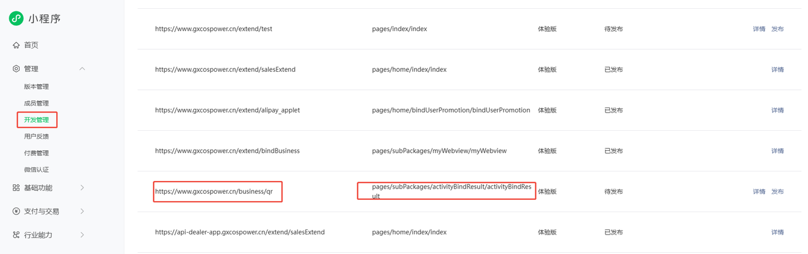

<!--
 * @Description: 
 * @Author: wuyanxia
 * @LastEditTime: 2025-08-08 00:28:49
 * @Date: 2025-08-07 23:48:44
 * @LastEditors: wuyanxia
-->
# 问题和总结汇总
## h5页面长按图片保存埋点
在微信小程序内嵌的H5页面开发中，我遇到了一个关于保存图片埋点的问题：在添加埋点之前，原方案是将加载并保存图片的逻辑绑定在img标签的onLoad事件上，但这一设计导致页面加载时图片onLoad会自动触发。若仅实现保存图片功能，此方案尚可接受；然而，由于埋点统计需求是仅在用户主动保存图片时触发，若将埋点逻辑直接关联至onLoad事件，则会导致页面加载时弹窗弹出即自动触发埋点，这显然与产品需求不符。针对这一问题，我和领导谈论了一下，最终采纳了领导提出的优化方案：通过监听touchStart与touchEnd事件来实现长按保存图片的埋点统计。具体实现方式为：在用户触摸屏幕时（touchStart事件），记录初始时间并启动定时器；若用户在设定时间内未抬起手指（即长按），则触发埋点统计逻辑；当用户手指离开屏幕（touchEnd事件）时，清除定时器以避免不必要的埋点触发。这一方案准确地满足了产品需求，实现了仅在用户长按保存图片时触发埋点统计的功能。
## 在 iOS 系统的微信小程序中，通过长按操作保存图片时，会出现一个带有透明绿色背景的选中状态效果
这实际上是由于系统默认选中了页面中的某个元素导致的视觉干扰。经过查阅相关资料，发现可以通过为相关元素添加以下 CSS 属性来有效解决这一问题：
user-select: none; 用于禁止元素内容被用户选中，避免触发系统默认的文本选中行为；
-webkit-tap-highlight-color: transparent; 则用于消除 iOS 设备上点击或长按元素时产生的透明高亮背景色。
通过同时应用这两条样式规则，即可彻底消除长按保存图片时出现的透明绿色背景，从而提升用户体验的流畅性与视觉一致性。
## 在微信小程序中实现“长按按钮保存图片”功能
由于系统原生仅支持对图片标签的长按操作触发保存到相册的弹窗，我通过结构优化与事件监听巧妙解决了这一交互限制。具体实现方案为：在按钮内部嵌套一个隐藏的  标签（可通过样式控制其不可见或占位），同时为按钮绑定 touchStart 和 touchEnd 事件。当用户长按按钮时，通过 touchStart 事件启动定时器判断长按时长，若达到阈值则动态加载图片（或触发已预加载的  标签的保存逻辑），最终调用系统原生能力唤起保存弹窗；用户松开手指时（touchEnd）则清除定时器以避免误触发。此方案既保留了按钮的标准化交互形态，又通过事件代理实现了对图片长按保存功能的无缝兼容，提升了用户体验与功能完整性。
## App发布外网环境后，app分享d到小程序，点击分享卡片跳转到正式小程序而不是体验版小程序
App发布外网环境后，测试人员在测试过程中发现：通过App分享活动至微信时，点击分享卡片会默认跳转到正式版小程序，而非预期的体验版小程序。经与App开发团队沟通确认，原来在分享功能实现中，针对跳转至小程序（正式版或体验版）的路径，是可以通过特定配置进行灵活设定的。
## chrome会自定将http转成https，导致访问不到http://ccs.costrip.cn:3001
解决办法：进入网址：chrome://net-internals/#hsts，将写入ccs.costrip.cn，点击delete，然后刷新页面，重新访问http://ccs.costrip.cn:3001即可看到


## npm报错：request to https://registry.npm.taobao.org failed, reason certificate has expired （淘宝镜像过期）
淘宝镜像过期
淘宝镜像已经从registry.npm.taobao.org切换到registry.npmmirror.com,旧域名也将停止服务
查看npm镜像源：npm config list
清空缓存：npm cache clean --force
修改镜像源npm config set registry https://registry.npmmirror.com
也可在项目中添加.npmrc文件，设置registry=https://registry.npmmirror.com

## 微信小程序地图bindmarkertap事件会触发bindtap事件
开发者工具有这个问题，但是真机不存在,解决方法：
```
<map
  id="cabinetMap"
  enable-3D="true"
  show-location="true"
  markers="{{markers}}"
  latitude="{{latitude}}"
  longitude="{{longitude}}"
  bindlabeltap="goMapEvent"
  bindmarkertap="goMapEvent"
  bindtap="goMapEvent"
/>
```
节流函数：utils中
```
let timer:any = null;
export const throttle = (fn:Function, wait: number) => {
  let context = this;
  let args:any = arguments;
 
  if (!timer) {
    timer = setTimeout(() => {
      fn.apply(context, args);
      timer = null;
    }, wait)
  }
}
```
```
  goMapEvent(event) {
    throttle(() => this.onTapMap(event), 100);
  },
    onTapMap(e:any) {
    
    if (e) {
      if (e.type === 'markertap') {
        console.log('触发点击marker事件');
      } else {
        console.log('触发点击地图事件');
      }
    }
  },
```
## finclip开发小程序内嵌App管理端迁移地图页面和NFC识别遇到问题及总结
<a href="../public/pdf/管理端迁移地图页面和NFC识别遇到问题及总结.pdf">点击这里查看问题</a>

[管理端迁移地图页面和NFC识别遇到问题及总结](../public/pdf/管理端迁移地图页面和NFC识别遇到问题及总结.pdf)

## 支付宝扫描二维码跳转的页面获取参数和通过分享链接进入获取参数区别
通过分享链接进入，参数在useRouter().params中获取
通过扫描二维码进入，参数实在options.query中，通过解构获取参数
微信小程序获取参数不管是扫描二维码进入还是分享链接进入，获取参数都是通过options.query获取
## 微信小程序扫描二维码跳转绑定页面和支付宝小程序扫描二维码跳转绑定页区别
微信小程序：
首先,需要在开发管理中配置二维码携带的域名对应的跳转路径，这样扫了二维码会跳转到对应的路径下


其次，配置好之后，如果在体验版本下，只能通过删除一条测试连接，然后再配置一条测试连接才能跳转过去，一次只能配置5条


支付宝小程序是在小程序码里面配置二维码携带域名以及扫码后的跳转路径，和微信小程序不同的是，体验版配置好后就生效了。


## 支付宝小程序体验版分享好友后，点击分享卡片报错：访问的页面不存在
小程序分享后，点击分享的卡片会自动跳转到线上版本，如果想要跳转到体验版本，可以在体验版本联调设置中开启联调扫码版本，就会默认跳转到当前版本。

## 七鱼客服迁移使用ysf('open')导致小程序点击返回按钮跳不出的问题
在迁移基于七鱼客服的项目时，我使用 import @neysf/qiyu-web-sdk 的方式在静态资源环境中引入七鱼sdk。开发初期，我遇到了跨域问题，不过凭借已有的跨域解决工具，顺利克服了这一障碍。
完成开发并部署后，我将新域名地址配置到小程序中。当在小程序里点击在线客服时，七鱼客服页面能够正常显示。然而，新的问题随之而来：点击客服页面左上角的返回按钮时，系统默认会跳转到 /kf 路径，而该路径又会自动重定向回七鱼客服页面。经过排查，发现是由于调用 ysf('open') 方法时，最终会改变 location.href，导致浏览器路由栈中多了一次记录，当用户点击左上角返回按钮时，实际返回的是/kf路径，而/kf路径又会加载七鱼 SDK 的页面，进而陷入死循环。为了解决这一问题，我对代码进行了优化，将原本的跳转方式改为使用 location.replace(ysf('url'))。这种方法不会在浏览器路由栈中新增记录，从而确保了左上角返回按钮能够正常工作，用户可以顺利返回上一页面。至此，该问题得到了完美解决。遇到路由跳不出去的问题，要想想是不是浏览器路由栈发生了改变，如果确定是这方面，要减少路由栈的增加。

## 业务员考核系统地图开发中遇到图例数据庞大，全部渲染到地图上导致地图页面卡顿
在开发中遇到图例数据庞大，若将其一次性全部渲染到地图页面上，会引发严重的性能问题，导致页面操作出现明显卡顿，极大影响用户体验与系统流畅度，跟产品及时反馈这个问题后，产品将前后端领导以及开发人员聚齐开会商讨解决方案，最终确定一套解决方案：当比例尺小于200米的时候，拖动地图和缩放地图的时候加载地图中心点的图例数据，不再一次性渲染所有图例数据。按照这一方案实施后，效果立竿见影，地图页面的卡顿问题得到了彻底解决，操作变得流畅自如，用户能够更加顺畅地与地图进行交互。所以在遇到交互问题影响用户体验的时候要及时反馈问题，并积极参与商讨解决方案。

## React相关知识点
[React相关知识点](../public/pdf/React相关知识点介绍.pdf)
