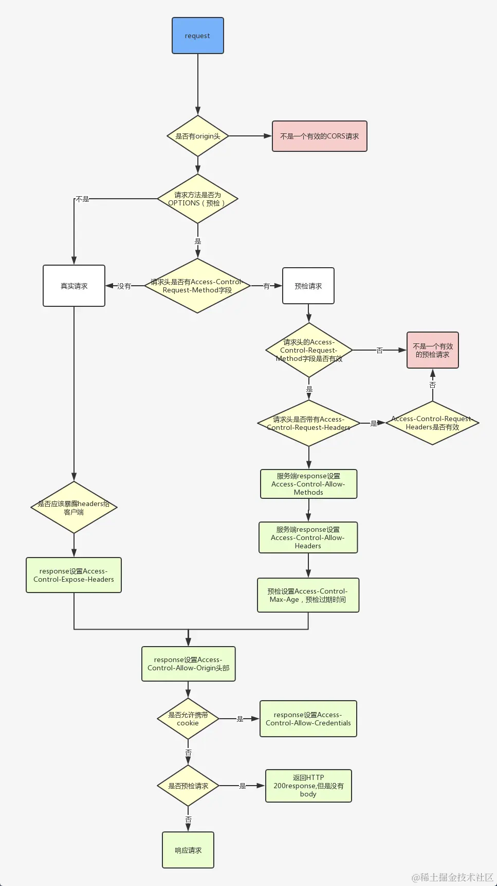
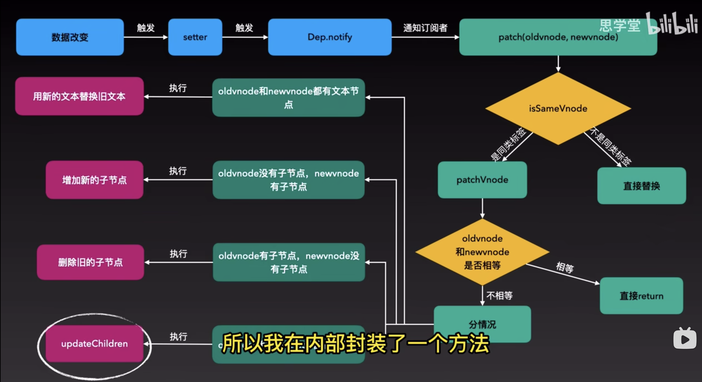
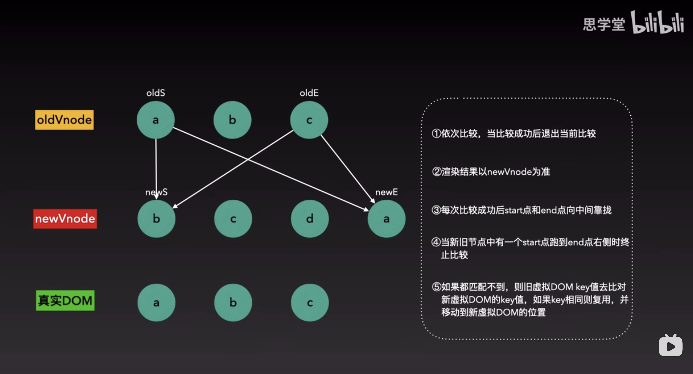
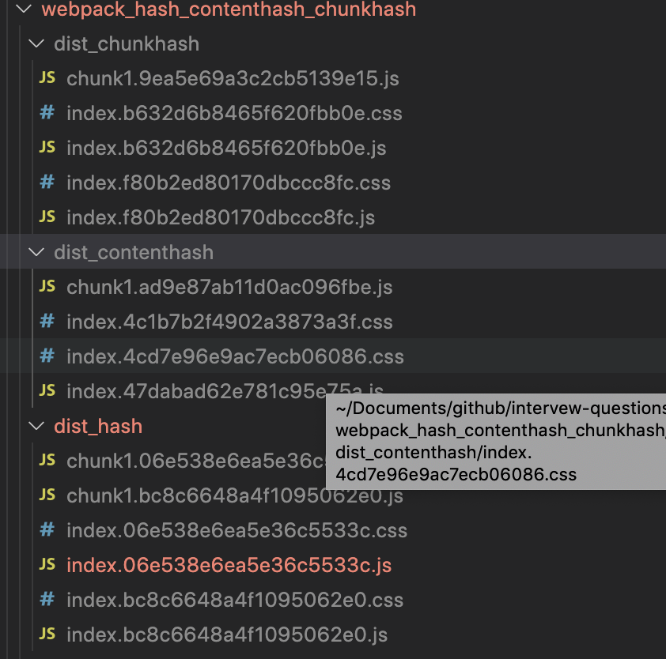
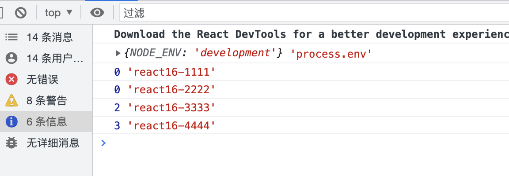
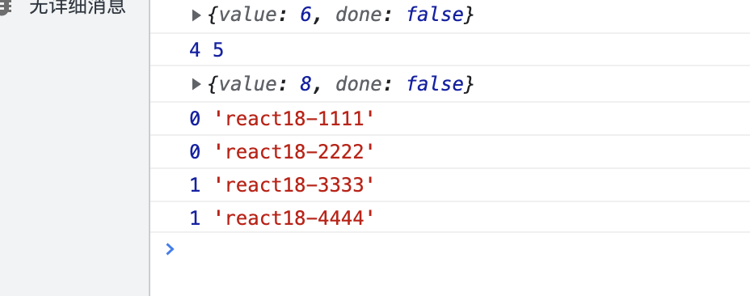
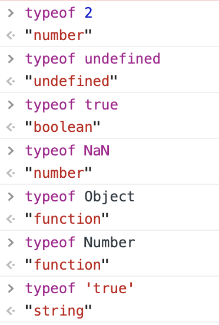
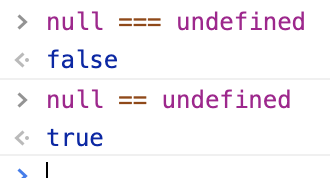
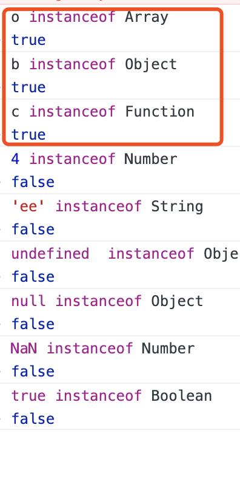

# 前端面试题汇总2
## fetch请求的时候为什么会有一个option请求，这个请求有什么用处?
fetch请求先发一个options请求，这个叫预检请求(preelight)，来确认服务器是否允许接受请求，为了获取服务端设置的跨域配置,然后根据返回的 header 中的信息,来看这个接口允许哪些方法请求,允许携带哪些 header,是否允许当前域名跨域请求等等
options请求出现的情况只有两种：
1. 获取目的资源所支持的通信方式；
2. 跨域请求中，options请求是浏览器发起的prelight request(预检请求)，以检测实际请求是否可以被浏览器接受；
跨域请求分两种：简单请求，复杂请求
符合以下任一情况就是复杂请求，只有复杂的跨域请求才会进行options请求
1. 使用方法PUT或DELETE；
2. 发送json格式的数据（content-type: application/json）；
3. 请求中带有自定义头部
**为什么跨域的复杂请求需要OPTIONS请求?**
复杂请求可能对服务器数据产生副作用。例如delete或者put,都会对服务器数据进行修改,所以在请求之前都要先询问服务器，当前网页所在域名是否在服务器的许可名单中，服务器允许后，浏览器才会发出正式的请求，否则不发送正式请求。
### 整个完整流程:

## Fetch的API用法
fetch是基于Promise设计的，支持async/await,语法简单，更加的语义化,
```js
fetch(url,{
method:'POST', // PUT/GET/DELETE
mode:'cors', // 请求的模式，如 cors、 no-cors 或者 same-origin，cors:发送的是复杂跨域请求，会先发送预检请求（options）,no-cors:发送的是同源请求或简单的跨域请求，same-origin:发送的是同源请求
credentials:'omit'// include/same-origin omit:任何情况都不发送cookie,include:同源或跨域都发送cookie,same-origin:只有同源时发送跨域
headers:{
Authorization: `Bearer ${token}`  //加Bearer就是一种规范，其实不加也是可以的，但是要看后端是怎么解析的，跟后端商量好，Bearer token 是一种安全令牌，有了这个安全令牌就可以在任何地方方式某个接口
},
body:{
},
cache:'no-cache', // default|no-cache|no-store|reload
// default:缓存相同的请求，使用 http 请求中默认的缓存模式
// no-store：总是发送正常请求，且不缓存任何请求
// reload：总是发送正常请求（不检查缓存），再用请求结果更新缓存
// no-cache：有缓存则发送条件请求、无缓存则发送正常请求，再用请求结果更新缓存
// force-cache：有缓存则强制使用缓存（不发送任何请求）、无缓存则发送正常请求再用请求,结果更新缓存
}).then((res) => {

}).catch((err) => {

})
```

## fetch使用的常见问题及解决办法

1. fetch默认不携带cookie
fetch发送请求默认是不发送cookie的，不管是同域还是跨域；那么问题就来了，对于那些需要权限验证的请求就可能无法正常获取数据，这时可以配置其credentials项，其有3个值：
1. omit: 默认值，忽略cookie的发送
2. same-origin: 表示cookie只能同域发送，不能跨域发送
3. include: cookie既可以同域发送，也可以跨域发送

fetch请求对某些错误http状态不会reject
这主要是由fetch返回promise导致的，因为fetch返回的promise在某些错误的http状态下如400、500等不会reject，相反它会被resolve；只有网络错误会导致请求不能完成时，fetch 才会被 reject；所以一般会对fetch请求做一层封装，例如下面代码所示：
```js
function checkStatus(response) {
  if (response.status >= 200 && response.status < 300) {
    return response;
  }
  const error = new Error(response.statusText);
  error.response = response;
  throw error;
}
function parseJSON(response) {
  return response.json();
}
export default function request(url, options) {
  let opt = options||{};
  return fetch(url, {credentials: 'include', ...opt})
    .then(checkStatus)
    .then(parseJSON)
    .then((data) => ( data ))
    .catch((err) => ( err ));
}
```

2. fetch不支持超时timeout处理
fetch不像大多数ajax库那样对请求设置超时timeout，它没有有关请求超时的feature，我们真正需要的是abort()， timeout可以通过timeout+abort方式来实现，起到真正超时丢弃当前的请求。
利用Promise.race方法接受一个promise实例数组参数，表示多个promise实例中任何一个最先改变状态，那么race方法返回的promise实例状态就跟着改变
```js
var oldFetchfn = fetch; //拦截原始的fetch方法
window.fetch = function(input, opts){//定义新的fetch方法，封装原有的fetch方法
    var fetchPromise = oldFetchfn(input, opts);
    var timeoutPromise = new Promise(function(resolve, reject){
        setTimeout(()=>{
             reject(new Error("fetch timeout"))
        }, opts.timeout)
    });
    retrun Promise.race([fetchPromise, timeoutPromise])
}
```
3. fetch不支持JSONP
fetch是与服务器端进行异步交互的，而JSONP是外链一个javascript资源，并不是真正ajax，所以fetch与JSONP没有什么直接关联，当然至少目前是不支持JSONP的,目前比较成熟的开源JSONP实现fetch-jsonp给我们提供了解决方案。

4. fetch不支持progress事件
XHR是原生支持progress事件的，例如下面代码这样：
```js
var xhr = new XMLHttpRequest()
xhr.open('POST', '/uploads')
xhr.onload = function() {}
xhr.onerror = function() {}
function updateProgress (event) {
  if (event.lengthComputable) {
    var percent = Math.round((event.loaded / event.total) * 100)
    console.log(percent)
  }
xhr.upload.onprogress =updateProgress; //上传的progress事件
xhr.onprogress = updateProgress; //下载的progress事件
}
xhr.send();
```
但是fetch是不支持有关progress事件的；不过可喜的是，根据fetch的指导规范标准，其内部设计实现了Request和Response类；其中Response封装一些方法和属性，通过Response实例可以访问这些方法和属性，例如response.json()、response.body等等；值得关注的地方是，response.body是一个可读字节流对象，其实现了一个getRender()方法，其具体作用是：
getRender()方法用于读取响应的原始字节流，该字节流是可以循环读取的，直至body内容传输完成；
因此，利用到这点可以模拟出fetch的progress
```js
// fetch() returns a promise that resolves once headers have been received
fetch(url).then(response => {
  // response.body is a readable stream.
  // Calling getReader() gives us exclusive access to the stream's content
  var reader = response.body.getReader();
  var bytesReceived = 0;


  // 接受一个值时返回promise
  reader.read().then(function processResult(result) {
    // Result objects contain two properties:
    // done  - true if the stream has already given you all its data.
    // value - some data. Always undefined when done is true.
    if (result.done) {
      console.log("Fetch complete");
      return;
    }

    // result.value for fetch streams is a Uint8Array
    bytesReceived += result.value.length;
    console.log('Received', bytesReceived, 'bytes of data so far');

    // Read some more, and call this function again
    return reader.read().then(processResult);
  });
});
```

4. fetch跨域问题
要满足浏览器端支持CORS，服务器通过Access-Control-Allow-Origin来允许指定的源进行跨域，仅此一种方式。
fetch浏览器支持不好
一些低版本的的浏览器IE，Edge浏览器不支持，可以使用fetch+polyfill,项目中常用whatwg-fetch，


## html5标签语义化，section和article区别

HTML语义化就是指在使用HTML标签构建页面时，避免大篇幅的使用无语义的标签，使用有语义化的标签有利于页面内容结构化，利于css页面可读，利于SEO，利于代码可读。
语义化的标签有：header,footer,nav,aside,article,time,section,mark等，这些语义化的标签一看就知道代表意思，更容易理解。

## css3动效有哪些
transform,translate, rotate,skew,animation,svg, canvas,transition
## 怎么处理token过期问题
15分钟之内如果没有操作自动退出登录，如果15分钟之内有被操作，重置登录过期时间
后端设置过期时间900s,登录之后存储过期时间expries和登录时间loginTime，全局添加点击事件，点击的时候记录当前时间currentTime,计算
diffTime = (currentTime - loginTime) / 1000 ，判断diffTime 和 expriesTime / 10 , diffTime和expriesTime的大小，分三种情况：

1. 0-90s内点击，如果diffTime > 0 && diffTime < expriesTime / 10 ,记录window.flag=true,记录window.diffTime=diffTime
设置延时器，let timeout = SetTimeout(() => {
// refreshToken()
},expriesTime - window.diffTime)
2. 90s之后点击：如果diffTime >= expriesTime / 10 && diffTime < expriesTime,这就说明还在15分钟之内，但是大于90s需要重新请求token和expries,loginTime,并重置全局变量，记录window.flag=false,记录window.diffTime=0,timeout = null
3. 900s之后点击：如果diffTime > expriesTime，说明已经过期，直接跳出登录。


可不可以全局定义一个最后一次点击时间lastClickTime，设置一个延时器，expriesTime - lastClickTime - 10000,到达这个时间就请求token，只要点击就清除延时器，重新创建延时器，expriesTime - lastClickTime <= 10,立刻调用refreshToken

## 用css对一个span标签绘制关闭按钮
```css
 <style>
        div {
            width: 40px;
            height: 40px;
            border: 1px solid #eee;
            position: relative;
        }

        .close::before {
            transform: rotate(45deg);
        }

        .close::after {
            transform: rotate(-45deg);
        }

        .close::before,
        .close::after {
            content: '';
            position: absolute;
            height: 2px;
            width: 100%;
            top: 50%;
            left: 0;
            margin-top: -1px;
            background: grey;
        }
    </style>
```

## react-router和node的router的区别
一个匹配 http request 一个匹配 window.location
## react中为什么要引入immutable.js?
immutable Data一旦被创建就不能被修改，对Immutable对象所有的修改或添加删除操作都会返回一个新的Immutable对象，他实现的原理是持久化数据结构，也就是说在使用旧数据创建新数据的时候要保证新数据可用且不变，同时避免了deepCopy带来的性能损耗，且immutable使用共享结构，就是如果对象中一个节点发生变化，只修改这个节点和受它影响的父节点，其他节点共享，这样可大大提升性能。
[immutable常用API](../src/questions/immutable.js)

## 为什么选择react作为主框架？对比vue和angular有什么优点？
### React
react就是个javascript框架，它相对于mvc来说只是一个v，react具有较高的性能，代码逻辑简单，有如下优点：
1. 组件化：代码更加模块化，重用代码更容易
ReactJS 是一个基于组件的架构。应用程序是使用组件构建的，其中每个组件都有其逻辑和控件。组件可复用性高，而且哪个组件出了问题，可以很方便的隔离。
2. jsx语法：使用声明式语法JSX来重新定义视图开发
JSX 代表 Javascript XML。它是 Javascript 和 Html 的融合。它是一种类似于 HTML 的标记语法，用于描述应用程序的 UI 外观。总体上使代码易于理解和调试，避免了复杂的 javascript DOM 结构。
3. 高效：虚拟dom加diff算法减少dom操作来提高渲染性能
我们之前修改dom是通过document.getElementById()之类的方式，修改DOM元素，速度慢且性能低，而虚拟dom只是一个简单的js对象，最少包含tag,props,children三个属性，用js对象模拟DOM节点，操作内存中的js对象要比直接修改真实dom要快的多，等更新完虚拟DOM,再将虚拟DOM对象映射为真实DOM，最后交给浏览器渲染。这种方式对局部DOM进行更新，UI渲染过程速度快。
```js
let element = {
    tag: 'ul',
    props: {
        id: 'list'
    },
    children: [
        {
            tag: 'li',
            props: {
                id: 'item-0'
            },
            children: ['第一个li标签']
        },
        {
            tag: 'li',
            props: {
                id: 'item-1'
            },
            children: ['第二个li标签']
        },
    ]
}

```
4. 单向数据流
数据在整个应用程序中单向流动，可提供更大的灵活性并提高应用程序的效率。
单向数据绑定的显着优势在于它在应用程序中提供了更好的控制。
5. 将DOM操作抽象为状态的改变 
6. 灵活
react可以与已知的库很好的结合使用

缺点：
1. React本身只是一个V而已，并不是一个完整的框架，所以如果是大型项目想要一套完整的框架的话，基本都需要加上ReactRouter和Redux或Mobx才能写大型应用。
2. React库更新频繁，不向前兼容

### vue:
Vue是尤雨溪编写的一个构建数据驱动的Web界面的库，准确来说不是一个框架，它聚焦在V（view）视图层。
特性：
1. 轻量级框架
2. 双向数据绑定
3. 指令
4. 插件化
优点：
1. 简单 官方文档很清晰，比 Angular 简单易学
2. 快速：异步批处理方式更新 DOM。
3. 组合：用解耦的、可复用的组件组合应用程序。
4. 紧凑：~18kb min+gzip，且无依赖。
5. 强大：表达式 无需声明依赖的可推导属性 (computed properties)。
6. 对模块友好：可以通过 NPM、Bower 或 Duo 安装。
缺点：
影响度不是很大
不支持IE8
### Angular:
它有以下的特性：
1. 良好的应用程序结构
2. 双向数据绑定
3. 指令
4. HTML模板
5. 可嵌入、注入和测试
优点：
1. 模板功能强大丰富，自带了极其丰富的angular指令。
2. 是一个比较完善的前端框架，包含服务，模板，数据双向绑定，模块化，路由，过滤器，依赖注入等所有功能；
3. 自定义指令，自定义指令后可以在项目中多次使用。
4. ng模块化比较大胆的引入了Java的一些东西（依赖注入），能够很容易的写出可复用的代码，对于敏捷开发的团队来说非常有帮助。
5. angularjs是互联网巨人谷歌开发，这也意味着他有一个坚实的基础和社区支持。
缺点：
1. angular 入门很容易 但深入后概念很多, 学习中较难理解.
2. 文档例子非常少, 官方的文档基本只写了api, 一个例子都没有, 很多时候具体怎么用都是google来的, 或直接问misko,angular的作者.
3. 对IE6/7 兼容不算特别好, 就是可以用jQuery自己手写代码解决一些.
4. 指令的应用的最佳实践教程少, angular其实很灵活, 如果不看一些作者的使用原则,很容易写出 四不像的代码, 例如js中还是像jQuery的思想有很多dom操作.
5. DI 依赖注入 如果代码压缩需要显示声明.

## react使用map遍历的时候为什么要加上key值
因为react中渲染dom是通过render方式，也就是通过虚拟的dom与真实的存在的dom树比较之后发现哪不一样，再进行渲染，这样的渲染对于性能的提升很有帮助，所以键值在保证稳定性,唯一性的时候，在遍历寻找需要改变的地方时候就能很块的找见并对其进行操作，如果键值不是稳定的而是变化的就会使渲染更改dom的效率大大的打折。
## 为什么要给每个动态子项添加一个key？？？
我们都知道在写动态子组件的时候如果没有给每个动态子组件一个key时，他就会报出一个警告：
warning:Each child in an array or iterator should have a unique "key" prop.Check the render method of 'APP'. See .......
这个警告指的是，如果每一个组件是一个数组或迭代器的话，那么必须有一个唯一的key prop。

react利用key来识别组件，它是一种身份标识。keys是react用于追踪哪些列表中元素被修改、被添加或者被移除的辅助标识。
key用来标识当前项的唯一性的props
## eval使用
```js
function foo(str, a) {
  eval(str)
  console.log(a, b)
}

var b = 2;
foo('var b = 3', 1)//输出1，3
```

eval(...)函数可以接受一个字符串为参数，并将其中的内容视为好像在书写时就存在程序中这个位置的代码，换句话说，可以在你的代码中用程序生成代码并运行，就好像代码是写在那个位置的一样。
既然eval(...)使代码运行在那里，那么就类似于：
```js
function foo(str, a) {
  var b = 3;
  console.log(a, b)
}

var b = 2;
foo('var b = 3', 1)
```
这样就出现了内层作用域遮蔽外层作用域
在严格模式的程序中，eval(...)在运行时有其自己的词法作用域，意味着其在声明无法修改所在的作用域。


## 请写出下面代码的运行结果,为什么
```js
async function async1() {
    console.log('async1 start');
    await async2();
    console.log('async1 end');
}
async function async2() {
    console.log('async2');
}
console.log('script start');
setTimeout(function() {
    console.log('setTimeout');
}, 0)
async1();
new Promise(function(resolve) {
    console.log('promise1');
    resolve();
}).then(function() {
    console.log('promise2');
});
console.log('script end');
```

顺序：script start > async1 start > async2 > promise1 > script end > async1 end > promise2 > setTimeout
## 使用迭代的方式实现 flatten 函数。扁平化并去重算法题
编写一个程序将数组扁平化去并除其中重复部分数据，最终得到一个升序且不重复的数组
```js
var arr = [ [1, 2, 2], [3, 4, 5, 5], [6, 7, 8, 9, [11, 12, [12, 13, [14] ] ] ], 10];
```
```js
const obj = {} // 去重使用
function flat (arr, newArr) {
  arr.map((item) => {
    if (item instanceof Array) { // 判断是否为数组，为数组就调用flat函数
      flat(item, newArr)
    } else { // 不为数组
      if (!obj[item]) { // 不为数组要看是否obj已存在，不存在push
        newArr.push(item)
        obj[item] = true
      }

    }
  })
  return newArr
}

var arr = [[1, 2, 2], [3, 4, 5, 5], [6, 7, 8, 9, [11, 12, [12, 13, [14]]]], 10]
const data = flat(arr, [])
let newData = data.sort((a, b) => a - b)
console.log(data, newData, 'kkk')
```


## 两个数组合并成一个数组

请把两个数组 ['A1', 'A2', 'B1', 'B2', 'C1', 'C2', 'D1', 'D2'] 和 ['A', 'B', 'C', 'D']，合并为 ['A1', 'A2', 'A', 'B1', 'B2', 'B', 'C1', 'C2', 'C', 'D1', 'D2', 'D']。
```js
const arr1 = ['A1', 'A2', 'B1', 'B2', 'C1', 'C2', 'D1', 'D2']
const arr2 =  ['A', 'B', 'C', 'D']
let newArr = arr1.concat(arr2.map((item) => item+'3')).sort()
newArr = newArr.map((item) => {
if(item.includes(3)) {
return item.slice(0,-1)
}else {
return item
}
})
console.log(newArr)
```
##  改造下面的代码，使之输出0 - 9，写出你能想到的所有解法。
```js
for (var i = 0; i< 10; i++){
function a(i) {
	setTimeout(() => {
		console.log(i);
    }, 1000)
}
a(i)

}
```
## Virtual DOM 真的比操作原生 DOM 快吗？谈谈你的想法
虚拟DOM实际上就是一个对象，对象里面至少有element,props,children等属性，通过对比新旧虚拟DOM的变化，来更新真实dom,实际上是js操作对象，要比js直接操作真是dom要快的多

## 下面的代码打印什么内容，为什么？
```js
var b = 10;
(function b(){
    b = 20;
    console.log(b); 
})();
```


## 下面代码中 a 在什么情况下会打印 1？
```js
var a = ?;
if(a == 1 && a == 2 && a == 3){
 	console.log(1);
}
```
## React中子组件如果不想通过一级一级单项数据流传递props拿到父组件的值，还有什么办法可以拿到？
通过createContext,useContext
通过redux
## for...in,for...of 区别
1. for in 和 for of 都可以循环数组，for in 输出的是数组的index下标，而for of 输出的是数组的每一项的值。
```js
const arr = [1,2,3,4]
// for ... in
for (const key in arr){
    console.log(key) // 输出 0,1,2,3
    }
// for ... of
for (const key of arr){
    console.log(key) // 输出 1,2,3,4
    }
```

2. for in 可以遍历对象，for of 不能遍历对象，只能遍历带有iterator接口的，例如Set,Map,String,Array
```js
const object = { name: 'lx', age: 23 }
    // for ... in
    for (const key in object) {
      console.log(key) // 输出 name,age
      console.log(object[key]) // 输出 lx,23
    }
 
    // for ... of
    for (const key of object) {
      console.log(key) // 报错 Uncaught TypeError: object is not iterable
    }

```
## 装饰器
Decorator 是 ES7 的一个新语法，正如其“装饰器”的叫法所表达的，他可以对一些对象进行装饰包装然后返回一个被包装过的对象，可以装饰的对象包括：类，属性，方法等。Decorator 的写法与 Java 里的注解（Annotation）非常类似，但是一定不要把 JS 中的装饰器叫做是“注解”，因为这两者的原理和实现的功能还是有所区别的，在 Java 中，注解主要是对某个对象进行标注，然后在运行时或者编译时，可以通过例如反射这样的机制拿到被标注的对象，对其进行一些逻辑包装。而 Decorator 的原理和作用则更为简单，就是包装对象，然后返回一个新的对象描述（descriptor），其作用也非常单一简单，基本上就是获取包装对象的宿主、键值几个有限的信息。
简单来说，JS 的装饰器可以用来“装饰”三种类型的对象：类的属性/方法、访问器、类本身，简单看几个例子吧。
```js
// decorator 外部可以包装一个函数，函数可以带参数
function Decorator(type){
    /**
     * 这里是真正的 decorator
     * @target 装饰的属性所述的类的原型，注意，不是实例后的类。如果装饰的是 Car 的某个属性，这个 target 的值就是 Car.prototype
     * @name 装饰的属性的 key
     * @descriptor 装饰的对象的描述对象
     */
    return function (target, name, descriptor){
        // 以此可以获取实例化的时候此属性的默认值
        let v = descriptor.initializer && descriptor.initializer.call(this);
        // 返回一个新的描述对象，或者直接修改 descriptor 也可以
        return {
            enumerable: true,
            configurable: true,
            get: function() {
                return v;
            },
            set: function(c) {
                v = c;
            }
        }
    }
}
```
## 前端性能优化
### 1. js层面
1. 减少资源文件的加载；用icon替代图片，用webp替代png/jpg/jpeg图片，用精灵图，或者压缩图片，或者用base64，data url添加图片，可以在webpack中配置
2. 减少http请求，可以使用缓存数据
3. 减少回流重绘，可以是dom元素脱离文档流，再对dom进行修改，等完全修改完再改回文档流
4. 分页
5. 懒加载，花瓣网瀑布流


### 2.webpack性能优化
1. 减少资源文件的加载。配置loader的时候，type类型设置'asset',parser中配置dataUrlCondition，设置maxSize,这样就可以根据图片资源大小在资源文件和base64文件之间进行自由选择，如下配置：
```js
{
          test: /\.webp$/,
          type: 'asset', // 设置asset就是在资源文件和base64文件之间可以自由选择，主要取决于临界值maxSize，这是一个通用的资源类型，他是在resource类型和inline类型之前来回转换
          parser: {
            dataUrlCondition: {
              maxSize: 4 * 1024 * 1024, // 最大值4M,当图片大小大于4M就生成资源文件，当图片小于4M就生成base64各式图片
            },
          },
}
```
2. 减少包构建大小。开发过程中使用BundleAnalyzerPlugin，配置好之后，这样项目启动后在页面中可以看到每个文件的体积大小，可以根据文件体积大小对文件进行优化。
3. 如果有必要更新node版本和webpack版本。
4. 进行代码分割提取，只编译当前业务代码，把第三方类库和更新不频繁的共享代码单独编译，可提高编译速度，比如在optimization中的splitChunks中的cacheGroups中配置vendor，commons等
5. 最小化chunk，配置optimization中runtimeChunk为single
6. 删除无用的loader和plugin
7. 开发环境devtool配置devtool:'eval-cheap-module-source-map',既可以锁定源码行数，又可以单独打包sourceMap文件，只有行信息无列信息，减少打包文件大小，生产环境配置devtool:false
8. 文件资源缓存，打包文件输出的时候配置contenthash，这样如果修改了css文件，重新打包的时候，只有css文件重新单独打包出来hash，其他没有变化的js文件的hash将不再发生变化，加快打包速度。
9. 使用webpack的tree-shaking功能，webpack可以通过在package.json设置sideEffects: false,开启tree shaking,使用比如lodash的时候可以这样 import {join,throttle,debounce} from 'lodash'
10. 在都满足使用的前提下，选择第三方库的时候选择体积小的库，比如lodash,lodash-es：
lodash 是默认的 commonjs 版本，是为了良好的浏览器兼容性, 它使用了旧版es5的模块语法，体积大。
lodash-es 是 lodash 的 es modules 版本 ，是着具备 ES6 模块化的版本，体积小。
### 2. react
1. render里面尽量减少新建变量和bind函数，传递参数是尽量减少传递参数的数量。
绑定this可以选择在constructor中绑定this,因为这里绑定只执行一次，在render中bind(this),每次render都会执行一次，如果使用箭头函数，每次render都会生成新的箭头函数，这样对比，在constructor中绑定this是性能最好的。
2. 使用shouldComponentUpdate,确定好在什么变量发生改变的时候再进行render
3. 使用PureComponent，PureComponent和Component相比几乎一样，只是PureComponent仅仅比Component对state和props进行了一层浅比较，可以减少渲染次数，提高渲染速度,PureComponent一般会用在一些纯展示组件上。
使用pureComponent的好处：当组件更新时，如果组件的props或者state都没有改变，render函数就不会触发。省去虚拟DOM的生成和对比过程，达到提升性能的目的。这是因为react自动做了一层浅比较。
4. 使用immutable持久化数据结构.immutable对象一旦创建就不可改变，对immutable的任何增加，修改，删除，都会生成一个新的immutable对象，**他实现的原理是持久化数据结构**，也就是说在使用旧数据创建新数据的时候要保证新数据可用且不变，同时避免了deepCopy带来的性能损耗，且immutable使用**共享结构**，就是如果对象中一个节点发生变化，只修改这个节点和受它影响的父节点，其他节点共享，这样可大大提升性
能。
6. 使用React.lazy按需加载组件，React.Suspense使用或者使用react-loadable,按需加载组件
```js
import Loadable from 'react-loadable'
const NewComponent = Loadable({
loader:() => import('./Component'),
loading:<Loading/>
})
```
```js
import React from 'react'
const NewComponent = React.lazy(() => import('./Component'))
<React.Suspense>
<NewComponent/>
</React.Suspense>
```
6. 为频繁触发事件添加节流和防抖函数，减少频繁点击触发带来的性能损耗
7. react hooks中使用useMemo()减少不必要的渲染，减少子组件重复执行
8. 使用memo包裹函数组件，可以对state和props进行浅比较，减少不必要的渲染

## Module和commonjs的区别
module是es6的语法，commonjs主要是是针对服务端js，也就是node中使用的
1. 两者的模块导入导出语法不同，commonjs是module.exports，exports导出，require导入；ES6则是export导出，import导入。
2. module属于编译时加载，也就是静态加载，在编译时就能确定模块的依赖关系，以及输入和输出的变量；commonjs属于运行时加载，只有代码在运行时才能确定这些东西。
3. module输出的是值的引用，commonjs输出的是值的拷贝。
4. module中的this是指 undefined，commonjs的this是指的是当前模块
5. module中的import是异步加载，commonjs中的require是同步加载
6. ES6在编译期间会将所有import提升到顶部，commonjs不会提升require
7. module可以做到tree-shaking，也就是可以加载模块部分用到的内容，commonjs需要加载整个模块，再取内容。
8. 然后就是commonjs中的一些顶层变量在ES6中不再存在：arguments，require，module，exports，__filename，__dirname

## new Promise中return一个new Promise，那么输出的的是什么？
输出还是一个Promise对象 


## diff算法 ???
diff算法即差异查找算法,本质就是比较两个js对象的差异，如果更新了dom，那么新旧两个虚拟dom之间存在一定差异的，如果能快速找到这两个js对象之间的差异，就可以最小化更新视图



https://www.bilibili.com/video/BV1JR4y1R7Ln/?spm_id_from=333.337.search-card.all.click&vd_source=a9500e67f039ff71904b8763e3dde4bb
updateChildren采用**首尾指针法**，渲染以新虚拟节点的结果为准
1.旧节点的start和新节点的start对比，对比相同，退出比较，对比不同，再拿旧节点的start和新节点的end对比，对比相同，
每次比对成功后，对比成功的start向右1移动，end向左移动
如果仍然没有比较成功，就要看虚拟节点的key值了，如果key相等就复用，并按照新虚拟节点的位置移动到对应位置，


## 立即执行函数
```js
(function foo() {
    console.log(2)
})()

(foo = () => {
    console.log(3)
})()
//第二种箭头函数方式的是错误的写法
```
## 三个dom元素，现在要删除最后一个，都经历了哪些生命周期
shouldComponentUpdate -UNSAFE_componentWillUpdate - render -componentDidUpdate


## 性能检测工具
## .基本数据类型有哪些？怎样去检测他们？
```js
// 基础数据类型 Number，String,Boolean,Undefined,Null,Symbol
// 引用数据类型  Array,Object,Function,Set,Map
const num = 2
const str = 'aaa'
const boolean = false
const symbol = Symbol()
let obj = {}
let arr = []
let set = new Set()
let map = new Map()
function fn () { }
console.log(typeof num, 'number')
console.log(typeof str, 'string')
console.log(typeof boolean, 'boolean')
console.log(typeof undefined, 'undefined')
console.log(typeof null, 'object')
console.log(typeof symbol, 'symbol')
console.log(obj instanceof Object, 'true')
console.log(arr instanceof Array, 'true')
console.log(fn instanceof Function, 'true')
console.log(set instanceof Set, 'true')
console.log(map instanceof Map, 'true')
console.log(Object.prototype.toString.call(arr), 'object Array')
console.log(Object.prototype.toString.call(obj), 'object Object')
console.log(Object.prototype.toString.call(fn), '[object Function]')
console.log(Object.prototype.toString.call(2), '[object Number]')
console.log(Object.prototype.toString.call('string'), '[object String]')
console.log(Object.prototype.toString.call(undefined), '[object Undefined]')
console.log(Object.prototype.toString.call(null), '[object Null]')
console.log(Object.prototype.toString.call(true), '[object Boolean]')
console.log(Object.prototype.toString.call(Symbol()), '[object Symbol]')
console.log(Object.prototype.toString.call(set), '[object Set]')
console.log(Object.prototype.toString.call(map), '[object Map]')
```
## 谈谈reactHooks的钩子？
useEffect,useState,useMemo,useContext,useCallback
## connect的参数
connect()

## 怎么决定一个状态是否放到store中
看这个状态跟全局别的组件有没有关联，如果有关联就放到store中，如果没有关联就放到state
## forEach,for循环和map的区别
|forEach|map|for|
|--|--|--|
|返回值|undefined|原数组|--|
|链式调用| 不可以链式调用|可以链式调用|--|
|没有办法终止或者跳出forEach()循环，除非抛出异常，所以想执行一个数组是否满足什么条件，返回布尔值，可以用一般的for循环实现，或者用Array.every()或者Array.some();|--|--|
## bind
```js
export default class App extends React {
    constructor (){
        this.onClick = this.onClick.bind(this);
    }

    onClick (){
        console.log('点击了按钮');
    }

    render (){
        return <div>
            <button onClick={this.onClick}>点击</button>
        </div>;  
    }  
}
```
我们不在render方法中button组件的 onClick 事件上直接写箭头函数的或者进行 bind 操作的原因是：这两种方式会在 render 方法每次执行的时候都执行一次，要不就是创建一个新的箭头函数或者重新执行一次 bind 方法。但回调函数的内容却从未改变过，因此这些重复的执行均为非必要的，上严格上来讲，存在有性能上的不必要的损耗。鉴于 constructor 只会执行一次，所以把 bind 操作放置于此是十分正确的处理方式。
对于上述例子，使用Hook方式应该如此：
```js
export default function App (){
    const onClick = useCallback(() => {
        console.log('点击了按钮');
    }, []);    

    return <>
        <button onClick={onClick}>点击</button> 
    </>;  
}
```

## component和PureComponent,还有memo的区别
https://www.jianshu.com/p/b3d07860b778
正常情况下我们创建一个组件通过ES6的class关键字和React.Component，但是有时候我们会用到PureComponent来创建组件,React.PureComponent 与 React.Component 几乎完全相同，只是他们俩主要的区别就是React.PureComponent会对props和state进行浅比较来实现shouldComponentUpdate，而Component并没有这样的功能
PureComponent只能在ES6语法class定义的组件中使用；一般在纯组件中用PureComponent比较多
而memo同样也是帮助我们控制渲染组件的，也是对state和props进行浅比较来实现shouldComponentUpdate，但是在使用PureComponent只能在es6 中的class组件使用，但memo却可以在function Component中使用。从这点也可以看出，react中会增加对Hook的重视。
React.memo 为高阶组件。它与 React.PureComponent 非常相似，但它适用于函数组件，但不适用于 class 组件。
```js
function MyComponent(props) {
  /* 使用 props 渲染 */
}
function areEqual(prevProps, nextProps) {
  /*
  如果把 nextProps 传入 render 方法的返回结果与
  将 prevProps 传入 render 方法的返回结果一致则返回 true，
  否则返回 false
  */
}
export default React.memo(MyComponent, areEqual);
```
此方法仅作为性能优化的方式而存在。但请不要依赖它来“阻止”渲染，因为这会产生 bug。
注意
与 class 组件中 shouldComponentUpdate() 方法不同的是，如果 props 相等，areEqual 会返回 true；如果 props 不相等，则返回 false。这与 shouldComponentUpdate 方法的返回值相反。
shouldComponentUpdate是如果props不相等，则返回true，相等则返回false
## 假如有成千上万条数据，你是怎么处理的
懒加载，分页，分批加载，懒加载。监听用户的滑动分批显示数据。
通过worker来做子线程来实现的
## require和import的区别

遵循规范
–require 是 AMD规范引入方式
–import是es6的一个语法标准，如果要兼容浏览器的话必须转化成es5的语法
 
调用时间
–require是运行时调用，所以require理论上可以运用在代码的任何地方
–import是编译时调用，所以必须放在文件开头
 
本质
–require是赋值过程，其实require的结果就是对象、数字、字符串、函数等，再把require的结果赋值给某个变量
–import是解构过程，但是目前所有的引擎都还没有实现import，我们在node中使用babel支持ES6，也仅仅是将ES6转码为ES5再执行，import语法会被转码为require
require时代的模块
node编程中最重要的思想之一就是模块，而正是这个思想，让JavaScript的大规模工程成为可能。模块化编程在js界流行，也是基于此，随后在浏览器端，requirejs和seajs之类的工具包也出现了，可以说在对应规范下，require统治了ES6之前的所有模块化编程，即使现在，在ES6 module被完全实现之前，还是这样。
node的module遵循CommonJS规范，requirejs遵循AMD，seajs遵循CMD，虽各有不同，但总之还是希望保持较为统一的代码风格。
## 高阶函数在react中的应用，装饰器
## 手写一个reduce
```js
export default function(initialState, reducerMap) {
    return (state = initialState, action) => {
        const reducer = reducerMap[action.type];
        return reducer ? reducer(state, action) : state;
    };
}

//createReducer就是上面 一段代码
import createReducer from 'app/utils/createReducer';
import { SET_U3D_VIEW_DATA } from 'app/constant/Topology';

export default createReducer(
    {
        u3dViewData: {
            level: 0,
            nodeId: 0
        }
    }, {
        [SET_U3D_VIEW_DATA]: (state, action) => {
            const {payload} = action;
            const {u3dViewData} = state;
            return Object.assign({}, {...state}, {
                u3dViewData: Object.assign({}, {...u3dViewData}, payload)
            });
        }
    }
)
```
## Array.isArray的原理
```js
Array.myIsArray = function(o){
   return Object.prototype.toString.call(Object(o)) === '[object Array]'
}
```
## 区分一下call里面有Object和没有Object的情况


## content-type的类型有哪些
text/plain 　　　　　　　　文本类型
text/css  　　　　　　　　 css类型
text/html 　　 　　　　　　html类型
application/x-javascript 　　js类型
application/json　　　　　 json类型，序列化后的 JSON 字符串，最常用，特别适合 RESTful 的接口
image/png jpg gif　　　　　 image/*    
application/x-www-form-urlencoded：form表单类型 ，浏览器的原生form表单
multipart/form-data：我们使用表单上传文件时，必须让 form 的 enctype 等于这个值
text/xml:是一种使用 HTTP 作为传输协议，XML 作为编码方式的远程调用规范

## js even loop事件循环机制:指计算机系统的一种运行机制；
javascript语言就是采用这种机制，来解决单线程运行带来的一些问题
## JS判断是否是数组的四种做法

## 判断对象是否是数组的几种方式
1.通过instanceof判断
instanceof运算符用于检验构造函数的prototype属性是否出现在对象的原型链中的任何位置，返回一个布尔值。
```js
let a = [];
a instanceof Array; //true
let b = {};
b instanceof Array; //false
```
在上方代码中，instanceof运算符检测Array.prototype属性是否存在于变量a的原型链上，显然a是一个数组，拥有Array.prototype属性，所以为true。
存在问题：
需要注意的是，prototype属性是可以修改的，所以并不是最初判断为true就一定永远为真。
其次，当我们的脚本拥有多个全局环境，例如html中拥有多个iframe对象，instanceof的验证结果可能不会符合预期，例如：
```js
//为body创建并添加一个iframe对象
var iframe = document.createElement('iframe');
document.body.appendChild(iframe);
//取得iframe对象的构造数组方法
xArray = window.frames[0].Array;
//通过构造函数获取一个实例
var arr = new xArray(1,2,3); 
arr instanceof Array;//false
```

导致这种问题是因为iframe会产生新的全局环境，它也会拥有自己的Array.prototype属性，让不同环境下的属性相同很明显是不安全的做法，所以Array.prototype !== window.frames[0].Array.prototype，想要arr instanceof Array为true，你得保证arr是由原始Array构造函数创建时才可行。
2.通过constructor判断
我们知道，实例的构造函数属性constructor指向构造函数，那么通过constructor属性也可以判断是否为一个数组。
```js
let a = [1,3,4];
a.constructor === Array;//true
```
同样，这种判断也会存在多个全局环境的问题，导致的问题与instanceof相同。
```js
//为body创建并添加一个iframe标签
var iframe = document.createElement('iframe');
document.body.appendChild(iframe);
//取得iframe对象的构造数组方法
xArray = window.frames[window.frames.length-1].Array;
//通过构造函数获取一个实例
var arr = new xArray(1,2,3); 
arr.constructor === Array;//false
```
3.通过Object.prototype.toString.call()判断
 Object.prototype.toString().call()可以获取到对象的不同类型，例如
let a = [1,2,3]
Object.prototype.toString.call(a) === '[object Array]';//true

它强大的地方在于不仅仅可以检验是否为数组，比如是否是一个函数，是否是数字等等
```js
//检验是否是函数
let a = function () {};
Object.prototype.toString.call(a) === '[object Function]';//true
//检验是否是数字
let b = 1;
Object.prototype.toString.call(a) === '[object Number]';//true
```
甚至对于多全局环境时， Object.prototype.toString().call()也能符合预期处理判断。
```js
//为body创建并添加一个iframe标签
var iframe = document.createElement('iframe');
document.body.appendChild(iframe);
//取得iframe对象的构造数组方法
xArray = window.frames[window.frames.length-1].Array;
//通过构造函数获取一个实例
var arr = new xArray(1,2,3); 
console.log(Object.prototype.toString.call(arr) === '[object Array]');//true
```

4.通过Array.isArray()判断
```js
//Array.isArray() 用于确定传递的值是否是一个数组，返回一个布尔值。
let a = [1,2,3]
Array.isArray(a);//true
```
简单好用，而且对于多全局环境，Array.isArray() 同样能准确判断，但有个问题，Array.isArray() 是在ES5中提出，也就是说在ES5之前可能会存在不支持此方法的情况。怎么解决呢？

## 判断数组方法的最终推荐
 当然还是用Array.isArray()，从ES5新增isArray()方法正是为了提供一个稳定可用的数组判断方法，不可能专门为此提出的好东西不用，而对于ES5之前不支持此方法的问题，我们其实可以做好兼容进行自行封装，像这样：
```js
 if (!Array.isArray) {
  Array.isArray = function(arg) {
    return Object.prototype.toString.call(arg) === '[object Array]';
  };
}
```
## 判断是对象的方法：

## 判断是函数的方法

## 常用的linux命令
## 介绍react
## reduce方法 
```js
var newArr = arr.reduce(function (prev, cur) {
    //prev.indexOf(cur) === -1 && prev.push(cur);
    //或者  
    !prev.includes(cur) && prev.push(cur)
    return prev;
},[]);
```
## 对象数组如何去重？
这个题目不只一家公司问到了，开始的时候一脸懵逼，心里想着每个对象的内存地址本身就不一样，去重的意义何在，非要去重的话，那只能通过JSON.stringify序列化成字符串(这个方法有一定的缺陷)后进行对比，或者递归的方式进行键-值对比，但是对于大型嵌套对象来说还是比较耗时的，所以还是没有答好，后来面试官跟我说是根据每个对象的某一个具体属性来进行去重，因为考虑到服务端返回的数据中可能存在id重复的情况，需要前端进行过滤，如下：
```JS
const responseList = [
  { id: 1, a: 1 },
  { id: 2, a: 2 },
  { id: 3, a: 3 },
  { id: 1, a: 4 },
];
const result = responseList.reduce((acc, cur) => {
    const ids = acc.map(item => item.id);
    return ids.includes(cur.id) ? acc : [...acc, cur];
}, []);
console.log(result); 
// -> [ { id: 1, a: 1}, {id: 2, a: 2}, {id: 3, a: 3} ]
```
## 数组常用的方法
Array.map,Array.forEach,Array. filter, Array.reduce,Array.isArray(arr),Array.some,Array.every, Object.entries,
 for... of,push,pop,shift,unshift,concat, Array.toString()Array.join(),Array.splice(开始位置， 删除的个数，元素);万能方法，可以实现增删改
## 项目同时适用less，sass怎么配置
## 异步的常⽤解决⽅案
## this 和箭头函数
this判断分四种：
我们会根据优先级来判断函数在某个调用位置应用哪条规则，如下：
1.函数是否在new中调用（new绑定）？如果是的话this绑定的就是这个新创建的对象；
2.函数是否通过call,apply（显示绑定）或者硬绑定调用？如果是，this绑定的就是指定的对象；
3.函数是否在上下文对象中调用（隐式绑定）？如果是，this绑定的就是那个上下文对象；
4.如果都不是的话，则使用默认绑定，如果在严格模式下，就绑定到undefined，非严格模式下绑定到全局对象；


规律1：函数用圆括号调用，函数的上下文是window对象
规律2：函数如果作为一个对象的方法，对象打点调用，函数的上下文就是这个对象
规律3：函数是事件处理函数，函数的上下文就是触发这个事件的对象
规律4：定时器调用函数，上下文是window对象
规律5：数组中存放的函数，被数组索引之后加圆括号调用，this就是这个数组
箭头函数中的this是继承外面的环境
```js
let obj={
    a:222,
    fn:function(){    
        setTimeout(function(){console.log(this.a)})
    }
};
obj.fn();//undefined

在obj中，一般调用普通函数的话，这个普通函数中的this指向这个对象，但是现在是一个延时器，延时器中的this指向window,而window中没有声明a,所以是undefined，要正常输出的话可以先定义this用以下方法：
let obj={
    a:222,
    fn:function(){    
    let self = this;
        setTimeout(function(){console.log(self.a)})
    }
};
obj.fn();//222


let obj={
    a:222,
    fn:function(){
    //定时器中使用箭头函数，箭头函数中的this继承定时器外的环境    
        setTimeout(()=>{console.log(this.a)})
    }
};
obj.fn();//222
```
## 函数式编程
函数式编程（英语：functional programming）或称函数程序设计、泛函编程，是一种编程范式，它将计算机运算视为函数运算，并且避免使用程序状态以及易变对象。即对过程进行抽象，将数据以输入输出流的方式封装进过程内部，从而也降低系统的耦合度。
## es6 编程 promise 的各种异常catch 和 try catch 捕获 顺序问题
## react setState 和 fetch 中的setTimeout 问题 深⼊理解异步和同步问题
## 原生ajax
```js
new Promise((resolve,reject) => {
    
    const xhr = new XMLHttpRequest();
xhr.onreadystatechange = function(){
    if(this.readyState == 4) {
        if(this.status === 200 || this.status.toString().indexOf(3) == 0) {
            resolve(this.response);
        }else {
            reject(new Error(this.statusText))
        }
    }
}
xhr.open('get',url,true);
xhr.send();
}).then((value) => {},(reason) => {})
```

Ajax的原理：
简单来说就是 通过XMLHttpRequest对象向服务器发异步请求，从服务器获得数据，然后用 javascript 来操作DOM更新页面的技术。
一般来说，大家可能都会习惯用JQuery提供的Ajax方法，但是用原生的js怎么去实现Ajax方法呢？
JQuery提供的Ajax方法：
```js
$.ajax({
    url: ,
    type: '',
    dataType: '',
    data: {
          
    },
    success: function(){
         
    },
    error: function(){
          
    }
 })
```

原生js实现Ajax方法是这样的：
```js
var Ajax = {
    get: function(url,fn){
        // XMLHttpRequest对象用于在后台与服务器交换数据
        var xhr=new XMLHttpRequest();
        xhr.open('GET',url,false);
        xhr.onreadystatechange=function(){
            // readyState == 4说明请求已完成
            if(xhr.readyState==4){
                if(xhr.status==200 || xhr.status==304){
                    console.log(xhr.responseText);
                    fn.call(xhr.responseText);
                }
            }
        }
        xhr.send();
    },

    // data应为'a=a1&b=b1'这种字符串格式，在jq里如果data为对象会自动将对象转成这种字符串格式
    post: function(url,data,fn){
        var xhr=new XMLHttpRequest();
        xhr.open('POST',url,false);
        // 添加http头，发送信息至服务器时内容编码类型
        xhr.setRequestHeader('Content-Type','application/x-www-form-urlencoded');
        xhr.onreadystatechange=function(){
            if (xhr.readyState==4){
                if (xhr.status==200 || xhr.status==304){
                    // console.log(xhr.responseText);
                    fn.call(xhr.responseText);
                }
            }
        }
        xhr.send(data);
    }
}
```
代码注释：
open(method, url, async) 方法需要三个参数:
method：发送请求所使用的方法（GET或POST）；与POST相比，GET更简单也更快，并且在大部分情况下都能用；然而，在以下情况中，请使用POST请求：
①无法使用缓存文件（更新服务器上的文件或数据库）
②向服务器发送大量数据（POST 没有数据量限制）
③发送包含未知字符的用户输入时，POST 比 GET 更稳定也更可靠
url：规定服务器端脚本的 URL(该文件可以是任何类型的文件，比如 .txt 和 .xml，或者服务器脚本文件，比如 .asp 和 .php （在传回响应之前，能够在服务器上执行任务）)；
async：规定应当对请求进行异步（true）或同步（false）处理；true是在等待服务器响应时执行其他脚本，当响应就绪后对响应进行处理；false是等待服务器响应再执行。
send() 方法可将请求送往服务器。
onreadystatechange：存有处理服务器响应的函数，每当 readyState 改变时，onreadystatechange 函数就会被执行。
readyState：存有服务器响应的状态信息。
0: 请求未初始化（代理被创建，但尚未调用 open() 方法）
1: 服务器连接已建立（open方法已经被调用）
2: 请求已接收（send方法已经被调用，并且头部和状态已经可获得）
3: 请求处理中（下载中，responseText 属性已经包含部分数据）
4: 请求已完成，且响应已就绪（下载操作已完成）
responseText：获得字符串形式的响应数据。
setRequestHeader()：POST传数据时，用来添加 HTTP 头，然后send(data)，注意data格式；GET发送信息时直接加参数到url上就可以，比如url?a=a1&b=b1。
Ajax的原理：
Ajax 的原理简单来说通过 XmlHttpRequest 对象来向服务器发异步请求，从服务器获得数据，然后用javascript来操作DOM而更新页面。这其中最关键的一步就是从服务器获得请求数据。
要清楚这个过程和原理，我们必须对 XMLHttpRequest 有所了解。XMLHttpRequest 是 ajax 的核心机制，它是在 IE5 中首先引入的，是一种支持异步请求的技术。简单的说，也就是 javascript 可以及时向服务器提出请求和处理响应，而不阻塞用户，达到无刷新的效果。
拓展ES6的 Promise 的AJAX GET方法请求数据：
```js
const getJSON = function(url) {
    const promise = new Promise(function(resolve, reject){
        const handler = function() {
            if (this.readyState !== 4) {
                return;
            }
            if (this.status === 200) {
                resolve(this.response);
            } else {
                reject(new Error(this.statusText));
            }
        };
        const client = new XMLHttpRequest();
        client.open("GET", url);
        client.onreadystatechange = handler;
        client.responseType = "json";
        client.setRequestHeader("Accept", "application/json");
        client.send();

    });
    return promise;
};
getJSON("promise.json").then(function(json) {
    console.log('Data: ', json);
}, function(error) {
    console.error('err', error);
});
```

## react hooks中useState返回的是个数组而不是对象？
其实了解es6的解构赋值 之后，这个问题答案就很明显了
数组的解构赋值：

```js
const foo = [1, 2, 3];
const [one, two, three] = foo;
console.log(one);	// 1
console.log(two);	// 2
console.log(three);	// 3
```

对象的解构赋值：
```js
const user = {
  id: 888,
  name: "xiaoxin"
};

const { id, name } = user;
console.log(id);	// 888
console.log(name);	
```
useState 返回的是数组，那么使用者可以对数组中的元素命名，代码看起来也比较干净
如果 useState 返回的是对象，在解构对象的时候必须要和 useState 内部实现返回的对象同名，想要使用多次的话，必须得设置别名才能使用返回值
```js
// 第一次使用
const { state, setState } = useState(false);
// 第二次使用
const { state: counter, setState: setCounter } = useState(0) 
```
useState 返回的是 array 而不是 object 的原因就是为了降低使用的复杂度，返回数组的话可以直接根据顺序解构，而返回对象的话要想使用多次就得定义别名了。
## 谈谈react中的闭包陷阱

• 像useEffect、useMomo和useCallback这样的钩子都有一个deps参数。每次执行渲染时，都会比较新的和旧的deps，如果deps发生变化，则会重新执行回调函数。
• 如果 useEffect 第二个参数传入 undefined 或者 null或者没有第二个参数，每次都会执行 ----->不断调用这个回调--->产生无限循环 ;
• 如果传入了一个空数组，只会执行一次(一般在异步请求的时候这么设置);
• 第二项为一个非空数组(正常情况),会对比数组中的每个元素有没有改变，来决定是否执行。
产生闭包陷阱的原因是，在useEffect等钩子中使用了某个状态，但它没有添加到deps数组中，因此即使状态发生了变化，也不会重新执行回调函数，它仍然引用旧的状态。(场景总结: 在useEffect中使用到state的时候需要特别小心,尤其是依赖)
闭包陷阱也很容易修复，我们只需要正确设置deps数组。这样，每次状态改变时，回调函数都会被重新执行，引用新的状态。但是，我们还需要注意清理以前的计时器、事件监听器等。


useEffect陷阱，useEffect中，每一个effect版本看到的值都来自于他看到的那次渲染
```js
const Test = () => {
const [name,setName] = useState('')
const [age,setAge] = useState(0)
useEffect(() => {
console.log(`${name}${age}`)
},[show])
return <div>
<Input value={name} onChange={e => {setName(e.target.value)}}/>
<Input value={name} onChange={e => {setAge(e.target.value)}}/>
</div>
}
```
```js
// useEeffect的闭包陷阱
function Dong () {
    const [count, setCount] = useState(0)
    useEffect(() => {
        const timer = setInterval(() => {
            console.log(count, 'coming1')
            setCount(count + 1)
        }, 3000)

        return () => clearInterval(timer)
    }, [count])


    return <div>guang</div>
}

export default Dong
```

useState陷阱 

，useState中返回的函数处理的都是基于上一次的值进行的修改
```js
let i = 0
const ViewApp = () => {
    const [list, setList] = useState([])
 

    const add = () => {
    //直接使用list.concat,这样的list
        setList(list.concat(<button key={i} onClick={add}>{i++}</button>))
        // setList(btnList => list.concat(<button key={i} onClick={add}>{i++}</button>))
    }

    const handleClick = () => {
        dispatch(incremented(1))
    }

    return <div className="App">
        <button onClick={add}>Add</button>
        {list.map((val) => val)}
    </div>

}
export default ViewApp
```


## react中的合成事件
React合成事件是React 模拟原生DOM事件所有能力 的一个事件对象。根据 W3C规范 来定义合成事件，兼容所有浏览器，拥有与浏览器原声事件相同的接口。合成事件除了拥有和浏览器原生事件相同的接口，包括stopPropagation()和preventDefault()；
React 17 将事件委托放在了 root 上而不是以前的 document 上
在React中，所有事件都是合成的，不是原生DOM事件
为什么会出现这个合成事件？
1. 浏览器兼容，实现更好的跨平台；
2. 避免垃圾回收；
3. 方便事件统一管理和事物机制
## 合成事件和原生事件的区别
1. 命名方式不同
原生：onclick  纯小写
合成：onClick 小驼峰
2. 事件处理函数写法不同
原生事件处理函数为字符串，传入一个函数作为事件处理函数
```js
    <button onclick='handleClick()'></button>
    <button onClick={handleClick}></button>
```
3. 阻止默认行为方式不同
原生事件：通过返回false方式阻止默认行为
合成事件： 显式使用preventDefault()方式阻止
```js
<a href='https://www.baiddu.com' onclick='console.log("阻止默认事件");return false;'></a>
// 合成事件
const handleClick = (e) => {\
e.preventDefault();
console.log("阻止默认事件");
}
```
## 合成事件和原生事件的执行顺序
```js
import React, { createRef, Component } from 'react'

class Event extends Component {
  constructor(props) {
    super(props)
    this.parentRef = createRef()
    this.childRef = createRef()
  }
  componentDidMount() {
    console.log('React componentDidMount！')
    this.parentRef.current?.addEventListener('click', () => {
      console.log('原生事件：父元素 DOM 冒泡阶段！')
    })
    this.parentRef.current?.addEventListener(
      'click',
      () => {
        console.log('原生事件：父元素 DOM 捕获阶段！')
      },
      true
    )
    this.childRef.current?.addEventListener('click', () => {
      console.log('原生事件：子元素 DOM 冒泡阶段！')
    })
    this.childRef.current?.addEventListener(
      'click',
      () => {
        console.log('原生事件：子元素 DOM 捕获阶段！')
      },
      true
    )
    document.addEventListener(
      'click',
      (e) => {
        console.log('原生事件：document DOM 捕获阶段！')
      },
      true
    )
    document.addEventListener('click', (e) => {
      console.log('原生事件：document DOM 冒泡阶段！')
    })
  }
  parentClickFun = () => {
    console.log('React 事件：父元素冒泡阶段！')
  }
  childClickFun = () => {
    console.log('React 事件：子元素冒泡阶段！')
  }
  parentClickCaptureFun = () => {
    console.log('React 事件：父元素捕获阶段！')
  }
  childClickCaptureFun = () => {
    console.log('React 事件：子元素捕获阶段！')
  }
  render() {
    return (
      <div
        ref={this.parentRef}
        onClick={this.parentClickFun}
        onClickCapture={this.parentClickCaptureFun}
      >
        <div
          ref={this.childRef}
          onClick={this.childClickFun}
          onClickCapture={this.childClickCaptureFun}
        >
          分析事件执行顺序
        </div>
      </div>
    )
  }
}
export default Event

```
以上相同代码在React16版本和react17版本下执行顺序不同：
16版本：
原生事件：document DOM 捕获阶段！
Event.js?c3cf:17 原生事件：父元素 DOM 捕获阶段！
Event.js?c3cf:27 原生事件：子元素 DOM 捕获阶段！
Event.js?c3cf:22 原生事件：子元素 DOM 冒泡阶段！
Event.js?c3cf:12 原生事件：父元素 DOM 冒泡阶段！
Event.js?c3cf:49 React 事件：父元素捕获阶段！
Event.js?c3cf:52 React 事件：子元素捕获阶段！
Event.js?c3cf:46 React 事件：子元素冒泡阶段！
Event.js?c3cf:43 React 事件：父元素冒泡阶段！
Event.js?c3cf:39 原生事件：document DOM 冒泡阶段！

原生事件：document DOM 捕获阶段！
模拟react16冒泡捕获.html:45 原生事件：父元素 DOM 捕获阶段！
模拟react16冒泡捕获.html:55 原生事件：子元素 DOM 捕获阶段！
模拟react16冒泡捕获.html:50 原生事件：子元素 DOM 冒泡阶段！
模拟react16冒泡捕获.html:40 原生事件：父元素 DOM 冒泡阶段！
模拟react16冒泡捕获.html:71 React 事件：父元素捕获阶段！
模拟react16冒泡捕获.html:72 React 事件：子元素捕获阶段！
模拟react16冒泡捕获.html:72 React 事件：子元素捕获阶段！
模拟react16冒泡捕获.html:71 React 事件：父元素捕获阶段！
模拟react16冒泡捕获.html:67 原生事件：document DOM 冒泡阶段！


17版本：
原生事件：document DOM 捕获阶段！
index.js?1013:49 React 事件：父元素捕获阶段！
index.js?1013:52 React 事件：子元素捕获阶段！
index.js?1013:17 原生事件：父元素 DOM 捕获阶段！
index.js?1013:27 原生事件：子元素 DOM 捕获阶段！
index.js?1013:22 原生事件：子元素 DOM 冒泡阶段！
index.js?1013:12 原生事件：父元素 DOM 冒泡阶段！
index.js?1013:46 React 事件：子元素冒泡阶段！
index.js?1013:43 React 事件：父元素冒泡阶段！
index.js?1013:39 原生事件：document DOM 冒泡阶段！

React 17 将事件委托放在了root上而不是以前的 document 上，17版本之前的事件委托放在了document上，

事件的执行顺序为原生事件先执行，合成事件后执行，合成事件会冒泡绑定到 document 上，所以尽量避免原生事件与合成事件混用，如果原生事件阻止冒泡，可能会导致合成事件不执行，因为需要冒泡到document 上合成事件才会执行。


## browserHistory 和 hashHistory 的优缺点比较
1. HashHistory和BrowserHistory都是history库中定义的类，可以通过history库中的createHashHistory和createBrowserHistory方法分别创建hashHistory和browserHistory对象，且都是单例对象。这两者都是通过对window.history对象和window.location对象的封装，
2. 使用hashHistory对象时，路由地址都放在URL的hash值中，hash值都以“#”开头，而使用browserHistory对象时，路由地址都在URL的path中。
browserHistory存在浏览器兼容问题。browserHistory使用了window.history对象中的pushState和replaceState方法，这两个方法是HTML5中新增的history API， 不是所有浏览器都支持。
3. browserHistory需要服务端的支持。当某个子页面重新刷新或者别人通过复制子页面的路由地址重新访问时，这时会发请求给服务端，传给服务端的请求地址是子页面对应的路由地址，服务端也要能做相应的解析，将前端页面返回。hashHistory由于将路由地址都放在hash值中，而URL中的hash值在请求服务端时会被忽略，所以服务端只需要处理首页的请求地址即可，不需要做其他处理。

4. hashHistory不能设置强制更新模式。hashHistory的路由地址都放在hash值中，而通过window.position.hash修改hash值时不会触发浏览器刷新页面，所以hashHistory不能设置强制更新模式，而browserHistory可以。

5. hashHistory可以设置哈希模式hashType。hashType有三个枚举值，分别是“slash”、“noslash”和“hashbang”，默认为“slash”，是。当值为“slash”时，其hash符号“#”后都将跟上“/”；当值为“noslash”时，则“#”后没有“/”；当值为“hashbang”时，则“#”会接上“!”与“/”，这样可以让搜索引擎在抓取URL时，会对URL中的hash进行抓取，从而获得更全面的信息。

6. hashHistory仅能从hashHistory.location.state中读取到state值，而不能从window.history.state中读取到，第4版本的history库不建议在hashHistory中使用state，虽然可通过location对象传递state，但是其作为页面级别的state，不具备持久化state的能力，因为window.location对象没有保存state的方法。当浏览器执行后退再前进到该页面时，读取hashHistory.location.state的值将为空，而browserHistory可以再次读取到state值。

## HashRouter与 BrowserRouter的区别
hashRouter和browserRouter路由来自react-router-dom,
1. 从原理上来讲：hashRouter路径中包含路径使用的是哈希值，相当于html的锚点定位，BrowserRouter是HTML5新特性history，没有HashRouter通用，且低版本的浏览器不支持；
2. 从路径表现形式来讲：hashRouter路径中包含#，例如：localhost:3000/#/a/b,browserRouter路径中不包含# ，例如：localhost:3000/a/b
3. 刷新后对路由state参数的影响：
使用BrowserRouter页面刷新后没有任何影响，因为state保存在history对象中，使用HashRouter，页面刷新后会导致参数丢失
4. 从用法上来讲：BrowserRouter进行组件之间跳转时可以传递任何参数实现组件之间的通信，HashRouter不能(除非手动拼接URL字符串)，因此一般配合Redux使用，实现组件间的数据通信。
5. HashRouter是react router中最简单的路由方式，它不需要服务器端参与页面渲染。而BrowseRouter会稍微复杂一点，因为要求服务器端对不同URL返回不同的HTML
hash路由不会出现在http请求中，而history路由出现在http请求中

## createHashHistory和createBrowserHistory()区别
|方式| 路径|是否需要服务端支持|备注|
|--|--|--|--|
|createBrowserHistory| http://localhost:8084/list |需要|使用browserHistory时，从 / 到 /user/liuna, 浏览器会向server发送request，所以server要做特殊请求，比如用的 express 的话，你需要 handle 所有的路由 app.get('*', (req, res) => { ... })，使用了 nginx 的话，nginx也要做相应的配置。|
|createHashHistory |http://localhost:8084/#/list|不需要|使用hashHistory时，因为有 # 的存在，浏览器不会发送request,react-router 自己根据 url 去 render 相应的模块。|

## useEffect相当于class组件中的哪些生命周期
useEffect相当于componentDidMount，componentDidUpdate,componentWillUnmount
```js
// 页面第一次渲染之后调用接口 componentDidMount
useEffect(() => {
dispatch(fetchList())
},[])
// 页面中某个值根据其他值变化而发生变化,依赖某个值的变化而变化 componentDidUpdate 
useEffect(() => {
// value变化的时候而变化
},[value])

// 跳转路由销毁数据的时候，相当于componentWillUnmount
useEffect(() => {
return function() {
dispatch(clearData())
}
},[])
```


## withRouter的作用和一个简单应用
import {withRouter} from 'react-router-dom'
作用：把不是通过路由切换过来的组件中，将react-router 的 history、location、match 三个对象传入props对象上
 
默认情况下必须是经过路由匹配渲染的组件才存在this.props，才拥有路由参数，才能使用编程式导航的写法，执行this.props.history.push('/detail')跳转到对应路由的页面
然而不是所有组件都直接与路由相连（通过路由跳转到此组件）的，当这些组件需要路由参数时，使用withRouter就可以给此组件传入路由参数，此时就可以使用this.props


父子组件通信有几种方式
1.直接在调用的时候将父组件的数据传递给子组件
2. 通过createContext，useContext
useContext接收上下文变量
```js
import React, { useState, useContext, createContext } from 'react'
// import Child from './Child'
const CountContext = createContext()
// 父组件向子组件传参

const Child = () => {
    const data = useContext(CountContext)
    console.log(data)
    return <div>
        <h3>我是createContext的子组件</h3>
        <p>计数：{data}</p>
    </div>
}
const WuseContext = () => {
    const [count, setCount] = useState(0)


    return <div>
        <button onClick={() => setCount(count + 1)}>我是createContext的添加</button>
        // 被CountContext.Provider包裹的子组件都可以通过useContext(被CountContext)获取
        <CountContext.Provider value={count}> 
            <Child />
        </CountContext.Provider>
    </div>
}
export default WuseContext
```
3.父组件获取子组件的属性和方法，使用useRef,useImperativeHandle,forwardRef结合使用，
子组件：
```js
import React, { useState, useImperativeHandle, forwardRef } from 'react'
const Child = (props, ref) => {
    console.log(props)
    const [num, setNum] = useState(0)

    useImperativeHandle(ref, () => ({
        num,
        handleClick

    }),[])
    const handleClick = () => {
        setNum(num + 1)
    }
    return <div>
        <h3>子组件</h3>
        <p>我是通过父组件调用我的方法修改的值{num}</p>
    </div>
}
export default forwardRef(Child)
```
父组件：
```js
import React, { useState, useRef } from 'react'
// 父组件调用子组件的属性和方法
import Child from './Child2'

const Parent = () => {

    const ref = useRef()


    const handleClick = () => {

        const { num, handleClick } = ref.current

        console.log(num, 'sss')

        handleClick()
    }
// 初始状态ref.current是没有值的， 只有调用了handleCliick，ref.current才有值
    return <div>
        <p>我是通过ref获取的子组件中的值{ref?.current?.num}</p>
        <button onClick={handleClick}>我是父组件配合useRef获取子组件的属性和方法</button>
        <Child ref={ref} />
    </div>

}
export default Parent
```

useReducer

reducer其实就是一个函数，接收两个参数，一个是状态，一个用来控制业务逻辑的判断参数，以下就是一个简单的reducer
```
function countReducer(state, action) {
    switch(action.type) {
        case 'add':
            return state + 1;
        case 'sub':
            return state - 1;
        default: 
            return state;
    }
}
```

useMemo：减少不必要的渲染，减少子组件重复执行
我们只希望点击小红的时候触发actionXiaohong的变化，点击志玲的时候不触发，就可以用useMemo,然后添加依赖，这样当点击小红的时候就只有
```js
import React, { useState, useMemo } from 'react';
import ChildComponent from './Child'
function WuseMemo () {
    const [xiaohong, setXiaohong] = useState('小红待客状态')
    const [zhiling, setZhiling] = useState('志玲待客状态')
    return (
        <>
            <button onClick={() => { setXiaohong(new Date().getTime()) }}>小红</button>
            <button onClick={() => { setZhiling(new Date().getTime() + ',志玲向我们走来了') }}>志玲</button>
            <ChildComponent name={xiaohong}>{zhiling}</ChildComponent>
        </>
    )
}
export default WuseMemo

import React, { useMemo } from 'react'
function ChildComponent ({ name, children }) {
    function changeXiaohong (name) {
        console.log('她来了，她来了。小红向我们走来了')
        return name + ',小红向我们走来了'
    }

    const actionXiaohong = useMemo(() => changeXiaohong(name), [name])
    return (
        <>
            <div>{actionXiaohong}</div>
            <div>{children}</div>
        </>
    )
}
export default ChildComponent
```

useRef
获取dom元素，获取变量,父子组件通信
react hooks中的useState和setState中的都是异步操作
## webpack中的hash,chunkHash,contentHash中什么区别？
hash跟整个项目的构建相关
hash:表示所有文件的hash值相同，如果文件内容发生改变，再次打包之后，所有打包文件的hash值均改变且相同
chunkhash:使用chunkhash,首次打包，同一入口中的css文件和js文件的hash值相同，如果只改变css文件，再次打包，css文件和js文件都会同时再打包，且hash值相同，但是实际上我们只改变了css文件，我们只希望再次打包的时候只有css文件重新被打包，这时候就可以用contenthash,如果是多个入口文件，只会影响被修改的入口文件相关的打包文件hash值
contenthash:使用contenthash,首次打包，css文件和js文件的hash值都不相同，如果只改变css文件，再次打包，只会影响css文件的打包，不会影响js文件,如果是多个入口，也只会影响被修改的那个入口文件相关的js文件打包的hash值


## webpack中plugins和loader的区别
loader用于对模块源码的转换，loader描述了webpack如何处理非javascript模块，并且在build中引入这些依赖。loader可以将文件从不同的语言（如TypeScript）转换为JavaScript，或者将内联图像转换为data URL。比如说：CSS-Loader，Style-Loader等。
【Plugin】：目的在于解决loader无法实现的其他事，从打包,优化和压缩，到重新定义环境变量，功能强大到可以用来处理各种各样的任务。webpack提供了很多开箱即用的插件：CommonChunkPlugin主要用于提取第三方库和公共模块，避免首屏加载的bundle文件，或者按需加载的bundle文件体积过大，导致加载时间过长，是一把优化的利器。而在多页面应用中，更是能够为每个页面间的应用程序共享代码创建bundle。
插件可以携带参数，所以在plugins属性传入new实例。
## var和let,const区别
1. var定义的变量可声明提升，但是let和const不可进行变量声明的提升，就是不可提升到作用域的顶部；
2. let和const定义的变量和常量只有在当前代码块中有效，一旦执行到代码块之外就无效了
3. let和const分别定义的变量和常量不会有变量声明的提升，就是不可提升到作用域的顶部；
4. 如果在let和const定义一个变量或者常量之前已经有var定义变量，那么再用let/const定义的话，会报错
5. const声明的对象，不允许修改绑定，但是允许修改对象中包含的值
```js
 const person = {name: 'haha'}
 //可以通过对象的属性进行修改person对象内部的值
 person.name = 'xixi';
 //不可以直接修改对象，下面这种写会报错
 person = {name: 'heihe'}
 ```

6. var定义的循环，每次迭代都共享着变量，循环内部创建的函数全部保留了对相同变量的引用
```js
var funcs = []
for(var i= 0;i < 10;i++){
    funcs.push(function(){
        console.log(i)
    })
}
funcs.forEach((func) => {
func()
})

//输出：10次数字10
```

7. 在IIFE表达式中，每次循环传入的变量i,都创建了一个副本并存储为变量value，这个变量的值就是相应迭代创建的函数所使用的值
```js
var funcs = []
for(var i= 0;i < 10;i++){
    funcs.push((function(value){
        return function(){
             console.log(i)
        }
       
    }(i)))
}
funcs.forEach((func) => {
func() //输出0，1，2...9
})
```
8. let声明模拟IIFE，每次迭代都会创建一个变量，以 之前迭代中同名变量的值初始化，每次循环时，let声明都会新创建一个变量，并将其初始化为当前的 i值 ，所以循环内部创建的每个 函数都能得到属于他们的副本。


## webpack-dev-middleware和webpack-hot-middleware

webpack-dev-server：它是一个静态资源服务器，只用于开发环境；
webpack-dev-server会把编译后的静态文件全部保存在内存里；

webpack-dev-middleware：是一个处理静态资源的middleware；

前面说的webpack-dev-server，实际上是一个小型Express服务器，它也是用webpack-dev-middleware来处理webpack编译后的输出。

webpack-hot-middleware：是一个结合webpack-dev-middleware使用的middleware，它可以实现浏览器的热更新（hot reload），这也是webpack文档里常说的HMR（Hot Module Replacement）。

## redux都有哪些重要的，比较基础的一些概念
react相对于mvc来讲就是一个v,redux是javascript的状态管理工具，react和redux结合使用能形成完成的mvc结构，redux相关的库有：react-redux,react-router-redux，
redux：
redux原来使用createStore创建store，createStore接收reducer,initialState,enhancer,
reducer (Function): 是一个函数，接收两个参数，分别是当前的 state 树和要处理的 action，返回新的state树。
[initialState] (any): 初始时的 state，是一个对象。
enhancer (Function): 增强store的高阶函数，返回一个新的store creator,可以加入routerMiddleware,sagaMiddleWare等一些中间件。

```js
import createSagaMiddleware from 'redux-saga';
import { routerReducer, routerMiddleware } from 'react-router-redux';
import { createStore, combineReducers, compose, applyMiddleware } from 'redux';
import { enableBatching } from 'redux-batched-actions';
import * as reducers from 'app/reducers/reducers';
import rootSagas from 'app/sagas';

const sagaMiddleWare = createSagaMiddleware();

export default {

    getInstantiate(initialState, history) {

        const reducer = combineReducers({
            ...reducers,
            routing: routerReducer
        });

        const instance = compose(
            applyMiddleware(routerMiddleware(history), sagaMiddleWare),
            window.window.__REDUX_DEVTOOLS_EXTENSION__ ? window.window.__REDUX_DEVTOOLS_EXTENSION__() : f => f
        );

        const store = createStore(enableBatching(reducer), initialState, instance);

        sagaMiddleWare.run(rootSagas);

        return store;

    }

};
```
在根目录中使用store:
```js
import React, { Component } from 'react';
import { Provider } from 'react-redux';
import { ConnectedRouter } from 'react-router-redux';
import { LocaleProvider } from 'antd';
import zhCN from 'antd/lib/locale-provider/zh_CN';
// createHistory
import { createBrowserHistory } from 'history';
// storeFactory
import storeFactory from 'app/store';
import rootRoutes from 'app/config/routes.config';
// components
import RenderPages from 'app/components/RenderPages';
// css
import './style.scss';

// history
const history = createBrowserHistory({
    basename: __BASENAME__
});

// store
const initState = {};
const store = storeFactory.getInstantiate(initState, history);

class App extends Component {
    render() {

        return (
            <Provider store={store}>
                <LocaleProvider locale={zhCN}>
                    <ConnectedRouter history={history}>
                        <RenderPages routes={rootRoutes} />
                    </ConnectedRouter>
                </LocaleProvider>
            </Provider>
        );
    }
}

export default App;

```

使用redux需要单独创建action，需要connect()
@reduxjs/toolkit：
定义切片Slice,它是应用中对action和reducer逻辑的整合，通过createSlice方法进行创建
```js
import { createSlice } from '@reduxjs/toolkit'
const initialState = {
  value: 0,
  data: [],
}

const homeSlice = createSlice({
  name: 'home',
  initialState,
  reducers: {
    incremented: (state, payload) => {
      console.log(state, payload)
      state.value += 1
    },
    decremented: (state) => {
      state.value -= 1
    },
  },
})
export const { incremented, decremented } = homeSlice.actions
export const initState = (state) => state.home.value

export default homeSlice
```
将reducer通过configureStore创建一个store:
```js
import homeReducer from '../homeReducer'
import { configureStore } from '@reduxjs/toolkit'

export default configureStore({
  reducer: {
   [homeReducer.name]:homeReducer.reducer
  },
})
```

根组件中使用store:
```js
import React from 'react'
import { Provider } from 'react-redux'
import {BrowserRouter, Routes, Route } from 'react-router-dom'
import { ConfigProvider } from 'antd'
import zhCN from 'antd/locale/zh_CN'
import store from '@/store'
import Home from '@/views/Home'
import './index.css'

const App = (props) => {
  return (
    <ConfigProvider locale={zhCN}>
      <Provider store={store}>
        <BrowserRouter>
          <Routes>
            <Route path='/home' element={<Home />} />
          </Routes>
        </BrowserRouter>
      </Provider>
    </ConfigProvider>
  )
}
export default App
```
组件中使用reducer中的数据(只有被store包裹的组件采用使用useDispatch,useSelector)，可以不用react-redux中的connect即可获取到数据
```js
import React, { useState } from 'react'
import { useDispatch, useSelector } from 'react-redux'
import { ConnectedRouter } from 'react-router-redux'
import homeReducer, { initState, incremented, decremented } from '@/reducers/homeReducer'
import { Button, Input } from 'antd'

let i = 0
const Home = () => {
  const posts = useSelector((state) => state.posts)
  const [list, setList] = useState([])
  const dispatch = useDispatch()

  const add = () => {
    console.log(list, i, 'sssslist')
    setList(
      list.concat(
        <button key={i} onClick={add}>
          {i++}
        </button>
      )
    )
  }

  const handleClick = () => {
    dispatch(incremented(1))
  }
  console.log(list, 'ddlist')

  return (
    <div className='App'>
      <button onClick={add}>Add</button>
      {list.map((val) => val)}
    </div>
  )
}
export default Home
```
## redux在使用中有哪些优化？
1. 使用immutable,我项目中使用seamless-immutable，轻量级的持久化数据结构的库，
原生redux写reducer如下：
```js
function homeReducer(state,action) {
switch(action.type) {
    case 'INCREMENT':
    return {...state,count:state.count+1}
    case 'DECREMEENT':
     return {...state,count:state.count-1}
    case incrementByAmount
    case 'INCREMENTBYAMOUNT':
    return {...state,count:action.count}
    default:
    return state
}
}
```
每次触发action,都需要浅拷贝一下state，这样会造成性能消耗，如果修改次数多了，会造成很大的性能浪费，这里就推荐使用immutable
2. 使用useSelector获取state，会有两个参数，一个回调函数，一个是equalityFn = refEquality，
第一个参数： 就是一个回调函数，用来拿取到store中的state
第二个参数：是用来性能优化的，对比拿到的state和上次的state， 是使用深层比较还是浅层比较，默认是深层比较，但是每次进行修改之后都进行深层比较会造成性能浪费，所以react-redux又提供了一个shallowEqual，这个的原理就是PureComponent的核心代码，进行浅比较，对于一些基本类型变化推荐使用
```js
const count1 = useSelector((state) => ({
    list: state.count.list,
    other: state.count.other
}), shallowEqual)
```


## 高阶组件的作用？
高阶组件实际上就是一个函数，参数是一个组件，返回值也是一个新的组件, 它其实就是设计模式里面的装饰者模式，通过组合的方式达到很高的灵活程度。使用高阶组件可以处理相同逻辑的方法，简化代码
高阶组件的作用是用于代码复用，可以把组件之间可复用的代码、逻辑抽离到高阶组件当中。新的组件和传入的组件通过 props 传递信息。
高阶组件有助于提高我们代码的灵活性，逻辑的复用性。


## react组件中接收到来自父组件传过来的值之后经历哪些生命周期？
首先是进入到componentWillReceiveProps->shouldComponentUpdate -> componentWillUpdate -> render -> componentDidUpdate 
页面刷新之后经历的生命周期：constructor -> componentWillMount -> render -> componentDidMount 
组件初次渲染时不会执行componentWillReceiveProps；当props发生变化时执行componentWillReceiveProps
## 版本的react废弃了哪些生命周期
componentWillReceiveProps被废弃，被getDerivedStateFromProps取代
这个声明周期在父组件的state发生变化的时候，导致子组件发生变化会触发这个生命周期的触发
getDerivedStateFromProps这个函数是一个静态函数，这个函数不能通过this访问到class属性，而是应该通过参数提供的nextProps以及prevState来进行判断，根据新传入的props来映射到state。
getDerivedStateFromProps这个函数和componentWillReceiveProps这个函数的参数也不一样 
如果props传入的内容不需要影响到你的state，那么就需要返回一个null，这个返回值是必须的，所以尽量将其写到函数的末尾。
getSnapshotBeforeUpdate()这个方法：
1：在render之前调用，state已更新
2：典型场景：获取render之前的dom状态
```js
static getDerivedStateFromProps(nextProps, prevState) {
    const {type} = nextProps;
    // 当传入的type发生变化的时候，更新state
    if (type !== prevState.type) {
        return {
            type,
        };
    }
    // 否则，对于state不进行任何操作
    return null;
}
```
## 项目中配追reset.css目的？
一个网站一般会用三种css文档来设定网站的样式，重置样式(reset.css)(重置默认的css样式)；公共样式 (common.css)(一系列页面共用共享的样式，如：头部底部样式)；独立样式(每个页面单独使用的样式，如index.css)。
reset.css，重叠样式表，不同的浏览器在实现w3c标准过程中，对各个元素的实现是不一致的。这就导致了同一个页面在不同的浏览器中比如ie和chrome中，表现有差异。为了解决这个问题，即不同浏览器中表现的一致性，需要使用css reset。
项目里面常用antd 的reset.css
```css
* {
    margin: 0;
    padding: 0;
    border:0;
}
ol,ul,li {
	list-style:none;
}
a:focus {
	outline:none;
}
img{
    border:0;
    display:block;
}
```
也可使用新的CSS工具——normalize.css
其最大的好处就是Normalize.css的作用是保留所有用的浏览器默认样式，而不是从每个元素中删除所有默认样式。
安装：npm install --save normalize.css
引入：import 'normalize.css/normalize.css'


## 浏览器的存储方式有哪些
sessionStorage,localStorage,cookie
相同点：1.都可以存储用户数据；2. 存储的都是字符串格式；3. 存储大小都有限制
不同点：
1. 存储大小不同。sessionStorage和localStorage都存储空间都是5M,而cookie存储空间只有4k
2. 生命周期不同。
sessionStorage再当前窗口或页面关闭之后，存储数据也就被清空了，
但是localStorage只要存储，只要不是代码清除数据，不管是关闭窗口还是页面，都永久有效，
cookie生命周期可以自定义，可以设置过期时间，只要在过期时间之内都是有效的
3. 浏览器支持不同。
sessionStorage和localStorage仅仅在现在浏览器支持，一些老旧的浏览器不支持，如果要做老旧浏览器的兼容就不能使用
cookie在任何浏览器上都可使用
4. API调用方式不同。
sessionStorage和localStorage有着统一的API接口，比如localStorage:
localStorage.setItem('name',value)
localStorage.getItem('name')
localStorage.removeItem('name')
localStorage.clear()
而cookie却不同，cookie调用如下：
cookie.set('name',value,{expries:7})
cookie.get('name')
cookie.remove('name')
5. 能否共享。不同浏览器不能共享localStorage.sessionStorage,相同浏览器不同页面可以共享相同的localStorage(域名和端口都相同)，但是不同浏览器不能共享sessionStorage,但是一个页面有多个iframe标签，那么他们之间是同源的，可以共享sessionStorage
6. 和服务端通信不同。cookie每次都随请求一起发送到服务器端，但是localStorage和sessionStorage存储数据不会和请求一起发送到服务器端
## token存在sessionStorage和localStorage中
token实际上就是和服务端通信的身份凭证，加密之后得到的字符串token
它在用户登录成功之后会返回给客户端，客户端主要有这么几种存储方式:

1. 存储在localStorage 中，每次调用接口的时候都把它当成一个字段传给后台。
2. 存储在cookie 中，让它自动发送，不过缺点就是不能跨域。
3. 拿到之后存储在localStorage中，每次调用接口的时候放在HTTP请求头的Authorization字段里所以token在客户端一般存放于localStorage，cookie，或 sessionStorage中。

将token存放在webStroage中，可以通过周域的js来访问。这样会导致很容易受到xss攻击，特别是项目中引入很多第三方js类库的情况下。如果js脚本被盗用，攻击者就可以轻易访问你的网站, webStroage作为一种储存机制,在传输过程中不会执行任何安全标准。
Xss攻击: cross-site Scripting(跨站脚本攻击)是一种注入代码攻击。恶意攻击者在目标网站上注入script代码，当访问者浏览网站的时候通过执行注入的script代码达到窃取用户信息，盗用用户身份等。

将token存放在cookie中可以指定 httponly，来防止被Javascript读取，也可以指定secure，来保证token只在HTTPS下传输。缺点是不符合Restful最佳实践，容易受到CSRF攻击。
CSRF跨站点请求伪造(Cross-Site Request Forgery)，跟xsS攻击一样，存在巨大的危害性。简单来说就是恶意攻击者盗用已经认证过的用户信息，以用户信息名义进行一些操作〈如发邮件、转账、购买商品等等)。由于身份已经认证过，所以目标网站会认为操作都是真正的用户操作的。CSRF并不能拿到用户信息，它只是盗用的用户凭证去进行操作。


## XSS攻击和CSRF
Xss攻击: cross-site Scripting(跨站脚本攻击)是一种注入代码攻击。
CSRF跨站点请求伪造(Cross-Site Request Forgery)
## token的登录流程
## 简述从输入网址到页面显示的过程
1. DNS解析：将域名解析成IP地址
2. TCP连接，TCP三次握手
3. 发送http请求
4. 服务端处理http请求并返回http报文
5. 浏览器解析渲染页面
6. 断开连接：TCP4次挥手
## 谈谈对TCP三次握手和四次挥手的理解

SYN(synchronous 建立联机) ACK(acknowledgement 确认) PSH(push 传送) FIN(finish 结束) 
SYN 表示建立连接，
FIN 表示关闭连接，
ACK 表示响应，
PSH 表示有 DATA 数据传输，
RST 表示连接重置。
  其中，ACK 是可能与 SYN，FIN 等同时使用的，比如 SYN 和 ACK 可能同时为 1，它表示的就是建立连接之后的响应，
  如果只是单个的一个 SYN，它表示的只是建立连接。
TCP 的几次握手就是通过这样的 ACK 表现出来的。
  但 SYN 与 FIN 是不会同时为 1 的，因为前者表示的是建立连接，而后者表示的是断开连接。
 |握手|握手详情|
|:---|:---|  
|第一次握手|客户端发送一个连接请求消息 SYN=1 到服务端,然后等待服务端响应|
|第二次握手|服务端接收到客户端发送到连接请求 SYN=1 消息之后，知道自己与客户端是可以连接成功的，给客户端应答，发送 ACK=1，SYN=1|
|第三次握手|客户端接收到服务端的应答反馈之后，确定自己和服务端是可以连接的，然后发送 http 请求|
四次挥手
 |挥手|挥手详情|
|:---|:---|
|第一次挥手|首先客户端请求关闭客户端到服务端方向的连接，这时客户端就要发送一个 FIN=1，表示要关闭一个方向的连接|
|第二次挥手|服务端接收到后是需要确认一下的，所以返回了一个 ACK=1|
|第三次挥手|这时只关闭了一个方向，另一个方向也需要关闭，所以服务端也向客户端发了一个 FIN=1 ACK=1|
|第四次挥手|客户端接收到后发送 ACK=1，表示接受成功|
## DOM树和渲染树有什么区别
DOM树是包含了所有html节点的树,渲染树是DOM树和CSSOM树组合而成的,最终渲染在页面上的树。DOM树和渲染树都是浏览器生成的
Dom Tree 包含了所有的HTMl标签,JS动态添加的元素等。
## 精灵图和base64区别
精灵图是将多张小图整合到一张图上，通过backrgound和position属性结合使用，base64,原本二进制形式转成以64个字符基本单位，所组成的一串字符串
## JS 异步解决方案的发展历程以及优缺点
## Promise 构造函数是同步执行还是异步执行，那么 then 方法呢？
promise构造函数是同步执行的，then方法是异步执行的，Promise接收一个excutor执行器函数，这个执行器函数接收两个参数resolve,reject，
执行成功的调用resolve,然后进行.then，执行失败的调用reject,在.catch中进行捕获。
new Promise((resolve,reject) => {
    resolve()
})

## 简单讲解一下http2的多路复用

## React 中 setState 什么时候是同步的，什么时候是异步的？

在react16中,由React控制的事件处理程序，以及生命周期内调用setState是异步更新state
React控制以外的事件中调用setState是**同步更新state**，好比原生js绑定事件、setTimeout/setInrerval等。
setState的“异步”并非说内部由异步代码实现，自己的执行过程和代码都是同步的。
之所以会有一种异步方法的表现形式，归根结底仍是由于React框架自己的性能机制所致使的。由于每次调用setState都会触发更新，异步操做是为了提升性能，将多个状态合并一块儿更新，减小re-render调用,如下代码，执行结果是0，0，2，3

```js
// react16
componentDidMount () {
    this.setState({
      count: this.state.count + 1,
    })
    this.setState({ val: this.state.val + 1 })
    console.log(this.state.val, 'react16-1111')    // 第 1 次 log 0

    this.setState({ val: this.state.val + 1 })
    console.log(this.state.val, 'react16-2222')    // 第 2 次 log 0

    setTimeout(() => {
      this.setState({ val: this.state.val + 1 })
      console.log(this.state.val, 'react16-3333')  // 第 3 次 log 2

      this.setState({ val: this.state.val + 1 })
      console.log(this.state.val, 'react16-4444')  // 第 4 次 log 3
    }, 0)
  }
```
执行结果

```js
// react18
componentDidMount () {
    this.setState({
      count: this.state.count + 1,
    })
    this.setState({ val: this.state.val + 1 })
    console.log(this.state.val, 'react18-1111')    // 第 1 次 log 0

    this.setState({ val: this.state.val + 1 })
    console.log(this.state.val, 'react18-2222')    // 第 2 次 log 0

    setTimeout(() => {
      this.setState({ val: this.state.val + 1 })
      console.log(this.state.val, 'react18-3333')  // 第 3 次 log 1

      this.setState({ val: this.state.val + 1 })
      console.log(this.state.val, 'react18-4444')  // 第 4 次 log 1
    }, 0)
  }
```
执行结果

在react版本中，setState在setInterval，setTimeout和原生事件中执行的时候是同步的，这句话是不成立的，合成事件和原生事件执行结果一样，而react16版本的合成事件和原生事件执行结果是不一样的
react18执行结果就完全没有了同步的概念，执行结果是0，0，1，1

## React setState 笔试题，下面的代码输出什么？
```js
class Example extends React.Component {
  constructor() {
    super();
    this.state = {
      val: 0
    };
  }
  
  componentDidMount() {
    this.setState({val: this.state.val + 1});
    console.log(this.state.val,'1111');    // 第 1 次 log 0

    this.setState({val: this.state.val + 1});
    console.log(this.state.val,'2222');    // 第 2 次 log 0

    setTimeout(() => {
    console.log(this.state.val,'3333')
      this.setState({val: this.state.val + 1});
      console.log(this.state.val,'4444');  // 第 3 次 log 1

      this.setState({val: this.state.val + 1});
      console.log(this.state.val,'5555');  // 第 4 次 log 1
    }, 0);
  }

  render() {
    return null;
  }
};

```
## 介绍下 npm 模块安装机制，为什么输入 npm install 就可以自动安装对应的模块？
npm安装机制
- 发出npm install命令
- 查询node_modules目录之中是否已经存在指定模块
- 若存在，不再重新安装
+ 若不存在
 - npm 向 registry 查询模块压缩包的网址
 - 下载压缩包，存放在根目录下的.npm目录里
 - 解压压缩包到当前项目的node_modules目录


## 有以下 3 个判断数组的方法，请分别介绍它们之间的区别和优劣
## 介绍下观察者模式和订阅-发布模式的区别，各自适用于什么场景
八种常用设计模式
设计模式是在某种场合下对某个问题的一种解决方案

1. 工厂模式：
就是指创建某一个类，这个类只能有一个实例
应用场景：
它的应用场景也非常容易识别：有构造函数的地方，我们就应该想到简单工厂；在写了大量构造函数、调用了大量的 new，就应该考虑是否使用工厂模式，将new操作单独封装。

通用实现
1、Factory： 工厂类，负责返回产品实例
2、Product：产品类，访问者从工厂拿到产品实例
3、Factory是工厂，工厂通过getInstance函数创建产品，通过getInstance把真正的构造函数Product封装起来了。
[Factory](../src/questions/DesignPattern/%E5%B7%A5%E5%8E%82%E6%A8%A1%E5%BC%8F.js)
简单工厂的优点
简单工厂的优点就是我们只要传递正确的参数，就能获得所需的对象，而不需要关心其创建的具体细节。
通过工厂，把真正的构造函数和使用者隔离开。让创建对象，创建实例的时候有个统一的入口。不是把所有的构造函数开放给所有的人，让他们自己去生成，这样会导致开放的东西过多。

2. 单例模式：保证一个类仅有一个实例，这个实例在系统中唯一被使用，并提供一个访问它的全局访问点。
单：单一，例：实例，一个构造函数只能生成一个实例，不管new多少次，都是这个实例
单例模式的核心是确保只有一个实例，并提供全局访问。
创建一个单例模式，我们可以使用闭包和静态方法来创建单例模式
我们定义一个Singleton类，该类定义一个GetInstance操作，允许客户访问它的唯一实例，GetInstance是一个静态方法，主要负责创建自己的唯一实例。代码保证了Singleton只new一次，用户每次访问的都是同一个东西。
关于静态方法: js里面，如果某个方法是挂在class上的，那么它是静态的方法，无论这个class被new了多少个，这个静态方法始终只有一个，该方法不会被实例继承，而是直接通过类来调用，这就称为“静态方法”
```js
class Singleton{
  constructor(name){
    this.name = name;
  }
  getName(){
     console.log(this.name);
  }
}
// 此静态方法是获取本类实例的唯一访问点
Singleton.getInstance = (function() {
   let instance 
   return function(name){
     // 若实例不存在，则new一个新实例，否则返回已有实例
    if (!instance) {
      instance = new Singleton(name) 
    }
    return instance
   } 
})()

// 比较两次实例化后对象的结果是实例相同
let A = Singleton.getInstance('A');
let B = Singleton.getInstance('B');

console.log(A===B); // true
console.log(A.getName());  // 'A'
console.log(B.getName());  // 'A'
```
适用场景：
1. 引用第三方库（多次引用只会使用一个库引用，如 jQuery）
项目中引入第三方库时，重复多次加载库文件时，全局只会实例化一个库对象，如 jQuery，lodash，moment …, 其实它们的实现理念也是单例模式应用的一种：
2.弹窗（登录框）
比如说页面登录框，只可能有一个登录框，那么你就可以用单例的思想去实现他，当然你不用单例的思想实现也行，那带来的结果可能就是你每次要显示登陆框的时候都要重新生成一个登陆框并显示（耗费性能），或者是不小心显示出了两个登录框。
3.购物车 (一个用户只有一个购物车)
4. 全局状态管理 store (Vuex / Redux)
我们知道Vuex是用来做状态存储或者是数据存储的。我们想要不同页面不同的模块访问获得的这个store值是完全一样的，这样才可以实现数据共享。保证一个 Vue 应用，一个React应用，只有一个全局的 Store。所以store是通过单例模式实现的。
设计原则的验证
单一职责原则，只实例化一个唯一的对象。

3. 观察者模式（发布-订阅模式）
观察者模式定义了一种一对多的依赖关系，让多个观察者对象同时监听某一个目标对象，当这个目标对象的状态发生变化时，会通知所有观察者对象，使它们能够自动更新。
发布-订阅模式：用来降低多个对象之间的依赖关系，它可以取代对象之间硬编码的通知机制，一个对象不用再显式地调用另外一个对象的某个接口，当有新的订阅者出现时，发布者的代码不需要进行任何修改;同样当发布者需要改变时，也不会影响到之前的订阅者。
举个例子：某个房地产公司将有楼盘推出，在售楼处有工作人员（消息发布者），有购房意向的人（订阅者）跟工作人员说，楼盘推出的时候给他们打电话或发短信。这时候工作人员要知道楼盘什么时候突出的状态，以及维护一份购房意向人员名单，过了几天，楼盘推出的状态改变，然后工作人员通知所有购房意向的人，这就是一个典型的观察者模式
```js
// 发布订阅模式
// 发布者更新状态state，然后通知所有订阅者，所有订阅者知道状态(state)该表之后，作出反应update
class Subject {
    constructor() {
        this.state = 0
        this.observers = []
    }
    getState () {
        return this.state
    }
    setState (state) {
        this.state = state
        this.notifyAllObservers()
    }
    attach (observer) {
        this.observers.push(observer)
    }
    notifyAllObservers () {
        this.observers.forEach((observer) => observer.update())
    }
}
class Observer {
    constructor(name, subject) {
        this.name = name
        this.subject = subject
        this.subject.attach(this)
    }
    update () {
        console.log(`${this.name}收到state改变为${this.subject.getState()}的消息`)
    }

}
let s = new Subject()
let o1 = new Observer('张三', s)
let o2 = new Observer('李四', s)
let o3 = new Observer('王二', s)
s.setState(1)
s.setState(2)
s.setState(3)

```
观察者模式应用
1. 只要我们曾经在 DOM 节点上面绑定过事件函数，那我们就曾经使用过发布—订阅模式。所有事件监听机制，全部用观察者模式。按钮被点击，回调函数才执行。注意观察者模式的一对多也可以是一对一，确切的来说是一对n的关系。
2. promise
我们先把then里边的函数先订阅上,resolve和reject就表示状态的变化
3. jquery的callback


代理模式
代理模式，式如其名——在某些情况下，出于种种考虑/限制，一个对象不能直接访问另一个对象，需要一个第三者（代理）牵线搭桥从而间接达到访问目的，这样的模式就是代理模式。
代理模式场景
1.网页事件代理（事件委托）
考虑到事件本身具有“冒泡”的特性，当我们点击 a 元素时，点击事件会“冒泡”到父元素 div 上，从而被监听到。如此一来，点击事件的监听函数只需要在 div 元素上被绑定一次即可，而不需要在子元素上被绑定 N 次——这种做法就是事件代理，它可以很大程度上提高我们代码的性能。
在这种做法下，我们的点击操作并不会直接触及目标子元素，而是由父元素作为代理。对事件进行处理和分发、间接地将其作用于子元素，因此这种操作从模式上划分属于代理模式。
2.es6 proxy --保护代理实现方案
调用new Proxy()可创建代替其他目标（target）对象的代理，代理可以拦截javascript引擎内部目标的底层对象操作，这些底层操作被拦截后会触发响应特定操作的陷阱函数。

适配器模式
外观模式
状态模式
迭代器模式
提供一种方法顺序访问一个聚合对象中各个元素，而又不暴露该对象的内部表示。
[迭代器模式](../src/questions/DesignPattern/%E8%BF%AD%E4%BB%A3%E5%99%A8%E6%A8%A1%E5%BC%8F.js)


## 聊聊 Redux 和 Vuex 的设计思想
## 说说浏览器和 Node 事件循环的区别
## 全局作用域中，用 const 和 let 声明的变量不在 window 上，那到底在哪里？如何去获取？
## cookie 和 token 都存放在 header 中，为什么不会劫持 token？
## 聊聊 Vue 的双向数据绑定，Model 如何改变 View，View 又是如何改变 Model 的
## 为什么使用eslint？
1. 提升代码质量；
2. 一些规则运行命令可以帮助自动修复；
3. ESLint可以校验我们写的代码，给代码定义一个规范，项目里的代码必须按照这个规范写。
4. 有的可以帮我们规范变量的使用方式；
5. 有的可以帮我们规范代码格式；
6. 用的可以帮我们更合适的使用新的语法；
加入ESLint有非常多的好处，比如说可以帮助我们避免一些非常低级的错误，一些格式上的问题导致我们在运行生产环境的时候出现一些不明所以的报错。还有就是在跟团队协作的时候，每个人都保持同一个风格进行代码书写，这样团队内部相互去看别人的代码的时候，就可以更容易的看懂。
为了保证团队开发人员提交的代码符合规范，可以在开发者上传代码的时候进行校验，可以配置husky,lint-staged
## 类型检查方法
1. typeof 检查基本类型数据
const symbol = Symbol();

typeof symbol
'symbol'
typeof undefined
'undefined'
typeof 2
'number'
typeof 'qq'
'string'
typeof true
'boolean'
typeof null
'object'


2. instanceof 检查引用类型数据


3. Object.prototype.toString.call()
Object.prototype.toString.call(arr) // [object Array]
Object.prototype.toString.call(object) // [object Object]
Object.prototype.toString.call(fun) // [object Function]
4. Array.isArray(arr) // true


## webpack的proxy

## get和post请求参数有没有长度限制
URL不存在参数上限的说法。该问题实际是IE对URL有长度限制的问题。
HTTP协议规范也没有对URL长度进行限制。这个限制是特定的浏览器及服务器对它的限制。IE对URL长度的限制是2083字节(2K+35)。对于其他浏览器，如Netscape、FireFox等，理论上没有长度限制，其限制取决于操作系统的支持。
理论上讲，POST是没有大小限制的。HTTP协议规范也没有进行大小限制。
## get和post请求有没有缓存
GET方法具有缓存机制。如果浏览器请求的资源已经在本地缓存中存在，浏览器将使用缓存而不是向服务器发送请求。这可以提高Web应用程序的性能。但是，如果应用程序的数据频繁变化，使用GET方法可能会导致浏览器缓存过期，从而影响性能。
POST方法没有缓存机制。每次使用POST方法发送请求时，浏览器都会向Web服务器发送请求，Web服务器也会重新处理请求。因此，POST方法的性能相对于GET方法较低。


## 如果自己搭建脚手架需要考虑哪些内容？
1. 构建用户界面使用什么UI框架，是vue还是react 还是angular,现在比较流行的vue和react，看下项目复杂度，如果复杂度比较低且学习成本不能太高，则选vue，反之可选择 react
2. 是否使用状态管理工具，选择什么状态管理工具,vue对应的vuex,react对应的有mobx、redux、@reduxjs/toolkit，使用什么路由
3. CSS预处理器,选择less还是sass
4. 发送网络请求，使用fetch还是axios，对request做适合本项目的二次封装，拦截错误信息，错误code，status,
5. 处理异步请求使用redux-thunk/redux-saga
6. 是否使用组件库，使用什么组件库，vue对应elementUI,react对应antd
7. 是否使用typescript
8. 检查前端编码规范：eslint,husky,lint-staged,prettier
9. 是否使用工具集lodash
10. react-intl国际化
11. 绘制个性化图表或关系图d3
12. mock模拟数据
13. utils工具集
14. 

## typescript中type和typescript的区别
type:类型别名 
类型别名用来给一个类型起个新名字，使用 type 创建类型别名，类型别名不仅可以用来表示基本类型，还可以用来表示对象类型、联合类型、元组
```ts
type userName = string; // 基本类型
type userId = string | number; // 联合类型
type arr = number[];  
// 对象类型
type Person = {
    id: userId; // 可以使用定义类型
    name: userName;
    age: number;
    gender: string;
    isWebDev: boolean;
};
// 范型
type Tree<T> = { value: T };
const user: Person = {
    id: "901",
    name: "椿",
    age: 22,
    gender: "女",
    isWebDev: false,
};
const numbers: arr = [1, 8, 9];
```
interface:接口，是命名数据结构（例如对象）的另一种方式；与type 不同，interface仅限于描述对象类型。
接口的声明语法也不同于类型别名的声明语法：
```ts
interface Person {
    id: userId;
    name: userName;
    age: number;
    gender: string;
    isWebDev: boolean;
}
```
相同点：

1. 都可以描述 Object和Function，但是语法不同

```ts
// type描述对象和函数
type Point = {
x:number;
y:number;
}
type setPointer = (x:number,y:number) => void;
// interface描述对象和函数
interface Point {
x:number;
y:number;
}
interface setPointer {
(x:number,y:number):void;
}
```
2. interface 和 type 都可以继承。

interface 继承 interface
```ts
interface Person{
    name:string;
}
interface Student extends Person { stuNo: number }
```
interface 继承 type
```ts
type Person{
    name:string;
}
interface Student extends Person { stuNo: number }
```
type 继承 type
```ts
type Person{
    name:string
}
type Student = Person & { stuNo: number }
```
type 继承 interface
```ts
interface Person{
    name:string
}
type Student = Person & { stuNo: number }
```
不同点：
1. 定义基本类型别名。type可定义基本类型别名，但是interface无法定义
```ts
type userName = string
type stuNo = number
```
2. 声明联合类型.type可以声明联合类型，但是interface不能
```ts
type Student = {stuNo: number} | {classId: number}
```
3. 声明元组.type可以声明元组类型,但是interface不能
```ts
type Data = [number, string];
```
4. 声明合并。如果你多次声明一个同名的接口，TypeScript 会将它们合并到一个声明中，并将它们视为一个接口，这称为声明合并。type不可以进行声明合并
```ts
interface Person { name: string }
interface Person { age: number }
let user: Person = {
    name: "Tolu",
    age: 0,
};
```
5. 索引签名问题
```ts
interface myInterface {
    title: string
}
type myType = {
    title: string
}

const exampleInterface: myInterface = {title: "订单页面"}
const exampleType: myType = {title: "订单页面"}
let record:Record<string,string>= {}
record = exampleType
record = exampleInterface // Index signature is missing
```
Record<string,string>与{[key:string]：string}相同。只有当该类型的所有属性都已知并且可以对照该索引签名进行检查时，才允许将子集分配给该索引签名类型。在您的例子中，从exampleType到Record<string,string>的所有内容都是可分配的。这只能针对对象字面量类型进行检查，因为一旦声明了对象字面量类型，就无法更改它们。因此，索引签名是已知的。
相反，在你使用interface去声明变量时，它们在那一刻类型并不是最终的类型。由于interfac可以进行声明合并，所以总有可能将新成员添加到同一个interface定义的类型上。

官方推荐用 interface，其他无法满足需求的情况下用 type，但其实，因为 联合类型 和 交叉类型 是很常用的，所以避免不了大量使用 type 的场景，一些复杂类型也需要通过组装后形成类型别名来使用。所以，如果想保持代码统一，还是可选择使用 type。通过上面的对比，类型别名 其实可涵盖 interface 的大部分场景。


## 用来处理css兼容的插件有哪些？
https://zhuanlan.zhihu.com/p/562149696
1. postcss-loader
常见的浏览器前缀有：Chrome和Safari的-webkit-、Firefox的-moz-、IE的-ms-等。
比如在IOS下，切换横屏的时候字体会自动变大，可以通过给html{ -webkit-text-size-adjust: 100%; 来解决这个问题。
再比如输入框在IE下会有一个关闭的图片号，可以通过给input[type=text]::-ms-clear{ display: none; }来解决这个问题。

常见的利用postcss来解决CSS兼容性的插件非常多，这里介绍一些：
Autoprefixer（自动化需要的属性添加浏览器厂商的私有前缀）
postcss-color-rgba-fallback（IE8不支持rgba()颜色，转换成十六进制）
postcss-opacity（给IE浏览器添加滤镜属性，作为降级处理）
postcss-pseudoelements（让IE8中不仅支持一个冒号:，也支持::的伪元素）
postcss-vmin（让IE9支持viewport相对单位vmin）
node-pixrem（让IE10以下不支持rem单位转成px单位）
postcss-cssnext（让CSS高级新语法得到支持，优雅降级）
postcss可以在前端工具webpack、gulp中进行集成，也可以单独通过nodejs环境进行使用
2. Polyfill（垫片）处理CSS兼容
Polyfill 是一块代码（通常是 Web 上的 JavaScript），用来为旧浏览器提供它没有原生支持的较新的功能。简单来说就是通过JavaScript方式来解决CSS兼容性问题，通常需要引入一个JavaScript文件。
下面介绍一些常见的处理CSS兼容性的Polyfill：

SELECTIVIZR（让IE6-9支持CSS3样式）

transform（让IE支持transform变形）

Respond（让IE6-8支持媒体查询）

html5shiv（让IE识别并支持HTML5元素）

css-vars-ponyfill（支持CSS变量）
Respond.js是让让IE6-8支持媒体查询，首先先去下载相关的JS文件，可以通过github进行下载，即：respond.src.js文件。

Respond.js在使用的时候，有一些要求：

需要启动本地服务器（localhost），不能使用普通本地的url地址（file://开头）；
需要外部引入CSS文件，将CSS样式书写在style中是无效的；
由于respond插件是查找CSS文件，再进行处理，所以respond文件一定要放置在CSS文件的后面。
```html
<style>
.box{
    width: 100px;
    height: 100px;
    background: pink;
}
</style>
<link rel="stylesheet" href="./test.css"  media="screen and (max-width: 480px)">
<script src="./respond.src.js"></script>
</head>
<body>
    <div class="box"></div>
</body>
/* test.css */
.box{
    background: skyblue;
}
```

3. css hack
条件hack，属性hack，选择器hack

```css
//条件hack:
<!--[if IE 8]>
<link href="ie8only.css" rel="stylesheet">
<![endif]-->
//属性hack
.box{
    color: #090\9; /* IE8+ */
    *color: #f00;  /* IE7 */
    _color: #ff0;  /* IE6 */
}
//选择器hack
* html .box { color: #090; }       /* For IE6 */
* + html .box { color: #ff0; }     /* For IE7 */

```

4. Normalize CSS
Normalize.css 只是一个很小的CSS文件，但它在默认的HTML元素样式上提供了跨浏览器的高度一致性。相比于传统的CSS reset，Normalize.css是一种现代的、为HTML5准备的优质替代方案。Normalize.css是一种CSS reset的替代方案
npm install --save normalize.css
创造Normalize CSS有下面这几个目的：
- 保护有用的浏览器默认样式，而不是完全去掉它们
- 一般化的样式：为大部分HTML元素提供
- 修复浏览器自身的bug并保证各浏览器的一致性
- 优化CSS可用性：用一些小技巧
- 解释代码：用注释和详细的文档来
所以强烈建议在开发网页的时候，首先要引入Normalize CSS，然后再进行具体的样式编写。
5.  移动端CSS兼容


## flex:1代表什么
flex: 1 实际上是三个属性的缩写：flex-grow: 1; flex-shrink: 1 flex-basis: auto;
flex-grow 的作用是表示在当前元素占多少份的意思。
没有设置flex-grow所以默认是flex-grow: 0；
flex-basis表示 flex中的剩余空间的大小。flex-grow 与 flex-basis 其实类似，区别在于，flex-grow 会填充满整个flex内容，而flex-basis不会通常满整个内容。
flex-shrink:设置1之后会根据总宽度进行收缩，flex-shrink设置为0表示当前元素不会进行收缩，flex-shrink的默认值为1;
子元素宽度超出父元素宽度，被设置flex-shrink:1的元素会进行收缩，最后收缩之后宽度等于父元素宽度
默认情况下设置：flex:1 1 auto;
## 定位方式有哪些
position定位（5种方式）
属性的五个值：
1、static:position默认值，静态定位，表示没有定位，元素会按照正常的位置显示，此时 top、bottom、left 和 right 4 个定位属性也不会被应用。
2、relative：相对定位，即相对于元素的正常位置进行定位，您可以通过 top、right、bottom、left 这 4 个属性来设置元素相对于正常位置的偏移量，在此过程中不会对其它元素造成影响。
3、absolute：绝对定位，相对于第一个非 static 定位的父级元素进行定位，可以通过 top、right、bottom、left 这 4 个属性来设置元素相对于父级元素位置的偏移量。如果没有满足条件的父级元素，则会相对于浏览器窗口来进行定位。使用绝对定位的元素不会对其它元素造成影响。
4、fixed：固定定位，相对于浏览器的创建进行定位，可以使用 top、right、bottom、left 这 4 个属性来定义元素相对于浏览器窗口的位置。使用固定定位的元素无论如何滚动浏览器窗口元素的位置都是固定不变的。
5、sticky：粘性定位，它是 relative 和 fixed 的结合体，能够实线类似吸附的效果，当滚动页面时它的效果与 relative 相同，当要滚动到屏幕之外时则会自动变成 fixed 的效果。

## react hooks能写到if中吗
hooks不能写在if语句里面
## hooks规则
1. hooks通常放在组件顶部
2. hook只能用在函数组件中，class组件不行，普通函数也不行，函数组件内部的函数也不行

## 平时有哪些比较好的编码规范？
## useState中第一个参数可以传函数吗
可以传递函数，
```
const [todos,setTodos] = useState(() => createTodos())
setToDos((prevTodos) => {
return [...prevTodos,createTodos()]

})
const [fn, setFn] = useState(() => someFunction);

function handleClick() {
  setFn(() => someOtherFunction);
}
```
不能这样调用，因为这样会调用他们，并存储结果
```
const [fn, setFn] = useState(someFunction);

function handleClick() {
  setFn(someOtherFunction);
}
```
因为这样

## useState中的值为什么可以在原来基础上进行变化

在react中通过currentRenderingFiber来标识当前渲染节点，每个组件都有一个对应的fiber节点，用来保存组件的相关数据信息。
每次函数组件渲染时，currentRenderingFiber就被赋值为当前组件对应的fiber，所以实际上hook是通过currentRenderingFiber来获取状态信息的。

## 数据精度问题
后端返回的跟浏览器上显示的不一样，后台返回的是10976458979374929，浏览器显示是10976458979374928
```js
// 浏览器控制台输入10976458979374929，打印出来是10976458979374928
console.log(10976458979374929);
VM204:1 10976458979374928
```

其实 ES6 引入了Number.MAX_SAFE_INTEGER和Number.MIN_SAFE_INTEGER这两个常量，用来表示这个范围的上下限。
Number.isSafeInteger()用来判断一个整数是否落在这个范围之内。
Number.isSafeInteger(10976458979374929) false
Number.isSafeInteger(10976458979374928) false
Number.isSafeInteger(10976458979374927) false
这些数据都超出了js的Number范围，看到的输出可能会有精度丢失的问题，后端返回数据没问题是因为java中的Long类型取值范围-2^63 + 1 到 2^63 - 1, 比JavaScript中大很多，所以后端能正常处理。
解决办法：
方式1： 数据库中存的就是数值型，修改数据库存的类型为字符串
方式2：返回接口时转为字符串类型给前端
但是如果后端不处理，前端怎么处理呢？
方案1：正则替换
如果我们使用的是axios请求数据，Axios 提供了自定义处理原始后端返回数据的 API：transformResponse , 可以这样处理：
```js
axios({  
method: method,  
url: url,  
data: data,  
transformResponse: [function (data) {  
    // 将Long类型数据转换为字符串
    const convertedJsonString = data.replace(/"(\w+)":(\d{15,})/g, '"$1":"$2"'); 
    return JSON.parse(convertedJsonString);  
}],  
})


// 假设后端返回的JSON数据如下：
const responseData = {
  id: 12345678901234567890, // 这是一个Long类型数据
  name: "John Doe"
};

// 处理过的json数据
console.log(responseData.id); // 这将输出字符串："12345678901234567890"
console.log(typeof responseData.id); // 这将输出 "string"
```
方案2：json序列化处理
我们可以借助json-bigint这个第三方包来处理。
json-bigint中的parse方法会把超出 JS 安全整数范围的数字转为一个 BigNumber 类型的对象，对象数据是它内部的一个算法处理之后的，我们要做的就是在使用的时候转为字符串来使用。

通过启用storeAsString选项,可以快速将BigNumber转为字符串，代码如下：
```js
  import JSONbig from "json-bigint";
    axios({  
    method: method,  
    url: url,  
    data: data,  
    transformResponse: [function (data) {  
+        const JSONbigToString = JSONbig({ storeAsString: true });
+          // 将Long类型数据转换为字符串
+          return JSONbigToString.parse(data);  
    }],  
    })
    
    
    // 假设后端返回的JSON数据如下：
    const responseData = {
      id: 12345678901234567890, // 这是一个Long类型数据
      name: "John Doe"
    };
    
    // 处理过的json数据
    console.log(responseData.id); // 这将输出字符串："12345678901234567890"
    console.log(typeof responseData.id); // 这将输出 "string"

```
不过最好是让后端处理，转成字符串

## css文件名加上module,比如index.module.less原因以及作用
在前端开发中，CSS 文件名加上 module 通常是为了启用 CSS Modules 功能。CSS Modules 是一种将 CSS 类名局部作用域化，在webpack配置中配置了
```
module.exports = {
  module: {
    rules: [
      {
        test: /\.module\.css$/,
        use: [
          'style-loader',
          {
            loader: 'css-loader',
            options: {
              modules: true
            }
          }
        ]
      }
    ]
  }
};
```
这样，Webpack 会对所有以 .module.css 结尾的文件应用 CSS Modules 处理。CSS 文件名加上 module 是为了启用 CSS Modules 功能，带来避免样式冲突、提高可维护性、方便组件复用等诸多好处.
使用：
```
/* component.module.css */
.local-button {
  composes: global-button; /* 复用全局类名 */
  font-size: 16px;
}

```
```
import React from 'react';
import styles from './component.module.css';

const MyComponent = () => {
  return (
    <button className={styles.localButton}>点击我</button>
  );
};
```

**作用**：
1. 避免全局污染，避免命名冲突，避免全局样式冲突；
2. 提高代码可维护性；
3. 方便组件复用；
4. 与 JavaScript 更好地集成；


