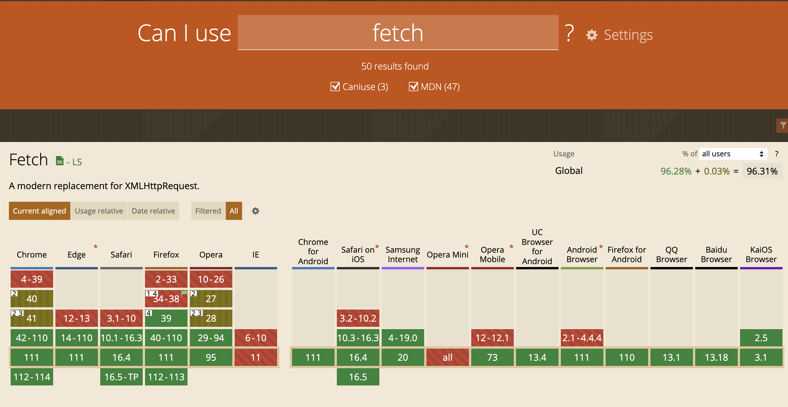
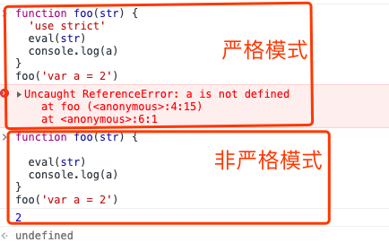
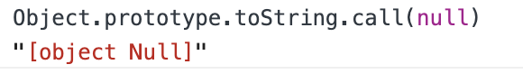
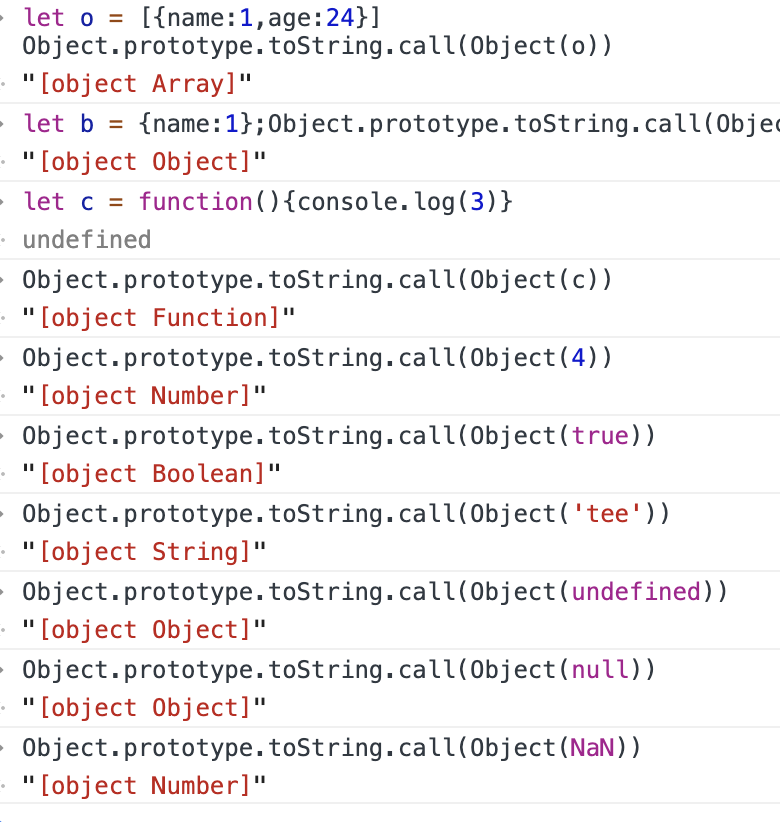
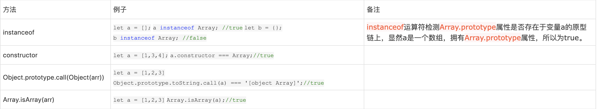
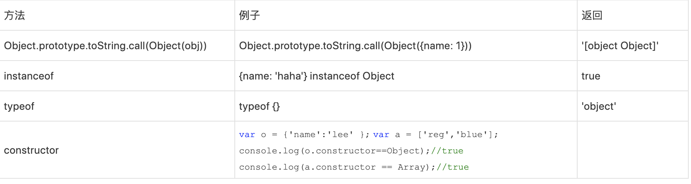
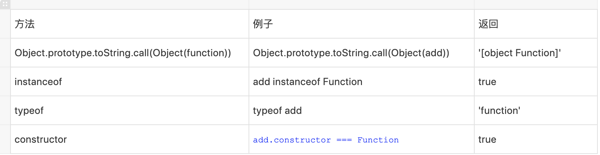

# 前端面试题汇总2
## fetch请求的时候为什么会有一个option请求，这个请求有什么用处?
fetch请求先发一个options请求，这个叫预检请求(preelight)，来确认服务器是否允许接受请求，为了获取服务端设置的跨域配置,然后根据返回的 header 中的信息,来看这个接口允许哪些方法请求,允许携带哪些 header,是否允许当前域名跨域请求等等
options请求出现的情况只有两种：
1. 获取目的资源所支持的通信方式；
2. 跨域请求中，options请求是浏览器发起的prelight request(预检请求)，以检测实际请求是否可以被浏览器接受；
跨域请求分两种：简单请求，复杂请求
符合以下任一情况就是复杂请求，只有复杂的跨域请求才会进行options请求
1. 使用方法PUT或DELETE；
2. 发送json格式的数据（content-type: application/json）；
3. 请求中带有自定义头部
**为什么跨域的复杂请求需要OPTIONS请求?**
复杂请求可能对服务器数据产生副作用。例如delete或者put,都会对服务器数据进行修改,所以在请求之前都要先询问服务器，当前网页所在域名是否在服务器的许可名单中，服务器允许后，浏览器才会发出正式的请求，否则不发送正式请求。
## Fetch的API用法
fetch是基于Promise设计的，支持async/await,语法简单，更加的语义化,
```js
fetch(url,{
method:'POST', // PUT/GET/DELETE
mode:'cors', // 请求的模式，如 cors、 no-cors 或者 same-origin
headers:{
},
body:{
},
credentials:'include',// 是否允许携带cookie
cache:'no-cache',

}).then((res) => {

}).catch((err) => {

})
```

## fetch使用的常见问题及解决办法

fetch默认不携带cookie
fetch发送请求默认是不发送cookie的，不管是同域还是跨域；那么问题就来了，对于那些需要权限验证的请求就可能无法正常获取数据，这时可以配置其credentials项，其有3个值：
1. omit: 默认值，忽略cookie的发送
2. same-origin: 表示cookie只能同域发送，不能跨域发送
3. include: cookie既可以同域发送，也可以跨域发送

fetch请求对某些错误http状态不会reject
这主要是由fetch返回promise导致的，因为fetch返回的promise在某些错误的http状态下如400、500等不会reject，相反它会被resolve；只有网络错误会导致请求不能完成时，fetch 才会被 reject；所以一般会对fetch请求做一层封装，例如下面代码所示：
```js
function checkStatus(response) {
  if (response.status >= 200 && response.status < 300) {
    return response;
  }
  const error = new Error(response.statusText);
  error.response = response;
  throw error;
}
function parseJSON(response) {
  return response.json();
}
export default function request(url, options) {
  let opt = options||{};
  return fetch(url, {credentials: 'include', ...opt})
    .then(checkStatus)
    .then(parseJSON)
    .then((data) => ( data ))
    .catch((err) => ( err ));
}
```

fetch不支持超时timeout处理
fetch不像大多数ajax库那样对请求设置超时timeout，它没有有关请求超时的feature，我们真正需要的是abort()， timeout可以通过timeout+abort方式来实现，起到真正超时丢弃当前的请求。
利用Promise.race方法接受一个promise实例数组参数，表示多个promise实例中任何一个最先改变状态，那么race方法返回的promise实例状态就跟着改变
```js
var oldFetchfn = fetch; //拦截原始的fetch方法
window.fetch = function(input, opts){//定义新的fetch方法，封装原有的fetch方法
    var fetchPromise = oldFetchfn(input, opts);
    var timeoutPromise = new Promise(function(resolve, reject){
        setTimeout(()=>{
             reject(new Error("fetch timeout"))
        }, opts.timeout)
    });
    retrun Promise.race([fetchPromise, timeoutPromise])
}
```
fetch不支持JSONP
fetch是与服务器端进行异步交互的，而JSONP是外链一个javascript资源，并不是真正ajax，所以fetch与JSONP没有什么直接关联，当然至少目前是不支持JSONP的,目前比较成熟的开源JSONP实现fetch-jsonp给我们提供了解决方案。

fetch不支持progress事件
XHR是原生支持progress事件的，例如下面代码这样：
```js
var xhr = new XMLHttpRequest()
xhr.open('POST', '/uploads')
xhr.onload = function() {}
xhr.onerror = function() {}
function updateProgress (event) {
  if (event.lengthComputable) {
    var percent = Math.round((event.loaded / event.total) * 100)
    console.log(percent)
  }
xhr.upload.onprogress =updateProgress; //上传的progress事件
xhr.onprogress = updateProgress; //下载的progress事件
}
xhr.send();
```
但是fetch是不支持有关progress事件的；不过可喜的是，根据fetch的指导规范标准，其内部设计实现了Request和Response类；其中Response封装一些方法和属性，通过Response实例可以访问这些方法和属性，例如response.json()、response.body等等；值得关注的地方是，response.body是一个可读字节流对象，其实现了一个getRender()方法，其具体作用是：
getRender()方法用于读取响应的原始字节流，该字节流是可以循环读取的，直至body内容传输完成；
因此，利用到这点可以模拟出fetch的progress
```js
// fetch() returns a promise that resolves once headers have been received
fetch(url).then(response => {
  // response.body is a readable stream.
  // Calling getReader() gives us exclusive access to the stream's content
  var reader = response.body.getReader();
  var bytesReceived = 0;

  // read() returns a promise that resolves when a value has been received
  reader.read().then(function processResult(result) {
    // Result objects contain two properties:
    // done  - true if the stream has already given you all its data.
    // value - some data. Always undefined when done is true.
    if (result.done) {
      console.log("Fetch complete");
      return;
    }

    // result.value for fetch streams is a Uint8Array
    bytesReceived += result.value.length;
    console.log('Received', bytesReceived, 'bytes of data so far');

    // Read some more, and call this function again
    return reader.read().then(processResult);
  });
});
```

fetch跨域问题
要满足浏览器端支持CORS，服务器通过Access-Control-Allow-Origin来允许指定的源进行跨域，仅此一种方式。
fetch浏览器支持不好
一些低版本的的浏览器IE，Edge浏览器不支持，可以使用fetch+polyfill,项目中常用whatwg-fetch，


## html5标签语义化，section和article区别


## css3动效有哪些
transform,translate, rotate,skew,animation,svg, canvas,transition
## 怎么处理token过期问题
15分钟之内如果没有操作自动退出登录，如果15分钟之内有被操作，重置登录过期时间
后端设置过期时间900s,登录之后存储过期时间expries和登录时间loginTime，全局添加点击事件，点击的时候记录当前时间currentTime,计算
diffTime = (currentTime - loginTime) / 1000 ，判断diffTime 和 expriesTime / 10 , diffTime和expriesTime的大小，分三种情况：

1. 0-90s内点击，如果diffTime > 0 && diffTime < expriesTime / 10 ,记录window.flag=true,记录window.diffTime=diffTime
设置延时器，let timeout = SetTimeout(() => {
// refreshToken()
},expriesTime - window.diffTime)
2. 90s之后点击：如果diffTime >= expriesTime / 10 && diffTime < expriesTime,这就说明还在15分钟之内，但是大于90s需要重新请求token和expries,loginTime,并重置全局变量，记录window.flag=false,记录window.diffTime=0,timeout = null
3. 900s之后点击：如果diffTime > expriesTime，说明已经过期，直接跳出登录。

## 用css对一个span标签绘制关闭按钮
```css
 <style>
        div {
            width: 40px;
            height: 40px;
            border: 1px solid #eee;
            position: relative;
        }

        .close::before {
            transform: rotate(45deg);
        }

        .close::after {
            transform: rotate(-45deg);
        }

        .close::before,
        .close::after {
            content: '';
            position: absolute;
            height: 2px;
            width: 100%;
            top: 50%;
            left: 0;
            margin-top: -1px;
            background: grey;
        }
    </style>
```

## react-router和node的router的区别
一个匹配 http request 一个匹配 window.location
## react中为什么要引入immutable.js?
immutable Data一旦被创建就不能被修改，对Immutable对象所有的修改或添加删除操作都会返回一个新的Immutable对象，他实现的原理是持久化数据结构，也就是说在使用旧数据创建新数据的时候要保证新数据可用且不变，同时避免了deepCopy带来的性能损耗，且immutable使用共享结构，就是如果对象中一个节点发生变化，只修改这个节点和受它影响的父节点，其他节点共享，这样可大大提升性能。
[immutable常用API](../src/questions/immutable.js)

## 为什么选择react作为主框架？对比vue和angular有什么优点？
### React
react就是个javascript框架，它相对于mvc来说只是一个v，react具有较高的性能，代码逻辑简单，有如下优点：
1. 组件化：代码更加模块化，重用代码更容易
ReactJS 是一个基于组件的架构。应用程序是使用组件构建的，其中每个组件都有其逻辑和控件。组件可复用性高，而且哪个组件出了问题，可以很方便的隔离。
2. jsx语法：使用声明式语法JSX来重新定义视图开发
JSX 代表 Javascript XML。它是 Javascript 和 Html 的融合。它是一种类似于 HTML 的标记语法，用于描述应用程序的 UI 外观。总体上使代码易于理解和调试，避免了复杂的 javascript DOM 结构。
3. 高效：虚拟dom加diff算法减少dom操作来提高渲染性能
我们之前修改dom是通过document.getElementById()之类的方式，修改DOM元素，速度慢且性能低，而虚拟dom只是一个简单的js对象，最少包含tag,props,children三个属性，用js对象模拟DOM节点，操作内存中的js对象要比直接修改真实dom要快的多，等更新完虚拟DOM,再将虚拟DOM对象映射为真实DOM，最后交给浏览器渲染。这种方式对局部DOM进行更新，UI渲染过程速度快。
```js
let element = {
    tag: 'ul',
    props: {
        id: 'list'
    },
    children: [
        {
            tag: 'li',
            props: {
                id: 'item-0'
            },
            children: ['第一个li标签']
        },
        {
            tag: 'li',
            props: {
                id: 'item-1'
            },
            children: ['第二个li标签']
        },
    ]
}

```
4. 单向数据流
数据在整个应用程序中单向流动，可提供更大的灵活性并提高应用程序的效率。
单向数据绑定的显着优势在于它在应用程序中提供了更好的控制。
5. 将DOM操作抽象为状态的改变 
6. 灵活
react可以与已知的库很好的结合使用

缺点：
1. React本身只是一个V而已，并不是一个完整的框架，所以如果是大型项目想要一套完整的框架的话，基本都需要加上ReactRouter和Redux或Mobx才能写大型应用。
2. React库更新频繁，不向前兼容

### vue:
Vue是尤雨溪编写的一个构建数据驱动的Web界面的库，准确来说不是一个框架，它聚焦在V（view）视图层。
特性：
1. 轻量级框架
2. 双向数据绑定
3. 指令
4. 插件化
优点：
1. 简单 官方文档很清晰，比 Angular 简单易学
2. 快速：异步批处理方式更新 DOM。
3. 组合：用解耦的、可复用的组件组合应用程序。
4. 紧凑：~18kb min+gzip，且无依赖。
5. 强大：表达式 无需声明依赖的可推导属性 (computed properties)。
6. 对模块友好：可以通过 NPM、Bower 或 Duo 安装。
缺点：
影响度不是很大
不支持IE8
### Angular:
它有以下的特性：
1. 良好的应用程序结构
2. 双向数据绑定
3. 指令
4. HTML模板
5. 可嵌入、注入和测试
优点：
1. 模板功能强大丰富，自带了极其丰富的angular指令。
2. 是一个比较完善的前端框架，包含服务，模板，数据双向绑定，模块化，路由，过滤器，依赖注入等所有功能；
3. 自定义指令，自定义指令后可以在项目中多次使用。
4. ng模块化比较大胆的引入了Java的一些东西（依赖注入），能够很容易的写出可复用的代码，对于敏捷开发的团队来说非常有帮助。
5. angularjs是互联网巨人谷歌开发，这也意味着他有一个坚实的基础和社区支持。
缺点：
1. angular 入门很容易 但深入后概念很多, 学习中较难理解.
2. 文档例子非常少, 官方的文档基本只写了api, 一个例子都没有, 很多时候具体怎么用都是google来的, 或直接问misko,angular的作者.
3. 对IE6/7 兼容不算特别好, 就是可以用jQuery自己手写代码解决一些.
4. 指令的应用的最佳实践教程少, angular其实很灵活, 如果不看一些作者的使用原则,很容易写出 四不像的代码, 例如js中还是像jQuery的思想有很多dom操作.
5. DI 依赖注入 如果代码压缩需要显示声明.


## redux都有哪些重要的，比较基础的一些概念
redux是javascript的状态管理工具，


## redux在使用中有哪些优化？
## 为什么使用eslint？
## 为什么选择redux-saga做异步处理？
## 怎么做适配？
## 高阶组件的作用？
## 类型检查方法
## 类型判断，对象的判断
## react组件中接收到来自父组件传过来的值之后经历哪些生命周期？
## react使用map遍历的时候为什么要加上key值
因为react中渲染dom是通过render方式，也就是通过虚拟的dom与真实的存在的dom树比较之后发现哪不一样，再进行渲染，这样的渲染对于性能的提升很有帮助，所以键值在保证稳定性,唯一性的时候，在遍历寻找需要改变的地方时候就能很块的找见并对其进行操作，如果键值不是稳定的而是变化的就会使渲染更改dom的效率大大的打折。
## 为什么要给每个动态子项添加一个key？？？
我们都知道在写动态子组件的时候如果没有给每个动态子组件一个key时，他就会报出一个警告：
warning:Each child in an array or iterator should have a unique "key" prop.Check the render method of 'APP'. See .......
这个警告指的是，如果每一个组件是一个数组或迭代器的话，那么必须有一个唯一的key prop。

react利用key来识别组件，它是一种身份标识。keys是react用于追踪哪些列表中元素被修改、被添加或者被移除的辅助标识。
key用来标识当前项的唯一性的props
## eval使用
```js
function foo(str, a) {
  eval(str)
  console.log(a, b)
}

var b = 2;
foo('var b = 3', 1)//输出1，3
```

eval(...)函数可以接受一个字符串为参数，并将其中的内容视为好像在书写时就存在程序中这个位置的代码，换句话说，可以在你的代码中用程序生成代码并运行，就好像代码是写在那个位置的一样。
既然eval(...)使代码运行在那里，那么就类似于：
```js
function foo(str, a) {
  var b = 3;
  console.log(a, b)
}

var b = 2;
foo('var b = 3', 1)
```
这样就出现了内层作用域遮蔽外层作用域
在严格模式的程序中，eval(...)在运行时有其自己的词法作用域，意味着其在声明无法修改所在的作用域。

## 介绍下深度优先遍历和广度优先遍历，如何实现？
## ES5/ES6 的继承除了写法以外还有什么区别？
## setTimeout、Promise、Async/Await 的区别
## Async/Await 如何通过同步的方式实现异步
## 请写出下面代码的运行结果,为什么
```js
async function async1() {
    console.log('async1 start');
    await async2();
    console.log('async1 end');
}
async function async2() {
    console.log('async2');
}
console.log('script start');
setTimeout(function() {
    console.log('setTimeout');
}, 0)
async1();
new Promise(function(resolve) {
    console.log('promise1');
    resolve();
}).then(function() {
    console.log('promise2');
});
console.log('script end');
```
## 扁平化并去重算法题
编写一个程序将数组扁平化去并除其中重复部分数据，最终得到一个升序且不重复的数组
```js
var arr = [ [1, 2, 2], [3, 4, 5, 5], [6, 7, 8, 9, [11, 12, [12, 13, [14] ] ] ], 10];
```
## JS 异步解决方案的发展历程以及优缺点
## Promise 构造函数是同步执行还是异步执行，那么 then 方法呢？
## 情人节福利题，如何实现一个 new
## 简单讲解一下http2的多路复用
## React 中 setState 什么时候是同步的，什么时候是异步的？
## React setState 笔试题，下面的代码输出什么？
```js
class Example extends React.Component {
  constructor() {
    super();
    this.state = {
      val: 0
    };
  }
  
  componentDidMount() {
    this.setState({val: this.state.val + 1});
    console.log(this.state.val);    // 第 1 次 log

    this.setState({val: this.state.val + 1});
    console.log(this.state.val);    // 第 2 次 log

    setTimeout(() => {
      this.setState({val: this.state.val + 1});
      console.log(this.state.val);  // 第 3 次 log

      this.setState({val: this.state.val + 1});
      console.log(this.state.val);  // 第 4 次 log
    }, 0);
  }

  render() {
    return null;
  }
};
```
## 介绍下 npm 模块安装机制，为什么输入 npm install 就可以自动安装对应的模块？
## 有以下 3 个判断数组的方法，请分别介绍它们之间的区别和优劣
## 介绍下观察者模式和订阅-发布模式的区别，各自适用于什么场景
## 聊聊 Redux 和 Vuex 的设计思想
## 说说浏览器和 Node 事件循环的区别
## 全局作用域中，用 const 和 let 声明的变量不在 window 上，那到底在哪里？如何去获取？
## cookie 和 token 都存放在 header 中，为什么不会劫持 token？
## 聊聊 Vue 的双向数据绑定，Model 如何改变 View，View 又是如何改变 Model 的
## 两个数组合并成一个数组

请把两个数组 ['A1', 'A2', 'B1', 'B2', 'C1', 'C2', 'D1', 'D2'] 和 ['A', 'B', 'C', 'D']，合并为 ['A1', 'A2', 'A', 'B1', 'B2', 'B', 'C1', 'C2', 'C', 'D1', 'D2', 'D']。
##  改造下面的代码，使之输出0 - 9，写出你能想到的所有解法。
```js
for (var i = 0; i< 10; i++){
	setTimeout(() => {
		console.log(i);
    }, 1000)
}
```
## Virtual DOM 真的比操作原生 DOM 快吗？谈谈你的想法

## 下面的代码打印什么内容，为什么？
```js
var b = 10;
(function b(){
    b = 20;
    console.log(b); 
})();
```
## 使用迭代的方式实现 flatten 函数。
## 下面代码中 a 在什么情况下会打印 1？
```js
var a = ?;
if(a == 1 && a == 2 && a == 3){
 	console.log(1);
}
```
## React中子组件如果不想通过一级一级单项数据流传递props拿到父组件的值，还有什么办法可以拿到？
## for...in,for...of 区别
## 装饰器
Decorator 是 ES7 的一个新语法，正如其“装饰器”的叫法所表达的，他可以对一些对象进行装饰包装然后返回一个被包装过的对象，可以装饰的对象包括：类，属性，方法等。Decorator 的写法与 Java 里的注解（Annotation）非常类似，但是一定不要把 JS 中的装饰器叫做是“注解”，因为这两者的原理和实现的功能还是有所区别的，在 Java 中，注解主要是对某个对象进行标注，然后在运行时或者编译时，可以通过例如反射这样的机制拿到被标注的对象，对其进行一些逻辑包装。而 Decorator 的原理和作用则更为简单，就是包装对象，然后返回一个新的对象描述（descriptor），其作用也非常单一简单，基本上就是获取包装对象的宿主、键值几个有限的信息。
简单来说，JS 的装饰器可以用来“装饰”三种类型的对象：类的属性/方法、访问器、类本身，简单看几个例子吧。
```js
// decorator 外部可以包装一个函数，函数可以带参数
function Decorator(type){
    /**
     * 这里是真正的 decorator
     * @target 装饰的属性所述的类的原型，注意，不是实例后的类。如果装饰的是 Car 的某个属性，这个 target 的值就是 Car.prototype
     * @name 装饰的属性的 key
     * @descriptor 装饰的对象的描述对象
     */
    return function (target, name, descriptor){
        // 以此可以获取实例化的时候此属性的默认值
        let v = descriptor.initializer && descriptor.initializer.call(this);
        // 返回一个新的描述对象，或者直接修改 descriptor 也可以
        return {
            enumerable: true,
            configurable: true,
            get: function() {
                return v;
            },
            set: function(c) {
                v = c;
            }
        }
    }
}
```
## 前端性能优化
## BundleAnalyzerPlugin
## component和PureComponent,还有memo的区别
## new Promise中return一个new Promise，那么输出的的是什么？
输出还是一个Promise对象
## webpack做性能优化
## webpack的proxy
## diff算法 ???
diff算法即差异查找算法,
React将Virtual DOM转换成actual DOM树的操作过程称为调和，而diff算法便是调和的具体实现。以下为过程实现：
 进行分层比较，两棵树只会对同一节点进行比较，即同一个父节点下的所有子节点，当发现子节点不存在时，则该节点及其子节点被完全删除，不会用于进一步的比较，这样只需要对数进行一次遍历，便能完成整个DOM树的比较
 ### tree diff
DOM 节点跨层级的移动操作少到可以忽略不计，针对这一现象，
React 通过 updateDepth 对 Virtual DOM 树进行层级控制，
只会对相同颜色方框内的 DOM 节点进行比较，即同一个父节点下的所有子节点。
当发现节点已经不存在，则该节点及其子节点会被完全删除掉，不会用于进一步的比较。
这样只需要对树进行一次遍历，便能完成整个 DOM 树的比较。
 ### component diff 
 如果是同一类型的组件，按照原策略继续比较Virtual DOM树即可；
如果不是同一类型组件，则将该组件判断为dirty component,从而替换掉整个组件下掉所有子节点；
对于同一类型的组件，有可能其Vitrual DOM没有任何变化，如果能确切知道这点，那么就可以节省大量的diff运算时间，因此，React允许用户通过shouldcomponentUpdate来判断组件是否需要进行算法分析
### element diff
节点处于同一层级时，React diff 提供了三种节点操作，分别为：INSERT_MARKUP（插入）、MOVE_EXISTING（移动）和 REMOVE_NODE（删除）。
新老集合所包含的节点，如下图所示，新老集合进行 diff 差异化对比，
通过 key 发现新老集合中的节点都是相同的节点，因此无需进行节点删除和创建，
只需要将老集合中节点的位置进行移动，更新为新集合中节点的位置，
此时 React 给出的 diff 结果为：B、D 不做任何操作，A、C 进行移动操作，即可。
## 立即执行函数
```js
(function foo() {
    console.log(2)
})()

(foo = () => {
    console.log(3)
})()
//第二种箭头函数方式的是错误的写法
```
## 三个dom元素，现在要删除最后一个，都经历了哪些生命周期
## 性能检测工具
## .基本数据类型有哪些？怎样去检测他们？
## 谈谈reactHooks的钩子？
## connect的参数
## 怎么决定一个状态是否放到store中
## forEach,for循环和map的区别
|forEach|map|for|
|--|--|--|
|返回值|undefined|原数组|--|
|链式调用| 不可以链式调用|可以链式调用|--|
|没有办法终止或者跳出forEach()循环，除非抛出异常，所以想执行一个数组是否满足什么条件，返回布尔值，可以用一般的for循环实现，或者用Array.every()或者Array.some();|--|--|
## bind
```js
export default class App extends React {
    constructor (){
        this.onClick = this.onClick.bind(this);
    }

    onClick (){
        console.log('点击了按钮');
    }

    render (){
        return <div>
            <button onClick={this.onClick}>点击</button>
        </div>;  
    }  
}
```
我们不在render方法中button组件的 onClick 事件上直接写箭头函数的或者进行 bind 操作的原因是：这两种方式会在 render 方法每次执行的时候都执行一次，要不就是创建一个新的箭头函数或者重新执行一次 bind 方法。但回调函数的内容却从未改变过，因此这些重复的执行均为非必要的，上严格上来讲，存在有性能上的不必要的损耗。鉴于 constructor 只会执行一次，所以把 bind 操作放置于此是十分正确的处理方式。
对于上述例子，使用Hook方式应该如此：
```js
export default function App (){
    const onClick = useCallback(() => {
        console.log('点击了按钮');
    }, []);    

    return <>
        <button onClick={onClick}>点击</button> 
    </>;  
}
```
## component和PureComponent,还有memo的区别
https://www.jianshu.com/p/b3d07860b778
正常情况下我们创建一个组件通过ES6的class关键字和React.Component，但是有时候我们会用到PureComponent来创建组件,React.PureComponent 与 React.Component 几乎完全相同，只是他们俩主要的区别就是React.PureComponent会对props和state进行浅比较来实现shouldComponentUpdate，而Component并没有这样的功能
PureComponent只能在ES6语法class定义的组件中使用；一般在纯组件中用PureComponent比较多
而memo同样也是帮助我们控制渲染组件的，也是对state和props进行浅比较来实现shouldComponentUpdate，但是在使用PureComponent只能在es6 中的class组件使用，但memo却可以在function Component中使用。从这点也可以看出，react中会增加对Hook的重视。
React.memo 为高阶组件。它与 React.PureComponent 非常相似，但它适用于函数组件，但不适用于 class 组件。
```js
function MyComponent(props) {
  /* 使用 props 渲染 */
}
function areEqual(prevProps, nextProps) {
  /*
  如果把 nextProps 传入 render 方法的返回结果与
  将 prevProps 传入 render 方法的返回结果一致则返回 true，
  否则返回 false
  */
}
export default React.memo(MyComponent, areEqual);
```
此方法仅作为性能优化的方式而存在。但请不要依赖它来“阻止”渲染，因为这会产生 bug。
注意
与 class 组件中 shouldComponentUpdate() 方法不同的是，如果 props 相等，areEqual 会返回 true；如果 props 不相等，则返回 false。这与 shouldComponentUpdate 方法的返回值相反。
shouldComponentUpdate是如果props不相等，则返回true，相等则返回false
## 假如有成千上万条数据，你是怎么处理的
懒加载，分页，分批加载，懒加载。监听用户的滑动分批显示数据。
通过worker来做子线程来实现的
## require和import的区别

遵循规范
–require 是 AMD规范引入方式
–import是es6的一个语法标准，如果要兼容浏览器的话必须转化成es5的语法
 
调用时间
–require是运行时调用，所以require理论上可以运用在代码的任何地方
–import是编译时调用，所以必须放在文件开头
 
本质
–require是赋值过程，其实require的结果就是对象、数字、字符串、函数等，再把require的结果赋值给某个变量
–import是解构过程，但是目前所有的引擎都还没有实现import，我们在node中使用babel支持ES6，也仅仅是将ES6转码为ES5再执行，import语法会被转码为require
require时代的模块
node编程中最重要的思想之一就是模块，而正是这个思想，让JavaScript的大规模工程成为可能。模块化编程在js界流行，也是基于此，随后在浏览器端，requirejs和seajs之类的工具包也出现了，可以说在对应规范下，require统治了ES6之前的所有模块化编程，即使现在，在ES6 module被完全实现之前，还是这样。
node的module遵循CommonJS规范，requirejs遵循AMD，seajs遵循CMD，虽各有不同，但总之还是希望保持较为统一的代码风格。
## 高阶函数在react中的应用，装饰器
## 手写一个reduce
```js
export default function(initialState, reducerMap) {
    return (state = initialState, action) => {
        const reducer = reducerMap[action.type];
        return reducer ? reducer(state, action) : state;
    };
}

//createReducer就是上面 一段代码
import createReducer from 'app/utils/createReducer';
import { SET_U3D_VIEW_DATA } from 'app/constant/Topology';

export default createReducer(
    {
        u3dViewData: {
            level: 0,
            nodeId: 0
        }
    }, {
        [SET_U3D_VIEW_DATA]: (state, action) => {
            const {payload} = action;
            const {u3dViewData} = state;
            return Object.assign({}, {...state}, {
                u3dViewData: Object.assign({}, {...u3dViewData}, payload)
            });
        }
    }
)
```
## Array.isArray的原理
```js
Array.myIsArray = function(o){
    return Object.prototype.toString.call(Object(o)) === '[object Array]'
}
```
## 区分一下call里面有Object和没有Object的情况


## content-type的类型有哪些
text/plain 　　　　　　　　文本类型
text/css  　　　　　　　　 css类型
text/html 　　 　　　　　　html类型
application/x-javascript 　　js类型
application/json　　　　　 json类型，序列化后的 JSON 字符串，最常用，特别适合 RESTful 的接口
image/png jpg gif　　　　　 image/*    
application/x-www-form-urlencoded：form表单类型 ，浏览器的原生form表单
multipart/form-data：我们使用表单上传文件时，必须让 form 的 enctype 等于这个值
text/xml:是一种使用 HTTP 作为传输协议，XML 作为编码方式的远程调用规范

## js even loop事件循环机制:指计算机系统的一种运行机制；
javascript语言就是采用这种机制，来解决单线程运行带来的一些问题
## JS判断是否是数组的四种做法

## 判断对象是否是数组的几种方式
1.通过instanceof判断
instanceof运算符用于检验构造函数的prototype属性是否出现在对象的原型链中的任何位置，返回一个布尔值。
```js
let a = [];
a instanceof Array; //true
let b = {};
b instanceof Array; //false
```
在上方代码中，instanceof运算符检测Array.prototype属性是否存在于变量a的原型链上，显然a是一个数组，拥有Array.prototype属性，所以为true。
存在问题：
需要注意的是，prototype属性是可以修改的，所以并不是最初判断为true就一定永远为真。
其次，当我们的脚本拥有多个全局环境，例如html中拥有多个iframe对象，instanceof的验证结果可能不会符合预期，例如：
```js
//为body创建并添加一个iframe对象
var iframe = document.createElement('iframe');
document.body.appendChild(iframe);
//取得iframe对象的构造数组方法
xArray = window.frames[0].Array;
//通过构造函数获取一个实例
var arr = new xArray(1,2,3); 
arr instanceof Array;//false
```

导致这种问题是因为iframe会产生新的全局环境，它也会拥有自己的Array.prototype属性，让不同环境下的属性相同很明显是不安全的做法，所以Array.prototype !== window.frames[0].Array.prototype，想要arr instanceof Array为true，你得保证arr是由原始Array构造函数创建时才可行。
2.通过constructor判断
我们知道，实例的构造函数属性constructor指向构造函数，那么通过constructor属性也可以判断是否为一个数组。
```js
let a = [1,3,4];
a.constructor === Array;//true
```
同样，这种判断也会存在多个全局环境的问题，导致的问题与instanceof相同。
```js
//为body创建并添加一个iframe标签
var iframe = document.createElement('iframe');
document.body.appendChild(iframe);
//取得iframe对象的构造数组方法
xArray = window.frames[window.frames.length-1].Array;
//通过构造函数获取一个实例
var arr = new xArray(1,2,3); 
arr.constructor === Array;//false
```
3.通过Object.prototype.toString.call()判断
 Object.prototype.toString().call()可以获取到对象的不同类型，例如
let a = [1,2,3]
Object.prototype.toString.call(a) === '[object Array]';//true

它强大的地方在于不仅仅可以检验是否为数组，比如是否是一个函数，是否是数字等等
```js
//检验是否是函数
let a = function () {};
Object.prototype.toString.call(a) === '[object Function]';//true
//检验是否是数字
let b = 1;
Object.prototype.toString.call(a) === '[object Number]';//true
```
甚至对于多全局环境时， Object.prototype.toString().call()也能符合预期处理判断。
```js
//为body创建并添加一个iframe标签
var iframe = document.createElement('iframe');
document.body.appendChild(iframe);
//取得iframe对象的构造数组方法
xArray = window.frames[window.frames.length-1].Array;
//通过构造函数获取一个实例
var arr = new xArray(1,2,3); 
console.log(Object.prototype.toString.call(arr) === '[object Array]');//true
```

4.通过Array.isArray()判断
```js
//Array.isArray() 用于确定传递的值是否是一个数组，返回一个布尔值。
let a = [1,2,3]
Array.isArray(a);//true
```
简单好用，而且对于多全局环境，Array.isArray() 同样能准确判断，但有个问题，Array.isArray() 是在ES5中提出，也就是说在ES5之前可能会存在不支持此方法的情况。怎么解决呢？

## 判断数组方法的最终推荐
 当然还是用Array.isArray()，从ES5新增isArray()方法正是为了提供一个稳定可用的数组判断方法，不可能专门为此提出的好东西不用，而对于ES5之前不支持此方法的问题，我们其实可以做好兼容进行自行封装，像这样：
```js
 if (!Array.isArray) {
  Array.isArray = function(arg) {
    return Object.prototype.toString.call(arg) === '[object Array]';
  };
}
```
## 判断是对象的方法：

## 判断是函数的方法

## 常用的linux命令
## 介绍react
## reduce方法 
```js
var newArr = arr.reduce(function (prev, cur) {
    //prev.indexOf(cur) === -1 && prev.push(cur);
    //或者  
    !prev.includes(cur) && prev.push(cur)
    return prev;
},[]);
```
## 对象数组如何去重？
这个题目不只一家公司问到了，开始的时候一脸懵逼，心里想着每个对象的内存地址本身就不一样，去重的意义何在，非要去重的话，那只能通过JSON.stringify序列化成字符串(这个方法有一定的缺陷)后进行对比，或者递归的方式进行键-值对比，但是对于大型嵌套对象来说还是比较耗时的，所以还是没有答好，后来面试官跟我说是根据每个对象的某一个具体属性来进行去重，因为考虑到服务端返回的数据中可能存在id重复的情况，需要前端进行过滤，如下：
```JS
const responseList = [
  { id: 1, a: 1 },
  { id: 2, a: 2 },
  { id: 3, a: 3 },
  { id: 1, a: 4 },
];
const result = responseList.reduce((acc, cur) => {
    const ids = acc.map(item => item.id);
    return ids.includes(cur.id) ? acc : [...acc, cur];
}, []);
console.log(result); 
// -> [ { id: 1, a: 1}, {id: 2, a: 2}, {id: 3, a: 3} ]
```
## 数组常用的方法
Array.map,Array.forEach,Array. filter, Array.reduce,Array.isArray(arr),Array.some,Array.every, Object.entries,
 for... of,push,pop,shift,unshift,concat, Array.toString()Array.join(),Array.splice(开始位置， 删除的个数，元素);万能方法，可以实现增删改
## 项目同时适用less，sass怎么配置
## 异步的常⽤解决⽅案
## this 和箭头函数
this判断分四种：
我们会根据优先级来判断函数在某个调用位置应用哪条规则，如下：
1.函数是否在new中调用（new绑定）？如果是的话this绑定的就是这个新创建的对象；
2.函数是否通过call,apply（显示绑定）或者硬绑定调用？如果是，this绑定的就是指定的对象；
3.函数是否在上下文对象中调用（隐式绑定）？如果是，this绑定的就是那个上下文对象；
4.如果都不是的话，则使用默认绑定，如果在严格模式下，就绑定到undefined，非严格模式下绑定到全局对象；


规律1：函数用圆括号调用，函数的上下文是window对象
规律2：函数如果作为一个对象的方法，对象打点调用，函数的上下文就是这个对象
规律3：函数是事件处理函数，函数的上下文就是触发这个事件的对象
规律4：定时器调用函数，上下文是window对象
规律5：数组中存放的函数，被数组索引之后加圆括号调用，this就是这个数组
箭头函数中的this是继承外面的环境
```js
let obj={
    a:222,
    fn:function(){    
        setTimeout(function(){console.log(this.a)})
    }
};
obj.fn();//undefined

在obj中，一般调用普通函数的话，这个普通函数中的this指向这个对象，但是现在是一个延时器，延时器中的this指向window,而window中没有声明a,所以是undefined，要正常输出的话可以先定义this用以下方法：
let obj={
    a:222,
    fn:function(){    
    let self = this;
        setTimeout(function(){console.log(self.a)})
    }
};
obj.fn();//222


let obj={
    a:222,
    fn:function(){
    //定时器中使用箭头函数，箭头函数中的this继承定时器外的环境    
        setTimeout(()=>{console.log(this.a)})
    }
};
obj.fn();//222
```
## 函数式编程
函数式编程（英语：functional programming）或称函数程序设计、泛函编程，是一种编程范式，它将计算机运算视为函数运算，并且避免使用程序状态以及易变对象。即对过程进行抽象，将数据以输入输出流的方式封装进过程内部，从而也降低系统的耦合度。
## es6 编程 promise 的各种异常catch 和 try catch 捕获 顺序问题
## react setState 和 fetch 中的setTimeout 问题 深⼊理解异步和同步问题
## 原生ajax
```js
new Promise((resolve,reject) => {
    
    const xhr = new XMLHttpRequest();
xhr.onreadystatechange = function(){
    if(this.readyState == 4) {
        if(this.status === 200 || this.status.toString().indexOf(3) == 0) {
            resolve(this.response);
        }else {
            reject(new Error(this.statusText))
        }
    }
}
xhr.open('get',url,true);
xhr.send();
}).then((value) => {},(reason) => {})
```

Ajax的原理：
简单来说就是 通过XMLHttpRequest对象向服务器发异步请求，从服务器获得数据，然后用 javascript 来操作DOM更新页面的技术。
一般来说，大家可能都会习惯用JQuery提供的Ajax方法，但是用原生的js怎么去实现Ajax方法呢？
JQuery提供的Ajax方法：
```js
$.ajax({
    url: ,
    type: '',
    dataType: '',
    data: {
          
    },
    success: function(){
         
    },
    error: function(){
          
    }
 })
```

原生js实现Ajax方法是这样的：
```js
var Ajax = {
    get: function(url,fn){
        // XMLHttpRequest对象用于在后台与服务器交换数据
        var xhr=new XMLHttpRequest();
        xhr.open('GET',url,false);
        xhr.onreadystatechange=function(){
            // readyState == 4说明请求已完成
            if(xhr.readyState==4){
                if(xhr.status==200 || xhr.status==304){
                    console.log(xhr.responseText);
                    fn.call(xhr.responseText);
                }
            }
        }
        xhr.send();
    },

    // data应为'a=a1&b=b1'这种字符串格式，在jq里如果data为对象会自动将对象转成这种字符串格式
    post: function(url,data,fn){
        var xhr=new XMLHttpRequest();
        xhr.open('POST',url,false);
        // 添加http头，发送信息至服务器时内容编码类型
        xhr.setRequestHeader('Content-Type','application/x-www-form-urlencoded');
        xhr.onreadystatechange=function(){
            if (xhr.readyState==4){
                if (xhr.status==200 || xhr.status==304){
                    // console.log(xhr.responseText);
                    fn.call(xhr.responseText);
                }
            }
        }
        xhr.send(data);
    }
}
```
代码注释：
open(method, url, async) 方法需要三个参数:
method：发送请求所使用的方法（GET或POST）；与POST相比，GET更简单也更快，并且在大部分情况下都能用；然而，在以下情况中，请使用POST请求：
①无法使用缓存文件（更新服务器上的文件或数据库）
②向服务器发送大量数据（POST 没有数据量限制）
③发送包含未知字符的用户输入时，POST 比 GET 更稳定也更可靠
url：规定服务器端脚本的 URL(该文件可以是任何类型的文件，比如 .txt 和 .xml，或者服务器脚本文件，比如 .asp 和 .php （在传回响应之前，能够在服务器上执行任务）)；
async：规定应当对请求进行异步（true）或同步（false）处理；true是在等待服务器响应时执行其他脚本，当响应就绪后对响应进行处理；false是等待服务器响应再执行。
send() 方法可将请求送往服务器。
onreadystatechange：存有处理服务器响应的函数，每当 readyState 改变时，onreadystatechange 函数就会被执行。
readyState：存有服务器响应的状态信息。
0: 请求未初始化（代理被创建，但尚未调用 open() 方法）
1: 服务器连接已建立（open方法已经被调用）
2: 请求已接收（send方法已经被调用，并且头部和状态已经可获得）
3: 请求处理中（下载中，responseText 属性已经包含部分数据）
4: 请求已完成，且响应已就绪（下载操作已完成）
responseText：获得字符串形式的响应数据。
setRequestHeader()：POST传数据时，用来添加 HTTP 头，然后send(data)，注意data格式；GET发送信息时直接加参数到url上就可以，比如url?a=a1&b=b1。
Ajax的原理：
Ajax 的原理简单来说通过 XmlHttpRequest 对象来向服务器发异步请求，从服务器获得数据，然后用javascript来操作DOM而更新页面。这其中最关键的一步就是从服务器获得请求数据。
要清楚这个过程和原理，我们必须对 XMLHttpRequest 有所了解。XMLHttpRequest 是 ajax 的核心机制，它是在 IE5 中首先引入的，是一种支持异步请求的技术。简单的说，也就是 javascript 可以及时向服务器提出请求和处理响应，而不阻塞用户，达到无刷新的效果。
拓展ES6的 Promise 的AJAX GET方法请求数据：
```js
const getJSON = function(url) {
    const promise = new Promise(function(resolve, reject){
        const handler = function() {
            if (this.readyState !== 4) {
                return;
            }
            if (this.status === 200) {
                resolve(this.response);
            } else {
                reject(new Error(this.statusText));
            }
        };
        const client = new XMLHttpRequest();
        client.open("GET", url);
        client.onreadystatechange = handler;
        client.responseType = "json";
        client.setRequestHeader("Accept", "application/json");
        client.send();

    });
    return promise;
};
getJSON("promise.json").then(function(json) {
    console.log('Data: ', json);
}, function(error) {
    console.error('err', error);
});
```


