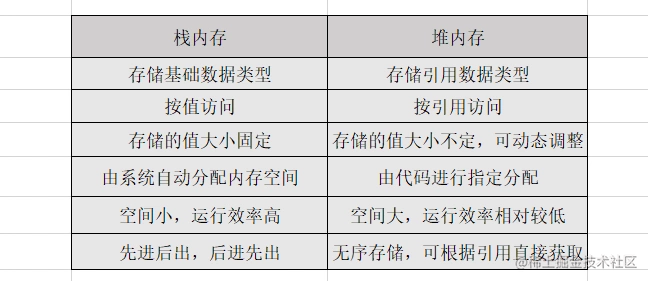

## 一、JavaScript基础

### 变量和类型
1. JavaScript规定了几种语言类型
基本数据类型：Number,String,Boolean,Undefined,Null ,es6中又添加了一种Symbol类型 ，常用来做对象中的key，实际在于后端交互过程中这种数据结构不常用
引用数据类型：Object,Array,Funtion
判断数据类型的方式有typeof 用来判断基本数据类型
instanceof可以判断引用数据类型，他返回的是布尔值
，Object.prototype.toString.call()基本数据类型和引用数据类型都可以判断
2. JavaScript对象的底层数据结构是什么
JavaScript中的数据在底层是以二进制存储，比如null所有存储值都是0，但是底层的判断机制，只要前三位为0，就会判定为object，所以才会有typeof null === 'object'这个bug。
JavaScript使用的是 堆(Heap) 和 栈( Stack)
JavaScript基本类型数据都是直接按值存储在栈中的(Undefined、Null、布尔、数字和字符串,Symbol)，每种类型的数据占用的内存空间的大小是确定的，并由系统自动分配和自动释放。这样带来的好处就是，内存可以及时得到回收，相对于堆来说 ，更加容易管理内存空间。

JavaScript引用类型数据被存储于堆中 (如对象、数组、函数等，它们是通过拷贝和new出来的）。其实，说存储于堆中，也不太准确，因为，引用类型的数据的地址指针是存储于栈中的，当我们想要访问引用类型的值的时候，需要先从栈中获得对象的地址指针，然后，在通过地址指针找到堆中的所需要的数据。

3. Symbol类型在实际开发中的应用、可手动实现一个简单的Symbol
    因为Symbol是不可重复的数据，所以Symbol常用来作为对象中的key值，
    手动实现Symbol:
```js
let generateName = (function(){
  var postfix = 0
  return function(desc) {
    postfix++
    return '@@' + desc + postfix
  }
})()
function Symbol(description) {
  // 1, 如果使用 new ，就报错
  if (this instanceof Symbol) {
    return new TypeError('Symbol is not constructor') // 实现第一点不可以使用new 调用
  }
  // 2  3如果 description 是 undefined，让 desc 为 undefined 否则 让 descString 为 ToString(description)
  let desc = description === undefined ? undefined : String(description)
 
  let symbol = Object.create({
    toString: function() {
      console.log(this._Name_)
      return this._Name_
    },
    valueOf: function () {
      return this;
    }
 
  })
  Object.defineProperties(symbol, {
    "_Description_" : {
      value: '',
      writable: false,
      enumerable: false,
      configurable: false
    },
    '_Name_': {
      value: generateName(description),
      writable: false,
      enumerable: false,
      configurable: false
    }
  })
  console.log(symbol)
  //3 因为调用该方法，返回的是一个新对象，两个对象之间，只要引用不同，就不会相同
  //  Symbol 函数的参数只是表示对当前 Symbol 值的描述，相同参数的 Symbol 函数的返回值是不相等的
  return symbol
}
var forMap = {};
// Symbol.keyFor 方法返回一个已登记的 Symbol 类型值的 key
Object.defineProperties(Symbol, {
    'for': {
        value: function (description) {
            var descString = description === undefined ? undefined : String(description)
            return forMap[descString] ? forMap[descString] : forMap[descString] = Symbol(descString); // 如果有就直接返回 重新使用同一个Symbol
        },
        writable: true,
        enumerable: false,
        configurable: true
    },
    'keyFor': {
        value: function (symbol) {
            for (var key in forMap) {
                if (forMap[key] === symbol) return key;
            }
        },
        writable: true,
        enumerable: false,
        configurable: true
    }
})
```
4. JavaScript中的变量在内存中的具体存储形式

5. 基本类型对应的内置对象，以及他们之间的装箱拆箱操作
6. 理解值类型和引用类型
js包含两种数据类型，基本数据类型和复杂数据类型，而其对应的值基本类型的值指的是简单的数据段，引用类型指的是那些可能有多个值构成的对象。可以从三个方面来理解：动态的属性、复制变量的值、传递参数
动态的属性:
引用类型可以动态的添加属性和方法或者删除属性和方法，基本类型不能动态的添加属性和方法
复制变量的值：引用类型复制变量实际上是复制变量的指针地址，基本类型复制的就是变量的值
传递参数：
所有函数的参数都是按值传递的，无论在向参数传递的是基本类型还是引用类型
7. 至少可以说出三种判断JavaScript数据类型的方式，以及他们的优缺点，如何准确的判断数组类型
typeof ,Object.prototype.toString.call(),instanceof,
typeof主要是判断基本数据,返回的是个字符串
instanceof 主要是判断引用数据类型的,返回布尔类型的字符串
Object.prototypeof.toString.call()既可以判断基本数据类型，也可以判断引用类型，返回
```js
const num = 2
const str = 'aaa'
const boolean = false
const symbol = Symbol()
let obj = {}
let arr = []
let set = new Set()
let map = new Map()
function fn () { }
console.log(typeof num, 'number')
console.log(typeof str, 'string')
console.log(typeof boolean, 'boolean')
console.log(typeof undefined, 'undefined')
console.log(typeof null, 'object')
console.log(typeof symbol, 'symbol')
console.log(obj instanceof Object, 'true')
console.log(arr instanceof Array, 'true')
console.log(fn instanceof Function, 'true')
console.log(set instanceof Set, 'true')
console.log(map instanceof Map, 'true')
console.log(Object.prototype.toString.call(arr), '[object Array]')
console.log(Object.prototype.toString.call(obj), '[object Object]')
console.log(Object.prototype.toString.call(fn), '[object Function]')
console.log(Object.prototype.toString.call(2), '[object Number]')
console.log(Object.prototype.toString.call('string'), '[object String]')
console.log(Object.prototype.toString.call(undefined), '[object Undefined]')
console.log(Object.prototype.toString.call(null), '[object Null]')
console.log(Object.prototype.toString.call(true), '[object Boolean]')
console.log(Object.prototype.toString.call(Symbol()), '[object Symbol]')
console.log(Object.prototype.toString.call(set), '[object Set]')
console.log(Object.prototype.toString.call(map), '[object Map]')
```
8. 可能发生隐式类型转换的场景以及转换原则，应如何避免或巧妙应用
有三个函数可以将非数值转换为数值：Number()、parseInt()、parseFloat()。Number()是转型函数，可用于任何数据类型。后两个函数主要用于将字符串转换为数值。
隐式类型转换:
1. 涉及类型转换最多的两个运算符是+和==。+可以是字符串相加，也可以是数字相加，在操作符中存在字符串时，优先转换为字符串。
2. −∗/- * /−∗/ 只针对Number类型，所以转换的结果只能是Number类型。
三种转换:
转换为数字:ES定义所有对象都有toString()方法，无论它是伪对象还是对象。
转换为字符串
转换为布尔值：
1. 除了+0，-0，NaN,其他数字布尔值都是true，2 == true
...

9. 出现小数精度丢失的原因，JavaScript可以存储的最大数字、最大安全数字，JavaScript处理大数字的方法、避免精度丢失的方法
最大数字是Number.MAX_VALUE、最大安全数字是Number.MAX_SAFE_INTEGER。Number.MAX_VALUE大于Number.MAX_SAFE_INTEGER，我的理解是js可以精确表示最大安全数字以内的数，超过了最大安全数字但没超过最大数字可以表示，但不精确，如果超过了最大数字，则这个数值会自动转换成特殊的Infinity值。
可以使用toFixed和Math.round的方法避免精度丢失，
// 位数要小于10000000的位数
const newNum = Math.round(number * 100000000)  / 100000000
newNum.toFixed(位数)
```js
function RoundNum(n, m){ //n表示需要四舍五入的数，m表示需要保留的小数位数
var newNum = Math.round(n * Math.pow(10, m)) / Math.pow(10, m) ;
//首先将要保留的小数位数的小数部分转成整数部分，利用幂函数将n乘以10的m次方
//然后利用Math.round()方法进行四舍五入处理
//最后再除以10的m次方还原小数部分
//注：此时还未能将所有数字正确转换。例如将1.0001保留3位小数我们想要的结果是1.000，而此时newNum里面的值是1
//所以还需要处理此种特殊情况，即保留的小数位上全0
var newSNum = newNum.toString();
//这一步将刚才进行处理过的数转换成字符串
var rs = newSNum.indexOf('.'); //利用indexOf查找字符串中是否有.，它返回某个指定的字符串值在字符串中首次出现的位置，不存在则返回-1
if (rs < 0) {
rs = newSNum.length;
newSNum += '.';
}
while (newSNum.length <= rs + m) { //在末尾加0
newSNum += '0';
}
return newSNum;
}
```
或者第三方库math.js
### 原型和原型链
1. 理解原型设计模式以及JavaScript中的原型规则


2. instanceof的底层实现原理，手动实现一个instanceof
4. 实现继承的几种方式以及他们的优缺点
5. 至少说出一种开源项目(如Node)中应用原型继承的案例
6. 可以描述new一个对象的详细过程，手动实现一个new操作符
7. 理解es6 class构造以及继承的底层实现原理
### 作用域和闭包
1. 理解词法作用域和动态作用域
2. 理解JavaScript的作用域和作用域链
3. 理解JavaScript的执行上下文栈，可以应用堆栈信息快速定位问题
4. this的原理以及几种不同使用场景的取值
5. 闭包的实现原理和作用，可以列举几个开发中闭包的实际应用
6. 理解堆栈溢出和内存泄漏的原理，如何防止
7. 如何处理循环的异步操作
8. 理解模块化解决的实际问题，可列举几个模块化方案并理解其中原理
### 执行机制
1. 为何try里面放return，finally还会执行，理解其内部机制
2. JavaScript如何实现异步编程，可以详细描述EventLoop机制
3. 宏任务和微任务分别有哪些
4. 可以快速分析一个复杂的异步嵌套逻辑，并掌握分析方法
5. 使用Promise实现串行
6. Node与浏览器EventLoop的差异
7. 如何在保证页面运行流畅的情况下处理海量数据
### 语法和API
1. 理解ECMAScript和JavaScript的关系
2. 熟练运用es5、es6提供的语法规范，
3. 熟练掌握JavaScript提供的全局对象（例如Date、Math）、全局函数（例如decodeURI、isNaN）、全局属性（例如Infinity、undefined）
4. 熟练应用map、reduce、filter 等高阶函数解决问题
5. setInterval需要注意的点，使用settimeout实现setInterval
6. JavaScript提供的正则表达式API、可以使用正则表达式（邮箱校验、URL解析、去重等）解决常见问题
7. JavaScript异常处理的方式，统一的异常处理方案
## 二、HTML和CSS
### HTML
1. 从规范的角度理解HTML，从分类和语义的角度使用标签
2. 常用页面标签的默认样式、自带属性、不同浏览器的差异、处理浏览器兼容问题的方式
3. 元信息类标签(head、title、meta)的使用目的和配置方法
4. HTML5离线缓存原理
5. 可以使用Canvas API、SVG等绘制高性能的动画
### CSS
https://blog.csdn.net/qq892765518/article/details/94571303
1. CSS盒模型，在不同浏览器的差异
2. CSS所有选择器及其优先级、使用场景，哪些可以继承，如何运用@规则
3. CSS伪类和伪元素有哪些，它们的区别和实际应用
4. HTML文档流的排版规则，CSS几种定位的规则、定位参照物、对文档流的影响，如何选择最好的定位方式，雪碧图实现原理
5. 水平垂直居中的方案、可以实现6种以上并对比它们的优缺点
6. BFC实现原理，可以解决的问题，如何创建BFC
7. 可使用CSS函数复用代码，实现特殊效果
8. PostCSS、Sass、Less的异同，以及使用配置，至少掌握一种
https://juejin.cn/post/6844903808049348616
9. CSS模块化方案、如何配置按需加载、如何防止CSS阻塞渲染
10. 熟练使用CSS实现常见动画，如渐变、移动、旋转、缩放等等
11. CSS浏览器兼容性写法，了解不同API在不同浏览器下的兼容性情况
12. 掌握一套完整的响应式布局方案
### 手写
1. 手写图片瀑布流效果
2. 使用CSS绘制几何图形（圆形、三角形、扇形、菱形等）
3. 使用纯CSS实现曲线运动（贝塞尔曲线）
4. 实现常用布局（三栏、圣杯、双飞翼、吸顶），可是说出多种方式并理解其优缺点
## 三、计算机基础
关于编译原理，不需要理解非常深入，但是最基本的原理和概念一定要懂，这对于学习一门编程语言非常重要
### 编译原理
1. 理解代码到底是什么，计算机如何将代码转换为可以运行的目标程序
2. 正则表达式的匹配原理和性能优化
3. 如何将JavaScript代码解析成抽象语法树(AST) 
4. base64的编码原理
5. 几种进制的相互转换计算方法，在JavaScript中如何表示和转换
### 网络协议
1.理解什么是协议，了解TCP/IP网络协议族的构成，每层协议在应用程序中发挥的作用
2.三次握手和四次挥手详细原理，为什么要使用这种机制
3.有哪些协议是可靠，TCP有哪些手段保证可靠交付
4.DNS的作用、DNS解析的详细过程，DNS优化原理
5.CDN的作用和原理
6.HTTP请求报文和响应报文的具体组成，能理解常见请求头的含义，有几种请求方式，区别是什么
7.HTTP所有状态码的具体含义，看到异常状态码能快速定位问题
8.HTTP1.1、HTTP2.0带来的改变
9.HTTPS的加密原理，如何开启HTTPS，如何劫持HTTPS请求
10.理解WebSocket协议的底层原理、与HTTP的区别
### 设计模式
1.熟练使用前端常用的设计模式编写代码，如单例模式、装饰器模式、代理模式等
2.发布订阅模式和观察者模式的异同以及实际应用
3.可以说出几种设计模式在开发中的实际应用，理解框架源码中对设计模式的应用
## 四、数据结构和算法
据我了解的大部分前端对这部分知识有些欠缺，甚至抵触，但是，如果突破更高的天花板，这部分知识是必不可少的，而且我亲身经历——非常有用！
### JavaScript编码能力
1.多种方式实现数组去重、扁平化、对比优缺点
2.多种方式实现深拷贝、对比优缺点
3.手写函数柯里化工具函数、并理解其应用场景和优势
4.手写防抖和节流工具函数、并理解其内部原理和应用场景
5.实现一个sleep函数
### 手动实现前端轮子
1.手动实现call、apply、bind
2.手动实现符合Promise/A+规范的Promise、手动实现async await
3.手写一个EventEmitter实现事件发布、订阅
4.可以说出两种实现双向绑定的方案、可以手动实现
5.手写JSON.stringify、JSON.parse
6.手写一个模版引擎，并能解释其中原理
7.手写懒加载、下拉刷新、上拉加载、预加载等效果
### 数据结构
1.理解常见数据结构的特点，以及他们在不同场景下使用的优缺点
2.理解数组、字符串的存储原理，并熟练应用他们解决问题
3.理解二叉树、栈、队列、哈希表的基本结构和特点，并可以应用它解决问题
4.了解图、堆的基本结构和使用场景
### 算法
1.可计算一个算法的时间复杂度和空间复杂度，可估计业务逻辑代码的耗时和内存消耗
2.至少理解五种排序算法的实现原理、应用场景、优缺点，可快速说出时间、空间复杂度
3.了解递归和循环的优缺点、应用场景、并可在开发中熟练应用
4.可应用回溯算法、贪心算法、分治算法、动态规划等解决复杂问题
5.前端处理海量数据的算法方案
## 五、运行环境
我们需要理清语言和环境的关系：
ECMAScript描述了JavaScript语言的语法和基本对象规范
浏览器作为JavaScript的一种运行环境，为它提供了：文档对象模型（DOM），描述处理网页内容的方法和接口、浏览器对象模型（BOM），描述与浏览器进行交互的方法和接口
Node也是JavaScript的一种运行环境，为它提供了操作I/O、网络等API
浏览器API
1.浏览器提供的符合W3C标准的DOM操作API、浏览器差异、兼容性
2.浏览器提供的浏览器对象模型 (BOM)提供的所有全局API、浏览器差异、兼容性
3.大量DOM操作、海量数据的性能优化(合并操作、Diff、requestAnimationFrame等)
4.浏览器海量数据存储、操作性能优化
5.DOM事件流的具体实现机制、不同浏览器的差异、事件代理
6.前端发起网络请求的几种方式及其底层实现、可以手写原生ajax、fetch、可以熟练使用第三方库
7.浏览器的同源策略，如何避免同源策略，几种方式的异同点以及如何选型
8.浏览器提供的几种存储机制、优缺点、开发中正确的选择
9.浏览器跨标签通信
浏览器原理
1.各浏览器使用的JavaScript引擎以及它们的异同点、如何在代码中进行区分
2.请求数据到请求结束与服务器进行了几次交互
3.可详细描述浏览器从输入URL到页面展现的详细过程
4.浏览器解析HTML代码的原理，以及构建DOM树的流程
5.浏览器如何解析CSS规则，并将其应用到DOM树上
6.浏览器如何将解析好的带有样式的DOM树进行绘制
7.浏览器的运行机制，如何配置资源异步同步加载
8.浏览器回流与重绘的底层原理，引发原因，如何有效避免
9.浏览器的垃圾回收机制，如何避免内存泄漏
10.浏览器采用的缓存方案，如何选择和控制合适的缓存方案
Node
1.理解Node在应用程序中的作用，可以使用Node搭建前端运行环境、使用Node操作文件、操作数据库等等
2.掌握一种Node开发框架，如Express，Express和Koa的区别
3.熟练使用Node提供的API如Path、Http、Child Process等并理解其实现原理
4.Node的底层运行原理、和浏览器的异同
5.Node事件驱动、非阻塞机制的实现原理
## 六、框架和类库
轮子层出不穷，从原理上理解才是正道
TypeScript

TS 支持的类型如下：boolean,number,string,[],Tuple,enum,any,void,null,undefined,never,Object。

TS 做为 JS 的超集，其「超」其实主要在两方面
TS 为 JS 引入了一套类型系统；
TS 支持一些非 ECMAScript 正式标准的语法，比如装饰器；
1. 理解泛型、接口等面向对象的相关概念，TypeScript对面向对象理念的实现

2. 理解使用TypeScript的好处，掌握TypeScript基础语法
使用typescript优点：
1. 可以对类型进行约束；
2. 开发过程中会知道自己在操作的数据类型,能增强开发的效率；
3. 提高代码可读性；
3.TypeScript的规则检测原理
4.可以在React、Vue等框架中使用TypeScript进行开发
React
1.React和vue选型和优缺点、核心架构的区别
2.React中setState的执行机制，如何有效的管理状态
3.React的事件底层实现机制
4.React的虚拟DOM和Diff算法的内部实现
5.React的Fiber工作原理，解决了什么问题
6.React Router和Vue Router的底层实现原理、动态加载实现原理
7.可熟练应用React API、生命周期等，可应用HOC、render props、Hooks等高阶用法解决问题
8.基于React的特性和原理，可以手动实现一个简单的React
Vue
1.熟练使用Vue的API、生命周期、钩子函数
2.MVVM框架设计理念
3.Vue双向绑定实现原理、Diff算法的内部实现
4.Vue的事件机制
5.从template转换成真实DOM的实现机制
多端开发
1.单页面应用（SPA）的原理和优缺点，掌握一种快速开发SPA的方案
2.理解Viewport、em、rem的原理和用法，分辨率、px、ppi、dpi、dp的区别和实际应用
3.移动端页面适配解决方案、不同机型适配方案
4.掌握一种JavaScript移动客户端开发技术，如React Native：可以搭建React Native开发环境，熟练进行开发，可理解React Native的运作原理，不同端适配
5.掌握一种JavaScriptPC客户端开发技术，如Electron：可搭建Electron开发环境，熟练进行开发，可理解Electron的运作原理
6.掌握一种小程序开发框架或原生小程序开发
7.理解多端框架的内部实现原理，至少了解一个多端框架的使用
数据流管理
1.掌握React和Vue传统的跨组件通信方案，对比采用数据流管理框架的异同
2.熟练使用Redux管理数据流，并理解其实现原理，中间件实现原理
3.熟练使用Mobx管理数据流，并理解其实现原理，相比Redux有什么优势
4.熟练使用Vuex管理数据流，并理解其实现原理
5.以上数据流方案的异同和优缺点，不情况下的技术选型
实用库
1.至少掌握一种UI组件框架，如antd design，理解其设计理念、底层实现
2.掌握一种图表绘制框架，如Echart，理解其设计理念、底层实现，可以自己实现图表
3.掌握一种GIS开发框架，如百度地图API
4.掌握一种可视化开发框架，如Three.js、D3
5.工具函数库，如lodash、underscore、moment等，理解使用的工具类或工具函数的具体实现原理
开发和调试
1.熟练使用各浏览器提供的调试工具
2.熟练使用一种代理工具实现请求代理、抓包，如charls
3.可以使用Android、IOS模拟器进行调试，并掌握一种真机调试方案
4.了解Vue、React等框架调试工具的使用
## 七、前端工程
前端工程化：以工程化方法和工具提高开发生产效率、降低维护难度
项目构建
1.理解npm、yarn依赖包管理的原理，两者的区别
2.可以使用npm运行自定义脚本
3.理解Babel、ESLint、webpack等工具在项目中承担的作用
4.ESLint规则检测原理，常用的ESLint配置
5.Babel的核心原理，可以自己编写一个Babel插件
6.可以配置一种前端代码兼容方案，如Polyfill
7.Webpack的编译原理、构建流程、热更新原理，chunk、bundle和module的区别和应用
8.可熟练配置已有的loaders和plugins解决问题，可以自己编写loaders和plugins
nginx
1.正向代理与反向代理的特点和实例
2.可手动搭建一个简单的nginx服务器、
3.熟练应用常用的nginx内置变量，掌握常用的匹配规则写法
4.可以用nginx实现请求过滤、配置gzip、负载均衡等，并能解释其内部原理
开发提速
1.熟练掌握一种接口管理、接口mock工具的使用，如yapi
2.掌握一种高效的日志埋点方案，可快速使用日志查询工具定位线上问题
3.理解TDD与BDD模式，至少会使用一种前端单元测试框架
版本控制
1.理解Git的核心原理、工作流程、和SVN的区别
2.熟练使用常规的Git命令、git rebase、git stash等进阶命令
3.可以快速解决线上分支回滚、线上分支错误合并等复杂问题
持续集成
1.理解CI/CD技术的意义，至少熟练掌握一种CI/CD工具的使用，如Jenkins
2.可以独自完成架构设计、技术选型、环境搭建、全流程开发、部署上线等一套完整的开发流程（包括Web应用、移动客户端应用、PC客户端应用、小程序、H5等等）
## 八、项目和业务
后端技能
1.了解后端的开发方式，在应用程序中的作用，至少会使用一种后端语言
2.掌握数据最终在数据库中是如何落地存储的，能看懂表结构设计、表之间的关联，至少会使用一种数据库
性能优化
1.了解前端性能衡量指标、性能监控要点，掌握一种前端性能监控方案
2.了解常见的Web、App性能优化方案
3.SEO排名规则、SEO优化方案、前后端分离的SEO
4.SSR实现方案、优缺点、及其性能优化
5.Webpack的性能优化方案
6.Canvas性能优化方案
7.React、Vue等框架使用性能优化方案
前端安全
1. XSS攻击的原理、分类、具体案例，前端如何防御
XSS攻击就是跨站脚本攻击(cross-site Scripting),是一种代码注入攻击，恶意攻击者在目标网站上注入script代码，当访问者浏览网页的时候通过执行注入的script代码盗窃用户信息，盗用用户身份等
比如：无限弹窗、篡改网站页面、获取用户信息等等。甚至你可以在网站里植入广告，以此来获取大量利润，这都是完全可以实现的。所以XSS的危害是巨大的，作为一个前端开发人员不得不小心。
2. CSRF攻击的原理、具体案例，前端如何防御
CSRF攻击就是跨站请求伪造(Cross-Site Request Forgery)，跟XSS一样，具有巨大的危害性，就是指恶意攻击者用已经认证过的用户信息，以用户的名义进行一些操作（如发邮件，转账，购买等），由于身份已经认证过，所以目标网站会认为操作都是正常用户进行的操作。CSRF并不能拿到用户信息，他只是盗用了用户凭证进行操作。
3. HTTP劫持、页面劫持的原理、防御措施
业务相关
1.能理解所开发项目的整体业务形态、业务目标、业务架构，可以快速定位线上业务问题
2.能理解所开发项目整体的技术架构、能快读的根据新需求进行开发规划、能快速根据业务报警、线上日志等定位并解决线上技术问题
3.可以将自己的想法或新技术在业务中落地实践，尽量在团队中拥有一定的不可替代性
## 九、学习提升
vczh大神在知乎问题【如何能以后达到温赵轮三位大神的水平？】下的回答：
这十几年我一共做了三件事：- 1、不以赚钱为目的选择学习的内容；- 2、以自己是否能造出轮子来衡量学习的效果；- 3、坚持每天写自己的代码，前10年每天至少6个小时，不包含学习和工作的时间。
上面几点可能有点难，第一点我就做不到，但是做到下面绩点还是比较容易的。
关于写博客说明下，能给别人讲明白的知识会比自己学习掌握的要深刻许多
1.拥有自己的技术博客，或者在一些博客平台上拥有自己的专栏
2.定期的将知识进行总结，不断完善自己的知识体系
3.尽量将自己的知识转换成真实的产出，不要仅仅停留在书面理解层面，更重要的是实际应用
4.坚持输出自己的代码，不要盲目的扎进公司业务。

